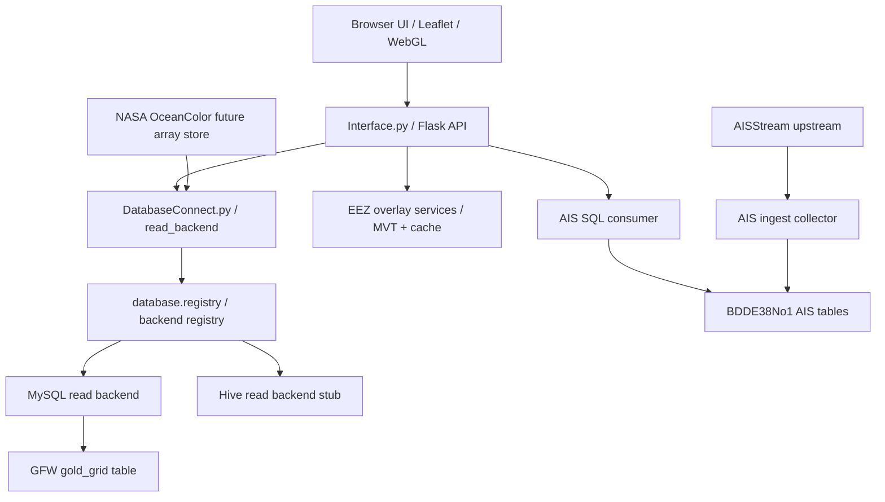

# GFW Flask MySQL Adapter

This is a small local map adapter for exploring ocean datasets with Flask, MySQL, PostGIS, and Leaflet.

The current app renders:

- GFW fishery grid records from MySQL, rendered through a WebGL-first map path with canvas fallback.
- AIS latest vessel positions from a live MySQL table maintained by a separate upstream collector.
- EEZ boundaries from PostGIS vector tiles and cached local vector data.
- A Leaflet map with table preview, timing metrics, render-state lights, time playback, fullscreen map mode, layer ordering, basemap controls, graticule controls, screenshot export, and per-layer style controls.

It is an experimental local tool. It is not a production GIS system.

## Upstream Handoff

Use `handoff/` when sharing this repo with upstream owners:

- `handoff/airflow_ais_crawler/` is for the Airflow/crawler owner. It explains the AISStream to SQL collector, the handoff JSON, SQL sink, timing, and health checks.
- `handoff/backend_config_contract/` is for the backend/system owner. It explains database config JSON, MySQL/Hive switching, dataset fields, and the capability matrix for disabled future skin/display settings.

Do not send real API keys through tracked files. `config/adapter.local.json` and `config/ais_collector.local.json` are local ignored files.

## Architecture

```text
core.py
  -> Interface.py              Flask routes and HTTP service
  -> DatabaseConnect.py        Dataset read backend dispatch and compatibility wrappers
  -> database/registry.py      @database_backend registry for read-model adapters
  -> AisLiveService.py         AIS live query packet
  -> AisIngestService.py       AISStream upstream collector to SQL latest-state table
  -> SpatialOverlay.py         EEZ overlay fallback helpers
  -> LodOverlayService.py      PostGIS / MVT EEZ tile helpers
  -> templates/index.html      Leaflet UI shell
  -> static/js/*               Frontend state, API, layer, and UI modules
```

The frontend is deliberately split by responsibility:

- `static/app.js`: bootstraps the app and wires UI events.
- `static/js/core`: shared state, DOM, map, and geographic helpers.
- `static/js/services`: API client calls and GFW record cache/prewarm behavior.
- `static/js/layers`: GFW, AIS, and EEZ rendering behavior.
- `static/js/rendering`: renderer capability checks, renderer selection, WebGL/canvas paint helpers, and GFW paint configuration.
- `static/js/ui`: table, playback, layer selector, map settings, and shared layer style controls.

Runtime pipeline:



The database read path is also split by responsibility:

- Decorators register available backend implementations, such as `@database_backend("mysql")`.
- JSON config selects the backend and connection per dataset.
- Route handlers call `schema_packet()` and `records_packet()` without knowing whether a dataset is backed by MySQL or a future Hive/Trino read model.

Example dataset routing:

```json
{
  "default_connection_ref": "local_mysql",
  "connections": {
    "local_mysql": {
      "kind": "mysql",
      "driver": "pymysql",
      "host": "127.0.0.1",
      "port": 3307,
      "user": "root",
      "password": "env:MYSQL_PASSWORD",
      "database": "ocean_fishery"
    },
    "class_hive": {
      "kind": "hive",
      "driver": "placeholder",
      "host": "hive-server.local",
      "port": 10000,
      "user": "hive",
      "password": "env:HIVE_PASSWORD",
      "database": "ocean_warehouse"
    }
  },
  "datasets": {
    "gfw_full": {
      "backend": "mysql",
      "connection_ref": "local_mysql",
      "table": "gold_grid"
    }
  }
}
```

Hive is intentionally registered only as an explicit unsupported stub in this version. It is a reserved read-model extension point, not a claimed working Hive integration.

Backend contract:

- `Interface.py` owns HTTP shape only. It must not know vendor-specific SQL/Hive query details.
- `DatabaseConnect.py` owns dataset read dispatch and compatibility wrappers.
- `database/registry.py` owns backend registration and backend instantiation.
- `config/*.json` owns backend selection, connection refs, and table/read-model names.
- Collector jobs own source-specific ingestion and sink-specific writes.
- Frontend layer code must consume API packets, not raw database credentials, raw source files, or collector paths.

## Features

### Data layers

The dataset selector supports these layers:

- `GFW fishery grid`
- `AIS vessel positions`
- `EEZ boundary overlay`

GFW and AIS are mutually exclusive primary data layers, but both can also be turned off. EEZ is an independent overlay and can be stacked with either primary layer.

Layer rows can be drag-reordered in the selector. The order controls map stacking by Leaflet pane z-index. Each layer has a gear panel:

- GFW exposes low/high gradient colors, max intensity, and alpha.
- AIS exposes collector key handoff plus density-grid or point-dot rendering.
- EEZ exposes fill color, boundary color, fill opacity, boundary opacity, and alpha.

The alpha and color controls are centralized in shared UI helpers so future layers should not copy one-off slider logic.

### Map

- Dark UI theme.
- Leaflet base map with selectable basemaps: light, dark, OSM, terrain, and satellite.
- Fullscreen map button.
- Fullscreen preserves the current geographic bounds instead of showing extra horizontal world copies.
- Map settings gear for scale bar, zoom buttons, mouse-wheel zoom, double-click zoom, dragging, screenshot export, and latitude/longitude graticule options.
- Latitude is clamped to avoid dragging into invalid north/south map bounds.
- EEZ uses vector tiles when available.

### Time controls

Time controls are enabled only when at least one selected layer exposes time capability. EEZ-only mode disables the single-day and time-sequence controls.

GFW currently supports:

- single-day mode
- latest available date jump
- start/end date range
- replay
- previous/next day
- play/pause
- playback speed

AIS is live viewport mode and does not use the date player.

### Timing panel

The timing drawer reports:

- SQL query time
- serialization time
- API total time
- client fetch-to-render time
- EEZ tile timing
- render-state gate for GFW, AIS, and EEZ readiness
- selected GFW render backend and draw timing
- row count

`rendering` timing is client draw time for the selected backend. It is not a claimed time saving. `fetch-to-render` remains the broader user-facing latency from API request through visible map update.

### Rendering and cache behavior

The app asks `/api/render/capability` for backend policy and inspects browser WebGL support. GFW rendering prefers WebGL when available and falls back to the canvas layer when not.

GFW records use a viewport/zoom-aware cache:

- Panning at the same zoom level keeps the current LOD packet when the cache key still matches.
- Zoom changes mark GFW as loading, clear the stale drawing, and fetch the new LOD packet.
- After a successful render, the client prewarms the other configured zoom/LOD packets in the background.
- Prewarm is opportunistic. It must not change the visible map until the requested render state is ready.

EEZ is treated closer to a basemap overlay: local vector data and PostGIS vector tiles are reused as much as possible, and pan-only movement should not force a full EEZ reload.

### AIS upstream ingest

AIS live data is intentionally split into two processes:

- `core.py serve` runs the local map UI and reads AIS from SQL.
- `core.py ingest-ais` runs a long-lived upstream AISStream collector and writes SQL latest-state rows.

The collector is not a frontend feature. It is an upstream data service whose job is to keep a durable AIS base table warm even when the map is closed. It can later be handed to the upstream/Airflow owner as a scheduled or long-lived data collection job. It upserts by `mmsi`, so the latest-state table keeps one current row per vessel instead of growing without bound. The map then queries that SQL table by viewport.

AIS latest-state reads must not impose an artificial total-row cap. The map may constrain reads by viewport, freshness, and future LOD representation, but `live.ais.limit: "max"` means the SQL query is unbounded and does not inherit `query_policy.max_limit`. If a numeric `live.ais.limit` is configured, it is treated as an explicit diagnostic cap, not the default product behavior.

Crawler timing lives in the crawler handoff JSON, not in the map rendering path. During local + Airflow dual-machine testing, `ingest_reconnect_seconds` and `ingest_status_report_seconds` default to 30 seconds to avoid two machines creating tight reconnect/status loops with the same upstream AIS key. After the collector is owned by one machine, those values can be lowered in the crawler JSON/secret, such as 3 seconds, without changing the map consumer.

This is a strict boundary:

- The map is a consumer.
- The collector is an upstream data feeder.
- The map must not directly consume AISStream for rendering.
- The map must not clean, crawl, or own upstream AIS collection.
- The collector writes SQL rows and a collector heartbeat row into `live.ais.ingest_meta_table`.
- The map reads SQL only after its locally configured collector key matches the collector key fingerprint in SQL metadata.

That internal key check is not a public auth system. It is a local boundary marker for this prototype: a normal user configures the AIS key once in the UI, the UI writes only a key fingerprint into `config/adapter.local.json`, writes the raw key into the crawler handoff file at `config/ais_collector.local.json`, and the map verifies that the SQL table is being maintained by the matching collector before it reads from it. Do not return the raw key from HTTP APIs, and do not use this key check as permission to blur the consumer/upstream boundary.

Future public setup can replace the local handoff file with a K8 Secret, Airflow variable, or upstream service registration. That handoff belongs to the crawler/upstream side, not to the map rendering path.

For the upstream owner, the handoff JSON should stay simple: upstream key, crawler timing, and destination sink. Changing polling/reconnect timing or changing the destination from local MySQL to another SQL/Hive-facing sink is crawler configuration work, not map UI work.

AIS SQL reads and writes may use `live.ais.connection_ref` to point at a shared entry in `connections`. The older inline `live.ais.connection` object remains supported for local overrides, but new deployments should prefer `connection_ref` so the SQL destination can move without changing AIS query/write code.

Minimal crawler handoff shape:

```json
{
  "schema": "rrkal.ais.collector_handoff.v1",
  "role": "upstream_ais_collector",
  "provider": "aisstream",
  "api_key": "<AISSTREAM_API_KEY>",
  "ingest": {
    "reconnect_seconds": 30,
    "status_report_seconds": 30,
    "flush_seconds": 1.0,
    "batch_size": 250,
    "meta_table": "ais_ingest_meta"
  },
  "sql": {
    "connection": {
      "host": "127.0.0.1",
      "port": 3306,
      "user": "root",
      "password": "env:RRKAL_AIS_MYSQL_PASSWORD"
    },
    "database": "BDDE38No1",
    "table": "ais_positions"
  }
}
```

To change the sink, edit only the collector-side `sql` section: `connection.host`, `connection.port`, `database`, and `table`. If the upstream owner later writes into Hive instead of MySQL, that change belongs to the collector/sink adapter and its config; the map should continue consuming the agreed read model rather than calling AISStream directly.

If historical tracks are needed later, add a separate history/events table with an explicit retention policy. Do not overload the latest-state table with unbounded event history.

### Upstream collectors

GFW and NASA ingestion are reusable upstream collector jobs, not frontend features:

- `collectors/gfw_collector.py` imports a configured GFW DuckDB source into the SQL read model.
- `collectors/nasa_ocean_collector.py` lists NASA OceanColor files, downloads authorized files, inspects NetCDF/HDF grids, and converts local files to Zarr.

The map UI must not learn raw source paths such as D-drive data folders, NASA download URLs, Zarr chunk paths, or temporary manifests. Those belong to collector configuration. The app should consume SQL tables or later service responses only.

For GFW, the collector currently writes the MySQL table consumed by the map. For NASA OceanColor grids, do not flatten all 4 km daily pixels into MySQL. The intended path is:

```text
NASA NetCDF/HDF source files
  -> collector-managed raw file cache
  -> collector-managed Zarr/xarray or TileDB array store
  -> DuckDB/SQL metadata, asset index, and tile-stat read model
  -> map/BI consumer queries
```

This keeps large scientific arrays in an array-native store and uses SQL for metadata, summaries, and query coordination. If the upstream owner later uses Hive, only the collector sink adapter and config should change; the map remains a consumer of the agreed read model.

NASA OceanColor downloads require Earthdata credentials supplied outside git, for example:

```powershell
$env:EARTHDATA_USERNAME = "your-earthdata-username"
$env:EARTHDATA_PASSWORD = "your-earthdata-password"
```

or:

```powershell
$env:EARTHDATA_TOKEN = "your-earthdata-token"
```

Initialize the D-drive NASA database:

```powershell
.\.venv\Scripts\python.exe collectors\nasa_ocean_collector.py --collector-config config\nasa_ocean_collector.example.json init-db
```

List the 2024 daily 4 km four-product manifest:

```powershell
.\.venv\Scripts\python.exe collectors\nasa_ocean_collector.py --collector-config config\nasa_ocean_collector.example.json list --start-date 2024-01-01 --end-date 2024-12-31 --output data\nasa_ocean_manifest_2024_daily_4km_four_products.json
```

Ingest the manifest into the D-drive NASA database:

```powershell
.\.venv\Scripts\python.exe collectors\nasa_ocean_collector.py --collector-config config\nasa_ocean_collector.example.json ingest-manifest --manifest data\nasa_ocean_manifest_2024_daily_4km_four_products.json --replace
```

Download, inspect, convert, and ingest a tiny first sample before starting a full-year download:

```powershell
.\.venv\Scripts\python.exe collectors\nasa_ocean_collector.py --collector-config config\nasa_ocean_collector.example.json download --manifest data\nasa_ocean_manifest_2024_daily_4km_four_products.json --max-files 1
.\.venv\Scripts\python.exe collectors\nasa_ocean_collector.py --collector-config config\nasa_ocean_collector.example.json inspect --path "D:\RRKAL_tools\nasa_ocean_store\raw\<dataset>\<year>\<file>.nc"
.\.venv\Scripts\python.exe collectors\nasa_ocean_collector.py --collector-config config\nasa_ocean_collector.example.json to-zarr --path "D:\RRKAL_tools\nasa_ocean_store\raw\<dataset>\<year>\<file>.nc"
.\.venv\Scripts\python.exe collectors\nasa_ocean_collector.py --collector-config config\nasa_ocean_collector.example.json ingest-grid --path "D:\RRKAL_tools\nasa_ocean_store\raw\<dataset>\<year>\<file>.nc" --replace
```

The configured 2024 NASA products are `CHL.chlor_a`, `FLH.nflh`, `KD.Kd_490`, and `SST.sst`. Treat these as schema discovery inputs until the first real files have been downloaded and inspected.

## Requirements

- Python 3.11+
- MySQL-compatible server
- PostgreSQL + PostGIS for EEZ vector tiles
- 7-Zip for extracting the temporary test-data archive
- Node.js only for local JavaScript syntax checks

Python dependencies are listed in `requirements.txt`.

## Quick Start

From the repo root:

```powershell
py -3 -m venv .venv
.\.venv\Scripts\python.exe -m pip install -r requirements.txt
Copy-Item config\adapter.example.json config\adapter.local.json -Force
```

Edit `config\adapter.local.json` for local database settings.

`config\adapter.local.json` is ignored by git. Keep real passwords there or in environment variables.

## Temporary Test Data Bootstrap

This repo does not commit large datasets. For repeatable demos, `config/adapter.example.json` includes a temporary `test_data_bootstrap` section.

When `auto_on_serve` is true, running the app downloads the public `.7z` test-data archive listed in `config/test_data.example.json` if the expected files are missing:

```text
data/gfw_full.duckdb
data/eez_v12.gpkg
```

The archive is hosted as a GitHub Release asset:

```text
https://github.com/Kagamihara-Ruruka/gfw-flask-mysql-adapter/releases/tag/test-data-v1
```

You can also run the bootstrap step manually:

```powershell
.\.venv\Scripts\python.exe core.py --config config\adapter.local.json bootstrap-test-data
```

This is a test-only convenience path. It is intentionally isolated in `TestDataBootstrap.py` and `config/test_data.example.json` so it can be removed later without touching the app core.

For AIS, use an environment variable instead of committing a password:

```powershell
$env:RRKAL_AIS_MYSQL_PASSWORD = "your-password"
```

Start only the AIS upstream collector:

```powershell
.\.venv\Scripts\python.exe core.py --config config\adapter.local.json ingest-ais
```

Or pass an explicit crawler handoff JSON for an Airflow/K8 worker:

```powershell
.\.venv\Scripts\python.exe core.py --config config\adapter.local.json ingest-ais --collector-config config\ais_collector.local.json
```

`ingest-ais` reads `config/ais_collector.local.json` when it exists, then writes the latest-state table and the `ais_ingest_meta` heartbeat table. The handoff file is gitignored because it contains the upstream AIS key. `config/adapter.local.json` should keep only the key fingerprint for the consumer-side SQL read gate.

For Airflow, Windows Task Scheduler, NSSM, Docker, or K8, run the same command as the collector task and provide the same SQL connection plus the crawler handoff/secret. The Flask UI does not need to be running for the collector to keep warming SQL.

Start the map UI:

```powershell
.\.venv\Scripts\python.exe core.py --config config\adapter.local.json serve
```

The server is intentionally single-instance. On startup it reads `flask_pid.txt`, force-exits the previous local Flask server when it is still running, clears the configured port when needed, and writes the new PID. This prevents duplicate AIS or database query loops from running at the same time.

Open:

```text
http://127.0.0.1:5057
```

## Import GFW Data

Import a DuckDB table into MySQL:

```powershell
.\.venv\Scripts\python.exe core.py --config config\adapter.local.json import --source "C:\path\to\gfw_full.duckdb" --replace
```

Import a smaller sample:

```powershell
.\.venv\Scripts\python.exe core.py --config config\adapter.local.json import --source "C:\path\to\gfw_full.duckdb" --replace --row-limit 5000
```

## NASA OceanColor Warehouse Seed

NASA OceanColor ingestion is an upstream warehouse task. The consumer map should read SQL/database service responses, not raw NetCDF files or Zarr paths.

Install the scientific stack:

```powershell
.\.venv\Scripts\python.exe -m pip install -r requirements.txt
```

Create or refresh the 2024 daily 4 km manifest for the four starter variables:

```powershell
.\.venv\Scripts\python.exe collectors\nasa_ocean_collector.py list --output data\nasa_ocean_manifest_2024_daily_4km_four_products.json
.\.venv\Scripts\python.exe collectors\nasa_ocean_collector.py ingest-manifest --manifest data\nasa_ocean_manifest_2024_daily_4km_four_products.json
```

Run the resumable full pipeline after setting Earthdata credentials in the environment:

```powershell
$env:EARTHDATA_USERNAME="..."
$env:EARTHDATA_PASSWORD="..."
.\.venv\Scripts\python.exe collectors\nasa_ocean_collector.py pipeline --manifest data\nasa_ocean_manifest_2024_daily_4km_four_products.json --timeout-seconds 600
```

The pipeline writes:

- raw NetCDF files under `D:\RRKAL_tools\nasa_ocean_store\raw`
- Zarr stores under `D:\RRKAL_tools\nasa_ocean_store\zarr`
- DuckDB read-model tables under `D:\RRKAL_tools\nasa_ocean_store\db\nasa_ocean.duckdb`

The first read-model tables are `nasa_ocean_assets`, `nasa_ocean_schema_snapshots`, and `nasa_ocean_tile_stats`. `nasa_ocean_tile_stats` is the initial map/BI query surface; downstream UI code should not depend on raw file locations.

## Docker Compose

The repo includes `docker-compose.yml` for local service support. Adjust ports and passwords in your local config before use.

```powershell
docker compose up -d
```

## API Surface

Health:

```text
GET /api/health
```

Datasets:

```text
GET /api/datasets
GET /api/datasets/<dataset_id>/schema
GET /api/datasets/<dataset_id>/records?date=YYYY-MM-DD&bbox=west,south,east,north&limit=100000
```

EEZ:

```text
GET /api/overlays/eez
GET /api/overlays/eez/tiles/<z>/<x>/<y>.pbf
GET /api/overlays/eez/boundary/tiles/<z>/<x>/<y>.pbf
```

AIS:

```text
GET /api/live/ais?bbox=west,south,east,north
GET /api/live/ais/ingest/status
GET /api/live/ais/settings
GET /api/live/ais/diagnostics
POST /api/live/ais/settings
DELETE /api/live/ais/settings
```

Rendering capability:

```text
GET /api/render/capability
```

## Validation

JavaScript syntax check:

```powershell
Get-ChildItem static\js -Recurse -Filter *.js | ForEach-Object { node --check $_.FullName }
node --check static\app.js
```

Git whitespace check:

```powershell
git diff --check -- static templates *.py config requirements.txt docker-compose.yml README.md
```

## Notes

- Do not commit `config/adapter.local.json`.
- Do not commit runtime logs, PID files, database files, or downloaded datasets.
- Use environment variables for local secrets.
- This app is designed as a small local exploratory adapter. Keep data access, rendering, and UI behavior separated as the feature set grows.
- EEZ country/claim attribution is not implemented yet. The current EEZ layer draws geometry only; identifying which country or claim owns a maritime zone requires a separate attribution field, tooltip/pick query, and UI treatment.
- AISHub polling remains a reserved fallback path. The MVP path is AISStream collector to SQL, then map consumption from SQL.
