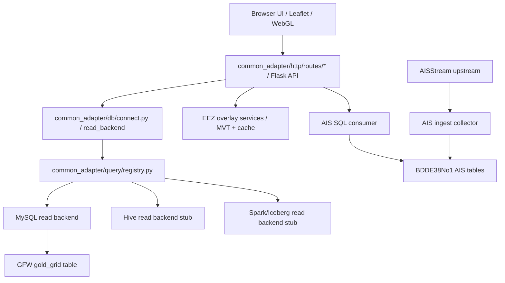
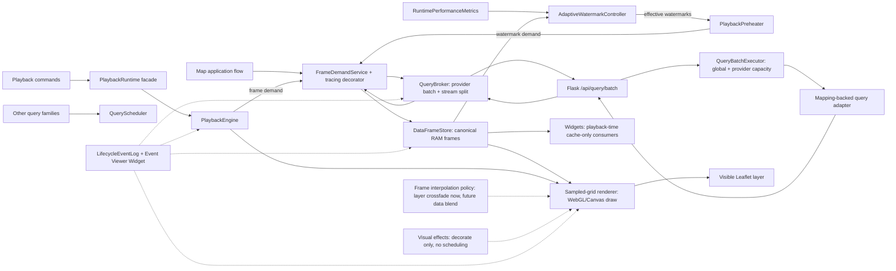
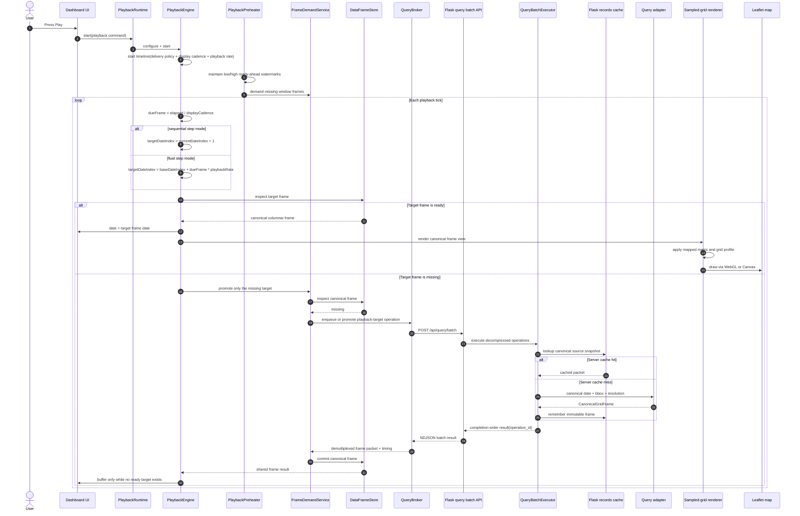
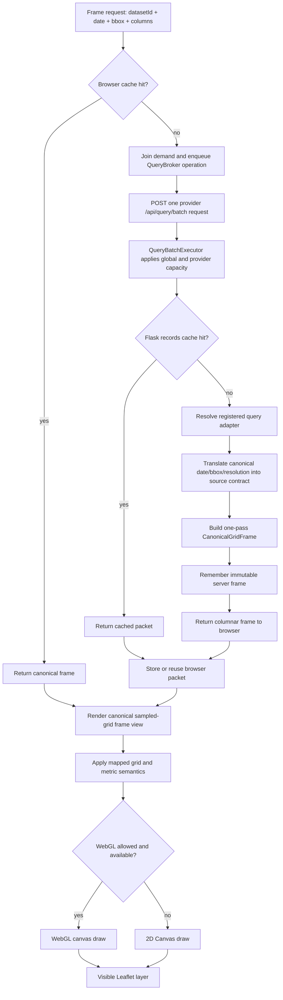
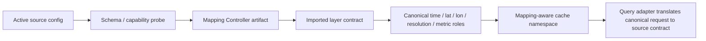

# Common Adapter

This is a local data adapter for exploring pluggable datasets with Flask, MySQL, PostGIS, and Leaflet.

The current app renders:

- GFW fishery grid records from MySQL, rendered through a WebGL-first map path with canvas fallback.
- AIS latest vessel positions from a live MySQL table maintained by a separate upstream collector.
- EEZ boundaries from PostGIS vector tiles and cached local vector data.
- A Leaflet map with table preview, timing metrics, render-state lights, time playback, fullscreen map mode, layer ordering, basemap controls, graticule controls, screenshot export, and per-layer style controls.

It is an experimental local tool. It is not a production GIS system.

Traditional Chinese documentation is available in [`README.zh-TW.md`](README.zh-TW.md).

The historical pre-512 MiB Chrome Incognito playback checkpoint is
available at [`benchmarks/playback_lifecycle_acceptance_2026-07-15.md`](benchmarks/playback_lifecycle_acceptance_2026-07-15.md).
The follow-up Runtime OOP regression report is available at
[`benchmarks/runtime_oop_acceptance_2026-07-15.md`](benchmarks/runtime_oop_acceptance_2026-07-15.md).
The Widget UI/Application boundary regression report is available at
[`benchmarks/widget_application_boundary_acceptance_2026-07-16.md`](benchmarks/widget_application_boundary_acceptance_2026-07-16.md).
The Clock Domain and trusted runtime-metrics acceptance report is available at
[`benchmarks/clock_domain_acceptance_2026-07-16.md`](benchmarks/clock_domain_acceptance_2026-07-16.md).
The current 512 MiB playback-pipeline, adaptive-watermark, and external Chrome
Incognito acceptance report is available at
[`benchmarks/adaptive_watermark_acceptance_2026-07-16.md`](benchmarks/adaptive_watermark_acceptance_2026-07-16.md).
The Mapping/query-broker/cache convergence and current side-browser acceptance report is available at
[`benchmarks/runtime_convergence_acceptance_2026-07-17.md`](benchmarks/runtime_convergence_acceptance_2026-07-17.md).
The current 5081 sampled-grid throughput, completion-order batching, and five-dataset playback acceptance report is available at
[`benchmarks/sampled_grid_throughput_acceptance_2026-07-17.md`](benchmarks/sampled_grid_throughput_acceptance_2026-07-17.md).
The one-pass Mapping and end-to-end columnar Canonical Frame acceptance report is available at
[`benchmarks/sampled_grid_canonical_frame_acceptance_2026-07-18.md`](benchmarks/sampled_grid_canonical_frame_acceptance_2026-07-18.md).

## Upstream Handoff

Use `handoff/` when sharing this repo with upstream owners:

- `handoff/airflow_ais_crawler/` is for the Airflow/crawler owner. It explains the AISStream to SQL collector, the handoff JSON, SQL sink, timing, and health checks.
- `handoff/backend_config_contract/` is for the backend/system owner. It explains database config JSON, MySQL/Hive/Spark boundary planning, dataset fields, and the capability matrix for disabled future skin/display settings.

Do not send real API keys through tracked files. `config/runtime/adapter.local.json` and `config/runtime/ais_collector.local.json` are local ignored files.

## Architecture

```text
core.py
  -> common_adapter/http/interface.py       Flask app factory and route assembly
  -> common_adapter/http/server.py          server lifecycle, PID, and port helpers
  -> common_adapter/http/routes/*           system, dataset, overlay, live, and developer routes
  -> common_adapter/db/connect.py           Dataset read backend dispatch
  -> common_adapter/db/backends/*           MySQL and future backend adapters
  -> common_adapter/query/registry.py       shared database/endpoint query-adapter registry
  -> common_adapter/query/identity.py       mapping-aware cache namespace
  -> common_adapter/ais/live.py             AIS live query packet
  -> common_adapter/ais/ingest.py           AISStream collector to SQL latest-state table
  -> common_adapter/spatial/overlay.py      EEZ overlay fallback helpers
  -> common_adapter/spatial/lod.py          PostGIS / MVT EEZ tile helpers
  -> templates/index.html      Leaflet UI shell
  -> static/js/*               Frontend state, API, layer, and UI modules
```

The runtime imports the canonical `common_adapter/` modules directly. The former root-module and `database/registry.py` compatibility paths have been removed; new code must not recreate dependencies on them.

Frontend Runtime ownership, the DI composition root, class-selection rules, and the Application Service template are documented in [`docs/architecture/runtime-oop.md`](docs/architecture/runtime-oop.md).

The frontend is deliberately split by responsibility:

- `static/app.js`: bootstraps the app and wires UI events.
- `static/js/core`: shared state, DOM, map, and geographic helpers.
- `static/js/services`: render intent, sampled-grid `QueryBroker`, general query scheduling, canonical frame cache, API calls, and shared service helpers.
- `static/js/layers`: sampled-grid, AIS, and EEZ rendering behavior, plus layer visual effects such as zoom blur and crossfade handoff.
- `static/js/rendering`: renderer capability checks, renderer selection, WebGL/canvas paint helpers, virtual-grid contracts, and data-driven paint configuration.
- `static/js/playback`: playback controls, delivery policy, pure timeline scheduler, frame readiness buffer, playback renderer handoff, playback interpolation policy, the independent preheater, the adaptive-watermark controller, and snapshot splitting helpers.
- `static/js/ui`: table, playback, layer selector, map settings, and shared layer style controls.

Runtime timing is injected by `ClockDomain`: monotonic wall time owns queue, network, cache, buffering, timeout, and percentile measurements; playback time alone applies the speed multiplier; render time owns animation-frame and draw measurements. Lifecycle events use `monotonic_ms`, and the status line, metrics Widget, and event viewer consume the same `RuntimePerformanceMetrics` snapshot instead of maintaining separate playback telemetry.

Runtime pipeline:



The source read path is split by responsibility:

- Decorators register available query-adapter implementations, such as `@query_adapter("mysql")`.
- JSON config selects the backend and connection per dataset.
- Route handlers call canonical schema/records operations without knowing whether a dataset is backed by MySQL, a serving endpoint, or a future Hive/Trino/Spark/Iceberg read model.

Example dataset routing:

```json
{
  "default_connection_ref": "local_mysql",
  "connections": {
    "local_mysql": {
      "kind": "mysql",
      "driver": "pymysql",
      "host": "127.0.0.1",
      "port": 3307,
      "user": "root",
      "password": "env:MYSQL_PASSWORD",
      "database": "common_fishery"
    },
    "class_hive": {
      "kind": "hive",
      "driver": "placeholder",
      "host": "hive-server.local",
      "port": 10000,
      "user": "hive",
      "password": "env:HIVE_PASSWORD",
      "database": "common_warehouse"
    }
  },
  "datasets": {
    "gfw_full": {
      "backend": "mysql",
      "connection_ref": "local_mysql",
      "table": "gold_grid"
    }
  }
}
```

Hive and Spark are intentionally registered only as explicit unsupported stubs in this version. They are reserved read-model extension points, not claimed working Hive, Spark, or Iceberg integrations.

Backend contract:

- `common_adapter/http/interface.py` owns Flask app assembly only; route modules own HTTP shape. Neither layer should know vendor-specific SQL, Hive, Spark, or Iceberg query details.
- `common_adapter/db/connect.py` owns shared database query helpers and dataset read dispatch. Backend classes live under `common_adapter/db/backends/`.
- `common_adapter/query/registry.py` owns registration and instantiation for database and endpoint query adapters.
- Active source configs own external names. Mapping artifacts translate them into canonical time, latitude, longitude, resolution, metric, and identity roles.
- Collector jobs own source-specific ingestion and sink-specific writes.
- Frontend layer code must consume API packets, not raw database credentials, raw source files, or collector paths.

## Features

### Data layers

The layer selector is built from imported layer contracts. It is not a hard-coded three-item dataset list:

- imported sampled-grid datasets produced by the Mapping Controller
- AIS vessel positions when an active websocket/read-model route is available
- EEZ boundary overlays when an active spatial route is available

Primary data layers are activation-controlled and may all be off; disabled imported layers do not query or render. EEZ is an independent overlay. For bounded sampled-grid datasets, Mapping owns the coverage union and `default_coverage_id`: the default coverage supplies the initial center, the union supplies CC bounds and the legal minimum zoom, and the source query keeps one complete coverage scope independent of camera zoom. A real source cell-limit fallback remains explicit as requested versus actual resolution; it is not camera LOD.

Layer rows can be drag-reordered in the selector. The order controls map stacking by Leaflet pane z-index. Each layer has a gear panel:

- Sampled-grid layers expose mapping-driven metric, resolution, color scale, intensity, and alpha controls.
- AIS exposes collector key handoff plus density-grid or point-dot rendering.
- EEZ exposes fill color, boundary color, fill opacity, boundary opacity, and alpha.

The alpha and color controls are centralized in shared UI helpers so future layers should not copy one-off slider logic.

### Map

- Dark UI theme.
- Leaflet base map with selectable basemaps: light, dark, OSM, terrain, and satellite.
- Fullscreen map button.
- Fullscreen preserves the current geographic bounds instead of showing extra horizontal world copies.
- Map settings gear for scale bar, zoom buttons, mouse-wheel zoom, double-click zoom, dragging, screenshot export, and latitude/longitude graticule options.
- Latitude is clamped to avoid dragging into invalid north/south map bounds.
- EEZ uses vector tiles when available.

### Time controls

Time controls are enabled only when at least one selected layer exposes time capability. EEZ-only mode disables the single-day and time-sequence controls.

Time-capable sampled-grid layers currently support:

- single-day mode
- latest available date jump
- start/end date range
- replay
- previous/next day
- play/pause
- playback speed

Playback scheduling is timeline-driven. Playback speed is a timeline rate, not the old "wait after the previous frame completes" loop. The default delivery policy is analysis mode: every selected real snapshot is consumed in order, and `playbackRate` changes the target cadence for the next snapshot. Smooth and strict delivery policy ports are visible in Settings but explicitly marked as not implemented, so they do not control the playback clock yet. Query and render work do not add another full interval after each frame. A cold run enters `PREPARING` and waits only for the next real target frame. Adaptive low/high watermarks govern background inventory and never become playback eligibility gates. During playback, only a genuinely missing target enters `BUFFERING`; the selected date stays fixed until that target is ready. Failed target requests are explicit frame-buffer failures, not endless `fetching` states; pause, replay, layer, and dataset changes invalidate stale queued preheat work without evicting completed frames.

The settings page exposes playback as separate responsibility boxes instead of one mixed control group:

- Playback timeline: delivery policy and `playbackRate` decide which real snapshot date the player is trying to show. Analysis mode is implemented; smooth and strict modes are reserved ports.
- Frame buffer: analysis mode reports `fetching/missing/ready/waiting/failed` state boundaries. The timing box records `buffering`, `resumed`, and `shown` events separately from SQL/API/render work.
- Data cache / preheat: an independent producer maintains low/high ready-ahead inventory. Trusted supply/consumption metrics are scoped to the active playback request and exclude Widget traffic. Adaptive mode uses half of the configured RAM budget as playback inventory capacity, with low/high refill thresholds at one-third and two-thirds of that capacity; fixed 10/15 thresholds remain available. The browser canonical-frame budget defaults to 512 MB and remains adjustable in Settings. The producer may desire a large cache inventory, but it exposes at most 12 outstanding frame demands to `QueryBroker`. The Registry publishes each physical provider's operation capacity; the broker limits effective batch size and provider in-flight work to that capacity, while the Flask `QueryBatchExecutor` enforces the same shared bound after decompression.
- Frame interpolation: playback can use the existing layer crossfade as a visual-only interpolation policy or switch directly between real snapshots; data blending remains reserved for a future `requestAnimationFrame` loop backed by render artifacts.
- Visual effects: crossfade decorates layer replacement; Gaussian blur is limited to zoom / LOD reload masking.
- Render pressure and timing: renderer policy and the dashboard timing box observe performance without owning the playback clock.

Playback invariants are covered by `tests/playback_contracts.test.mjs` and can be run with:

```powershell
python scripts/playback_contract_smoke.py
```

The guarded contracts are:

- `analysis` delivery uses `sequential` stepping: even if the clock is late or the speed is 4x, the next render target is always `currentIndex + 1`.
- Buffering can shift the scheduler clock, but it must not advance the selected date until the target frame is ready.
- Progressive cold cache reports `fetching 0 / 1`; when the target packet is ready it records `BUFFER_RESUMED` and then `FRAME_VISIBLE`.
- Progressive request failures report `failed`, emit a lifecycle error event, and stop playback after a real monotonic 30-second timeout instead of retrying forever.
- Cancelled or replaced progressive preheats cannot apply late progress, status, or failure state to the current playback generation.
- Cold playback enters `PREPARING` and waits only for the next target frame without counting that wait as a playback stall. During playback, the independent preheater fills missing frames to the high watermark while playback consumes ready frames.
- Insufficient supply samples keep the adaptive policy in `WARMING`; they do not trigger a probe or increase the playback readiness requirement.
- Only a missing target can enter `BUFFERING`; recovery resumes as soon as that target frame is ready. Manual seek still promotes only its target and does not wait for a refill watermark.
- `AdaptiveWatermarkController` reads only `RuntimePerformanceMetrics` and the `DataFrameStore` capacity snapshot. It performs no transport, changes no query concurrency, and never clears cache. UI paths may preview or display policy; only Preheater reconciliation applies it.
- `fluid` is the only step mode allowed to map elapsed time to future dates. It remains reserved behind the disabled smooth delivery port.
- Prefetch, render, interpolation, blur, and timing observations supply or decorate frames; none of them owns the playback date clock.

Current frontend module boundaries:

| Module | Boundary |
| --- | --- |
| `static/js/core/clock-domain.js` | DI-injected monotonic, playback, and render clocks. Playback speed is accepted only by playback cadence and consumption-rate calculations. |
| `static/js/playback/playback-delivery-policy.js` | Playback delivery policy: the single high-level owner for analysis/smooth/strict timeline semantics. Only analysis mode is enabled today; smooth and strict are exposed as reserved ports. |
| `static/js/playback/playback-scheduler.js` | Pure timeline math: cadence, due frame, speed/rate mapping, and target date index. |
| `static/js/playback/playback-runtime-controller.js` | Public playback facade and the sole owner of timer, generation, timeline, and session callbacks. UI code does not address `PlaybackEngine` or `PlaybackPreheater` directly. |
| `static/js/playback/playback-frame-buffer.js` | Pure frame-readiness decisions. It consumes injected frame inspection results and never rebuilds request context, mutates buffer state, or reads `DataFrameStore` independently. |
| `static/js/playback/playback-time-policy.js` | Pure monotonic buffer-timeout policy; it never reads playback speed. |
| `static/js/playback/playback-renderer.js` | Playback-to-render handoff: set selected date, sync controls, call the existing active-layer reload. |
| `static/js/playback/playback-interpolation-controller.js` | Playback interpolation policy: choose layer crossfade or direct switching during playback; data blending is not enabled yet. |
| `static/js/core/canonical-grid-frame.js` | Immutable browser-side columnar sampled-grid frame and zero-copy indexed/BBOX views. Row objects are created only at explicit presentation boundaries. |
| `static/js/services/frame-identity.js` | The only builder for canonical BBOX signatures, request intent keys, scope keys, and returned frame keys. |
| `static/js/services/data-frame-store.js` | Canonical RAM frame store, intent-to-frame aliases, compatible containing-BBOX materialization, pin/release ownership, byte-budgeted LRU eviction, and failure state. It defaults to a 512 MB browser budget and never performs transport. |
| `static/js/services/layer-query-coordinator.js` | Priority scheduler for query families outside the sampled-grid transport chain, with one execution per intent key, queued-task promotion, consumer-scoped cancellation, and a reserved foreground slot. |
| `static/js/services/query-policy-controller.js` | DI-owned policy command boundary for that general scheduler. It does not own sampled-grid provider capacity or playback watermarks. |
| `static/js/services/query-broker.js` | Provider-level transport owner. It bakes compatible operations across datasets into NDJSON batches, caps effective batch size and in-flight operations by Registry capacity, releases capacity per streamed result, and immediately backfills the highest-priority queued work. The provider key never replaces the dataset/cache identity. |
| `static/js/services/frame-demand-service.js` | The sampled-grid demand boundary. It checks `DataFrameStore`, joins an exact or containing-BBOX in-flight request when compatible, delegates a real miss directly to `QueryBroker`, normalizes the returned packet, and commits it once. |
| `common_adapter/query/batch.py` | Flask-side batch execution owner. `QueryBatchExecutor` keeps one global worker pool and a shared per-provider capacity pool, acquires provider permits before worker submission so capacity waits cannot starve other sources, yields results in completion order by `operation_id`, and isolates sibling failures. |
| `common_adapter/query/grid_frame.py` | Immutable server-side columnar sampled-grid frame, builder, transport projection, and zero-copy selection views. |
| `static/js/services/frame-demand-decorators.js` | DI-composed observability decorator. It records demand boundary duration and outcome without changing cache, scheduling, transport, result, or error semantics. |
| `static/js/playback/playback-preheater.js` | Long-lived producer that independently maintains low/high ready-ahead inventory. Desired inventory and the 12-request scheduling window are separate concerns; it does not own the playback clock or playback readiness. |
| `static/js/playback/adaptive-watermark-controller.js` | DI-owned stateful policy owner. It derives effective watermarks from trusted supply, cache-ready P95, playback consumption, and RAM budget, with monotonic decrease hysteresis. |
| `static/js/playback/playback-engine.js` | Frame consumer and playback lifecycle owner. It owns next-target preparation, target-miss buffering, visible-frame pins, and their lifecycle events; readiness is always the requested next frame, not a refill watermark. |
| `static/js/playback/playback-cache-service.js` | Playback cache settings/status facade. It exposes watermarks and RAM capacity but owns neither transport nor a batch pipeline. |
| `static/js/services/lifecycle-event-log.js` | Bounded event log, linear Queue-to-Ready pairing, explicit run export, and user-perceived Queue/HTTP/cache/render/stall metrics. |
| `static/js/services/runtime-performance-metrics.js` | The single trusted projection for supply, consumption, cache-ready tail latency, ready-ahead, and buffer-wait values. |
| `static/js/ui/widgets/capabilities/event-viewer.js` | Read-only lifecycle Event Viewer Widget with run/dataset/event filters and manual JSON export. Playback completion never opens a download or file dialog. |
| `static/js/layers/gfw-layer-effects.js` | Visual-only sampled-grid layer effects: zoom/LOD blur, reveal, retired-layer cleanup, and crossfade. The filename is historical; only `SampledGridLayerEffects` is exported. |
| `static/TimingMetrics.js` | DI-created query/render timing service. It accepts ClockDomain and does not keep a second playback-event timeline. |



AIS is live viewport mode and does not use the date player.

### Timing panel

The timing drawer reports:

- SQL query time
- serialization time
- API total time
- client fetch-to-render time
- EEZ tile timing
- render-state gate for GFW, AIS, and EEZ readiness
- selected GFW render backend and draw timing
- row count

`rendering` timing is client draw time for the selected backend. It is not a claimed time saving. `fetch-to-render` remains the broader user-facing latency from API request through visible map update.

### Rendering and cache behavior

The app asks `/api/render/capability` for backend policy and inspects browser WebGL support. Sampled-grid rendering prefers WebGL when available and falls back to the canvas layer when not.

Sampled-grid records use a mapping-, source-scope-, resolution-, and date-aware cache:

- A bounded dataset declared with complete Mapping coverage uses that stable coverage bbox for every camera position; pan and zoom redraw the existing canonical frame without changing its query or cache identity.
- A viewport-native source without bounded coverage, such as a bbox-backed database route, still refreshes when the viewport leaves its cached packet.
- An explicit resolution setting may request a different source packet without evicting completed packets at other resolutions. Camera zoom is renderer state and is not sent as sampled-grid source LOD.
- Date-to-date playback frame changes do not use Gaussian blur; they rely on cache readiness, renderer work, and layer crossfade.
- Once a sampled-grid scope is known, the independent Preheater maintains its configured ready-ahead window; it does not wait for a render callback to begin its lifecycle.
- Prewarm is opportunistic. It must not change the visible map, clear completed snapshots, or outrank a map request.
- HTTP sampled-grid adapters also cache canonical source snapshots by mapping namespace, date, coverage, and resolution. `query_policy.snapshot_cache_max_rows` is a global cross-namespace row budget, so enabling several datasets cannot multiply an independent unbounded cache for each dataset.

EEZ is treated closer to a basemap overlay: local vector data and PostGIS vector tiles are reused as much as possible, and pan-only movement should not force a full EEZ reload.

### Sampled-grid query and cache lifecycle

A playback frame is a canonical records packet identified by:

```text
mapping-aware cache namespace + date + source-scope bbox + limit + columns + resolution context
```

The cache namespace is derived from the active mapping contract, including source route, canonical field roles, grid profile, resolution policy, and query contract. Changing those semantics creates a new namespace; credentials and visualization-only settings do not. The Registry also derives a non-secret provider transport key and capacity from the physical source route. Datasets sharing that key share one provider capacity pool, but they retain independent cache namespaces and canonical frames. On a cold miss, `FrameDemandService` joins the logical intent and delegates it directly to `QueryBroker`; the broker bakes compatible operations into NDJSON requests whose effective size is bounded by available provider slots. Flask then decompresses the request through `QueryBatchExecutor`, which applies the global worker bound and each source's `query_policy.max_in_flight`, streams completion-order results, and identifies them by `operation_id`. Mapping writes each source row once into an immutable columnar `CanonicalGridFrame`; the same frame representation crosses the server cache, transport, browser store, Renderer, and Widget boundaries without inflating a second row graph. Each returned operation is committed once to `DataFrameStore`. On a warm path, the map, playback, selection tools, and Widgets reuse the same immutable frame.

Only the map/query application layer may create sampled-grid demand. `QueryBroker` orders those operations as `map-current`, `playback-target`, `playback-window`, `widget-interactive`, then `widget-auto/background`; `QueryScheduler` remains a separate owner for other query families and is not nested inside this chain. During `PREPARING`, `PLAYING`, or `BUFFERING`, Widgets are cache-only consumers. An explicit Tile interaction may request only the current missing slice through `widget-interactive`; an idle or paused chart may fill its configured history window through `widget-auto`. Active-date refreshes, table inspection, and Event Viewer rendering never start transport. Cancelling queued prewarm or Widget work never evicts completed packets.

There are two independent capacity controls. Runtime `query_policy.network_concurrency` bounds the Flask `QueryBatchExecutor` worker pool, while a source config's `query_policy.max_in_flight` bounds decompressed operations against that physical provider. The latter defaults conservatively to `1`; the tracked Pipeline Iceberg example uses `2` because a controlled one-versus-two-worker benchmark improved throughput. `/api/datasets` publishes this provider capacity, and the browser computes `min(batch_max_operations, source_capacity, available_slots)` before dispatch. Browser watermarks do not change either capacity. Validate source changes against Queue P95, adapter latency, provider latency, and visible-frame cadence together.

Source error semantics belong to Mapping. A mapping may declare `snapshot.no_data` to translate a source-specific missing partition into an empty, negatively cached canonical snapshot; `snapshot.retry` handles finite retries for transient source failures; `resolution_policy` is reserved for a real coarser-LOD fallback. These outcomes are not interchangeable.



Frame source resolution:



Config and layer mapping role:



### EEZ bootstrap and spatial route injection

EEZ is a SPATIAL route, not a DATABASE route. Its portable contract lives in `config/examples/sources/spatial/eez.example.json`.

The route has four boundaries:

1. Source asset: a cached Marine Regions EEZ GPKG or zip lives under `data/eez/` when a PostGIS import is needed.
2. Spatial provider: `provider: "postgis"` imports the cached GPKG into the configured PostGIS tables.
3. Layer contract: EEZ is exposed as an overlay layer, not as a normal SQL dataset.
4. Frontend renderer: Leaflet consumes MVT/vector packets and applies the existing EEZ LOD/cache behavior.

The source file is an app-managed cache, not a browser cache. Closing the browser does not remove it. In Docker or another deployed environment, mount `data/eez/` or another configured cache path as a persistent volume.

Default source:

```json
{
  "source": {
    "kind": "remote_gpkg_zip",
    "url": "https://www.marineregions.org/download_file.php?name=World_EEZ_v12_20231025_gpkg.zip",
    "source_page": "https://www.marineregions.org/downloads.php",
    "archive_path": "data/eez/World_EEZ_v12_20231025_gpkg.zip",
    "cache_path": "data/eez/eez_v12.gpkg",
    "form": {
      "name": "RRKAL Common Adapter",
      "organisation": "RRKAL",
      "email": "rrkal.common.adapter@example.com",
      "country": "Taiwan (Province of China)",
      "user_category": "academia",
      "purpose_category": "Data exploration & testing"
    }
  },
  "auto_download": true,
  "auto_import": true
}
```

Marine Regions returns an interactive download form before serving the zip. The downloader automates that form using `source.form`, preserves cookies from the first request, submits the disclaimer agreement, and validates that the final response is a real zip before saving it. You can replace the form metadata in local config if the project should report a different contact.

Manual bootstrap:

```powershell
.\.venv\Scripts\python.exe core.py --config config\runtime\adapter.local.json bootstrap-eez
```

Normal startup:

```powershell
docker compose up -d postgis
.\.venv\Scripts\python.exe core.py --config config\runtime\adapter.local.json serve
```

`serve` runs the same EEZ bootstrap before dependency checks. If `data/eez/eez_v12.gpkg` is absent and `auto_download` is true, startup downloads the Marine Regions zip through the automated form flow and extracts the matching GPKG. If PostGIS is enabled and the EEZ tables are missing or empty, startup imports the GPKG into `eez_v12`, `eez_v12_tile`, and `eez_v12_boundary`.

### AIS upstream ingest

AIS live data is intentionally split into two processes:

- `core.py serve` runs the local map UI and reads AIS from SQL.
- `core.py ingest-ais` runs a long-lived upstream AISStream collector and writes SQL latest-state rows.

The collector is not a frontend feature. It is an upstream data service whose job is to keep a durable AIS base table warm even when the map is closed. It can later be handed to the upstream/Airflow owner as a scheduled or long-lived data collection job. It upserts by `mmsi`, so the latest-state table keeps one current row per vessel instead of growing without bound. The map then queries that SQL table by viewport.

AIS latest-state reads must not impose an artificial total-row cap. The map may constrain reads by viewport, freshness, and future LOD representation, but `live.ais.limit: "max"` means the SQL query is unbounded and does not inherit `query_policy.max_limit`. If a numeric `live.ais.limit` is configured, it is treated as an explicit diagnostic cap, not the default product behavior.

Crawler timing lives in the crawler handoff JSON, not in the map rendering path. During local + Airflow dual-machine testing, `ingest_reconnect_seconds` and `ingest_status_report_seconds` default to 30 seconds to avoid two machines creating tight reconnect/status loops with the same upstream AIS key. After the collector is owned by one machine, those values can be lowered in the crawler JSON/secret, such as 3 seconds, without changing the map consumer.

This is a strict boundary:

- The map is a consumer.
- The collector is an upstream data feeder.
- The map must not directly consume AISStream for rendering.
- The map must not clean, crawl, or own upstream AIS collection.
- The collector writes SQL rows and a collector heartbeat row into `live.ais.ingest_meta_table`.
- The map reads SQL only after its locally configured collector key matches the collector key fingerprint in SQL metadata.

That internal key check is not a public auth system. It is a local boundary marker for this prototype: a normal user configures the AIS key once in the UI, the UI writes only a key fingerprint into the active WEBSOCKET route config, writes the raw key into the crawler runtime handoff file at `config/runtime/ais_collector.local.json`, and the map verifies that the SQL table is being maintained by the matching collector before it reads from it. Do not return the raw key from HTTP APIs, and do not use this key check as permission to blur the consumer/upstream boundary.

Future public setup can replace the local handoff file with a K8 Secret, Airflow variable, or upstream service registration. That handoff belongs to the crawler/upstream side, not to the map rendering path.

For the upstream owner, the handoff JSON should stay simple: upstream key, crawler timing, and destination sink. Changing polling/reconnect timing or changing the destination from local MySQL to another SQL/Hive-facing sink is crawler configuration work, not map UI work.

AIS SQL reads and writes use `live.ais.connection_ref` or the registered default MySQL connection. Inline `live.ais.connection` credentials are not a runtime path; the SQL destination remains owned by the connection registry.

Minimal crawler handoff shape:

```json
{
  "schema": "rrkal.ais.collector_handoff.v1",
  "role": "upstream_ais_collector",
  "provider": "aisstream",
  "api_key": "<AISSTREAM_API_KEY>",
  "ingest": {
    "reconnect_seconds": 30,
    "status_report_seconds": 30,
    "flush_seconds": 1.0,
    "batch_size": 250,
    "meta_table": "ais_ingest_meta"
  },
  "sql": {
    "connection": {
      "host": "127.0.0.1",
      "port": 3306,
      "user": "root",
      "password": "env:RRKAL_AIS_MYSQL_PASSWORD"
    },
    "database": "BDDE38No1",
    "table": "ais_positions"
  }
}
```

To change the sink, edit only the collector-side `sql` section: `connection.host`, `connection.port`, `database`, and `table`. If the upstream owner later writes into Hive instead of MySQL, that change belongs to the collector/sink adapter and its config; the map should continue consuming the agreed read model rather than calling AISStream directly.

If historical tracks are needed later, add a separate history/events table with an explicit retention policy. Do not overload the latest-state table with unbounded event history.

### Upstream collectors

GFW ingestion is a reusable upstream collector job, not a frontend feature:

- `collectors/gfw_collector.py` imports a configured GFW DuckDB source into the SQL read model.

The map UI must not learn raw source paths or temporary manifests. Those belong to collector configuration. The app should consume SQL tables or later service responses only.

## Requirements

- Python 3.11+
- MySQL-compatible server
- PostgreSQL + PostGIS for EEZ vector tiles
- 7-Zip for extracting the temporary test-data archive
- Node.js only for local JavaScript syntax checks

Python dependencies are listed in `requirements.txt`.

## Quick Start

From the repo root:

```powershell
py -3 -m venv .venv
.\.venv\Scripts\python.exe -m pip install -r requirements.txt
Copy-Item config\examples\runtime\adapter.example.json config\runtime\adapter.local.json -Force
```

Use `config\router_manifest.local.json` to select the active route fragments. Keep local database settings in a DATABASE fragment such as `config\database.local.json`, spatial overlay settings in a SPATIAL fragment such as `config\spatial.eez.local.json`, and websocket/source settings in a WEBSOCKET fragment such as `config\websocket.aisstream.local.json`.

Local config files are ignored by git. Keep real passwords in local fragments or in environment variables.

## EEZ PostGIS Dependency

EEZ is a hard runtime dependency when `overlays.eez.provider` is `postgis`. The app renders EEZ through PostGIS MVT tables, not directly from the `.gpkg` file during normal map use.

Start the local PostGIS service:

```powershell
docker compose up -d postgis
```

Download/cache the Marine Regions EEZ GPKG and import it into PostGIS:

```powershell
.\.venv\Scripts\python.exe core.py --config config\runtime\adapter.local.json bootstrap-eez
```

Check runtime dependencies before serving:

```powershell
.\.venv\Scripts\python.exe core.py --config config\runtime\adapter.local.json check-dependencies
```

`core.py serve` checks EEZ runtime assets and then runs the dependency check before opening the Flask server. If the local GPKG cache is missing and `auto_download` is true, startup downloads and extracts it first. If `eez_v12`, `eez_v12_tile`, or `eez_v12_boundary` is missing or empty and `auto_import` is true, startup imports from the GPKG before serving.

For AIS, use an environment variable instead of committing a password:

```powershell
$env:RRKAL_AIS_MYSQL_PASSWORD = "your-password"
```

Start only the AIS upstream collector:

```powershell
.\.venv\Scripts\python.exe core.py --config config\runtime\adapter.local.json ingest-ais
```

Or pass an explicit crawler handoff JSON for an Airflow/K8 worker:

```powershell
.\.venv\Scripts\python.exe core.py --config config\runtime\adapter.local.json ingest-ais --collector-config config\runtime\ais_collector.local.json
```

`ingest-ais` reads `config/runtime/ais_collector.local.json` when it exists, then writes the latest-state table and the `ais_ingest_meta` heartbeat table. The handoff file is gitignored because it contains the upstream AIS key. The active WEBSOCKET route config should keep only the key fingerprint for the consumer-side SQL read gate.

For Airflow, Windows Task Scheduler, NSSM, Docker, or K8, run the same command as the collector task and provide the same SQL connection plus the crawler handoff/secret. The Flask UI does not need to be running for the collector to keep warming SQL.

Start the map UI:

```powershell
.\.venv\Scripts\python.exe core.py --config config\runtime\adapter.local.json serve
```

The server is intentionally single-instance. On startup it reads `flask_pid.txt`, force-exits the previous local Flask server when it is still running, clears the configured port when needed, and writes the new PID. This prevents duplicate AIS or database query loops from running at the same time.

Open:

```text
http://127.0.0.1:5057
```

## Import GFW Data

Import a DuckDB table into MySQL:

```powershell
.\.venv\Scripts\python.exe core.py --config config\runtime\adapter.local.json import --source "C:\path\to\gfw_full.duckdb" --replace
```

Import a smaller sample:

```powershell
.\.venv\Scripts\python.exe core.py --config config\runtime\adapter.local.json import --source "C:\path\to\gfw_full.duckdb" --replace --row-limit 5000
```

## Docker Compose

The repo includes `docker-compose.yml` for local service support. Adjust ports and passwords in your local config before use.

```powershell
docker compose up -d
```

## API Surface

Health:

```text
GET /api/health
```

Datasets:

```text
GET /api/datasets
GET /api/datasets/<dataset_id>/schema
GET /api/datasets/<dataset_id>/records?date=YYYY-MM-DD&bbox=west,south,east,north&limit=max
GET /api/datasets/<dataset_id>/records/range?start=YYYY-MM-DD&end=YYYY-MM-DD&bbox=west,south,east,north&limit=max
POST /api/query/batch
```

EEZ:

```text
GET /api/overlays/eez
GET /api/overlays/eez/tiles/<z>/<x>/<y>.pbf
GET /api/overlays/eez/boundary/tiles/<z>/<x>/<y>.pbf
```

AIS:

```text
GET /api/live/ais?bbox=west,south,east,north
GET /api/live/ais/ingest/status
GET /api/live/ais/settings
GET /api/live/ais/diagnostics
POST /api/live/ais/settings
DELETE /api/live/ais/settings
```

Rendering capability:

```text
GET /api/render/capability
```

## Validation

Demo-critical smoke:

```powershell
python scripts\demo_smoke.py --base-url http://127.0.0.1:5081
```

Architecture and lifecycle contracts:

```powershell
python -m unittest discover -s tests
node --test tests/*.test.mjs
```

Audit a complete advertised date range with one bounded cold-query worker, a 30-date warm window, viewport drag, selected-tile, and LOD probes. The single-worker default measures the physical source without reproducing the provider contention already isolated by the runtime broker:

```powershell
python scripts\full_year_cache_benchmark.py `
  --dataset pipeline_iceberg.fishing_hours `
  --concurrency 1 `
  --warm-window 30 `
  --output "$env:TEMP\rrkal-full-year.json"
```

Local checkpoint on 2026-07-17, using the finest Mapping resolution, one cold worker, and a 30-date warm pass:

| Dataset | Dates | Cold completed | Cold median / p95 | Warm hits / p95 | Selected tile | Actual resolution |
| --- | ---: | ---: | ---: | ---: | ---: | ---: |
| `pipeline_iceberg.fishing_hours` | 366 | 366 | 781 ms / 1,113 ms | 30 / 30 / 67 ms | 30 ms, cache hit | 4 km |
| `pipeline_iceberg.chlor_a` | 355 | 355 | 793 ms / 1,088 ms | 30 / 30 / 61 ms | 13 ms, cache hit | 4 km |
| `pipeline_iceberg.ocean_productivity_score` | 355 | 355 | 803 ms / 1,183 ms | 30 / 30 / 65 ms | 14 ms, cache hit | 4 km |
| `pipeline_iceberg.sea_temperature` | 356 | 356 | 781 ms / 1,006 ms | 30 / 30 / 63 ms | 26 ms, cache hit | 4 km |
| `pipeline_iceberg.sustainability_pressure` | 355 | 355 | 762 ms / 1,190 ms | 30 / 30 / 75 ms | 16 ms, cache hit | 4 km |
| `gfw_full` | 31 | 31 | 31 ms / 56 ms | 30 / 30 / 31 ms | 7 ms source probe | 9.28 km |

All 1,818 advertised dates completed with zero failures. Pipeline Iceberg stayed at the requested 4 km route without LOD degradation, and its source snapshot high-water stayed below the global `800,000` canonical-row budget. The GFW probe remains bbox-backed MySQL; browser containment reuse is separately protected by the cache contract tests and prevents a selected tile inside a cached viewport from issuing another transport request.

For the 5081 throughput boundary, use the controlled 30-frame source/batch benchmark:

```powershell
python scripts\sampled_grid_batch_benchmark.py `
  --dataset pipeline_iceberg.sea_temperature `
  --frames 30 `
  --output "$env:TEMP\sampled-grid-batch.json"
```

The 2026-07-18 canonical-frame checkpoint measured `8791` at 1.470 fps with one request and 2.594 fps with two. The complete `5081` batch=2 cold path reached **1.377 fps**, a 25.8% increase over the previous 1.095 fps checkpoint, with a 1.468 s batch P95 for two frames. Warm batch=2 throughput was 6.787 fps. A three-operation batch against capacity 2 is rejected with HTTP 400. Mapping now writes directly into an immutable columnar frame in one pass; server cache, transport, browser store, Renderer, and Widgets no longer build, inflate, or deep-copy a sampled-grid row graph. The detailed equivalence, timing reconciliation, and residual 2x boundary are recorded in the canonical-frame acceptance report linked above.

For a Mapping-only equivalence and CPU benchmark:

```powershell
python scripts\sampled_grid_mapping_microbenchmark.py --rows 24192 --repeats 5
```

JavaScript syntax check:

```powershell
Get-ChildItem static\js -Recurse -Filter *.js | ForEach-Object { node --check $_.FullName }
node --check static\app.js
node --check static\TimingMetrics.js
```

Git whitespace check:

```powershell
git diff --check -- static templates scripts *.py config requirements.txt docker-compose.yml README.md
```

## Notes

- Do not commit `config/runtime/adapter.local.json`.
- Do not commit runtime logs, PID files, database files, or downloaded datasets.
- Use environment variables for local secrets.
- This app is designed as a small local exploratory adapter. Keep data access, rendering, and UI behavior separated as the feature set grows.
- EEZ country/claim attribution is available through the registered `1x1` maritime jurisdiction Widget. It consumes saved virtual-grid selections and distinguishes jurisdiction, disputed, joint-regime, and other mapped cases; it is an exploratory dataset interpretation, not a legal determination.
- AISHub polling remains a reserved fallback path. The MVP path is AISStream collector to SQL, then map consumption from SQL.
