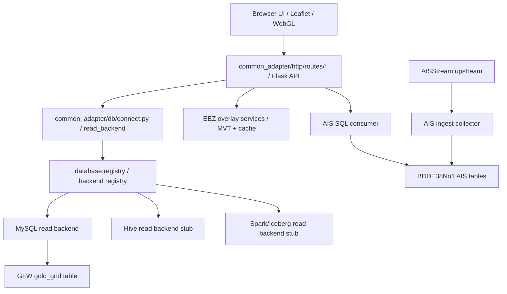
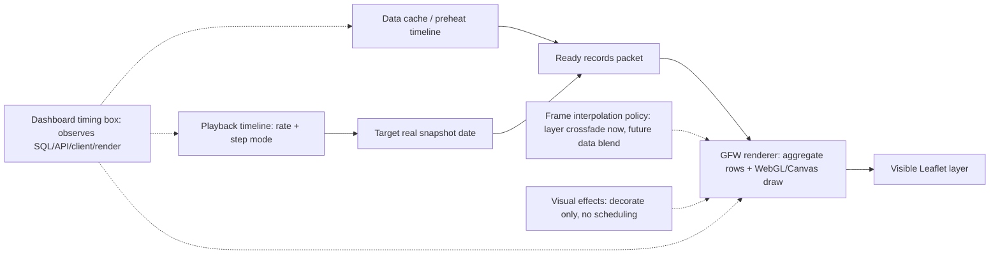
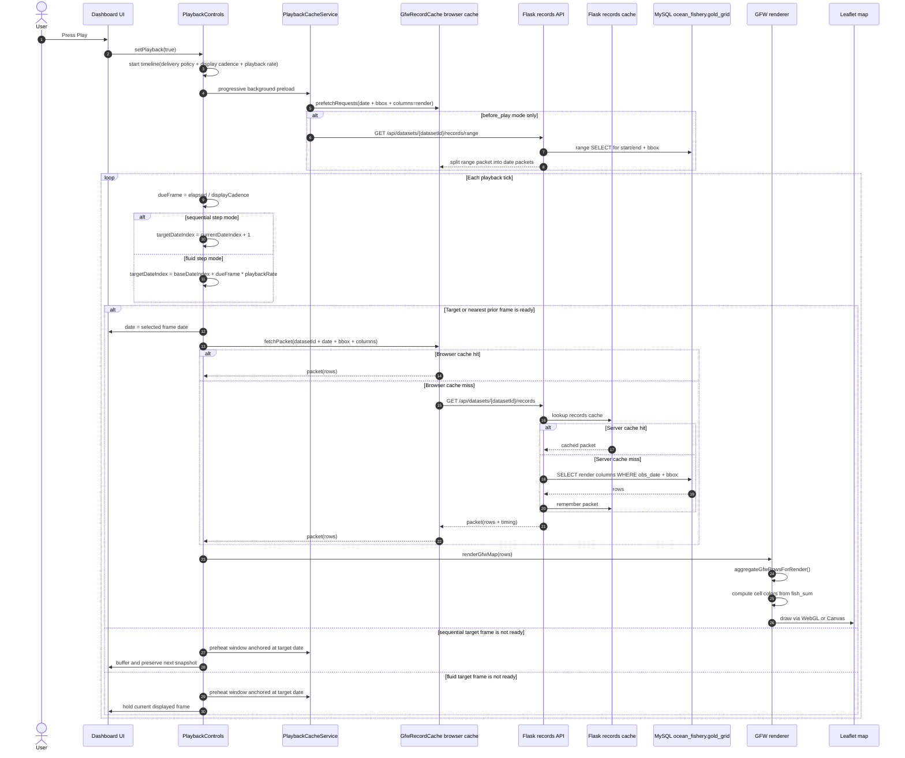
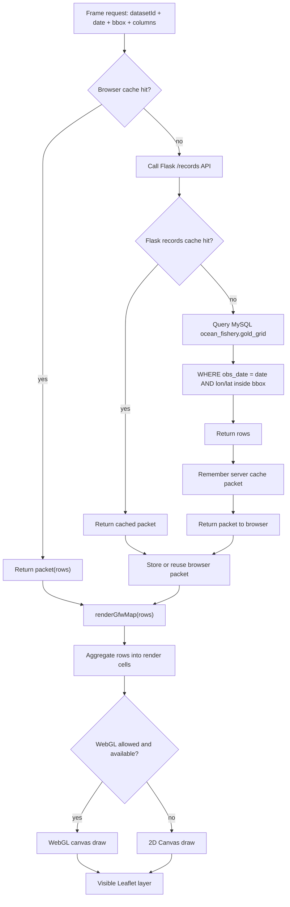
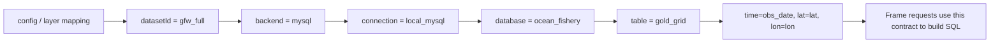

# Common Adapter

This is a local data adapter for exploring pluggable datasets with Flask, MySQL, PostGIS, and Leaflet.

The current app renders:

- GFW fishery grid records from MySQL, rendered through a WebGL-first map path with canvas fallback.
- AIS latest vessel positions from a live MySQL table maintained by a separate upstream collector.
- EEZ boundaries from PostGIS vector tiles and cached local vector data.
- A Leaflet map with table preview, timing metrics, render-state lights, time playback, fullscreen map mode, layer ordering, basemap controls, graticule controls, screenshot export, and per-layer style controls.

It is an experimental local tool. It is not a production GIS system.

Traditional Chinese documentation is available in [`README.zh-TW.md`](README.zh-TW.md).

## Upstream Handoff

Use `handoff/` when sharing this repo with upstream owners:

- `handoff/airflow_ais_crawler/` is for the Airflow/crawler owner. It explains the AISStream to SQL collector, the handoff JSON, SQL sink, timing, and health checks.
- `handoff/backend_config_contract/` is for the backend/system owner. It explains database config JSON, MySQL/Hive/Spark boundary planning, dataset fields, and the capability matrix for disabled future skin/display settings.

Do not send real API keys through tracked files. `config/runtime/adapter.local.json` and `config/sources/websocket/ais_collector.local.json` are local ignored files.

## Architecture

```text
core.py
  -> common_adapter/http/interface.py       Flask app factory and route assembly
  -> common_adapter/http/server.py          server lifecycle, PID, and port helpers
  -> common_adapter/http/routes/*           system, dataset, overlay, live, and developer routes
  -> common_adapter/db/connect.py           Dataset read backend dispatch
  -> common_adapter/db/backends/*           MySQL and future backend adapters
  -> common_adapter/db/registry.py          @database_backend registry
  -> common_adapter/ais/live.py             AIS live query packet
  -> common_adapter/ais/ingest.py           AISStream collector to SQL latest-state table
  -> common_adapter/spatial/overlay.py      EEZ overlay fallback helpers
  -> common_adapter/spatial/lod.py          PostGIS / MVT EEZ tile helpers
  -> templates/index.html      Leaflet UI shell
  -> static/js/*               Frontend state, API, layer, and UI modules
```

Legacy root module names such as `Interface.py` and `DatabaseConnect.py` remain as compatibility wrappers while the backend is moved into `common_adapter/`.

The frontend is deliberately split by responsibility:

- `static/app.js`: bootstraps the app and wires UI events.
- `static/js/core`: shared state, DOM, map, and geographic helpers.
- `static/js/services`: API client calls, GFW record cache/prewarm behavior, render intent, and shared service helpers.
- `static/js/layers`: GFW, AIS, and EEZ rendering behavior, plus GFW layer visual effects such as zoom blur and crossfade handoff.
- `static/js/rendering`: renderer capability checks, renderer selection, WebGL/canvas paint helpers, and GFW paint configuration.
- `static/js/playback`: playback controls, delivery policy, pure timeline scheduler, frame readiness buffer, playback renderer handoff, playback interpolation policy, playback telemetry, progressive prefetch controller, preheat service, worker policy, and snapshot splitting helpers.
- `static/js/ui`: table, playback, layer selector, map settings, and shared layer style controls.

Runtime pipeline:



The database read path is also split by responsibility:

- Decorators register available backend implementations, such as `@database_backend("mysql")`.
- JSON config selects the backend and connection per dataset.
- Route handlers call `schema_packet()` and `records_packet()` without knowing whether a dataset is backed by MySQL or a future Hive/Trino/Spark/Iceberg read model.

Example dataset routing:

```json
{
  "default_connection_ref": "local_mysql",
  "connections": {
    "local_mysql": {
      "kind": "mysql",
      "driver": "pymysql",
      "host": "127.0.0.1",
      "port": 3307,
      "user": "root",
      "password": "env:MYSQL_PASSWORD",
      "database": "common_fishery"
    },
    "class_hive": {
      "kind": "hive",
      "driver": "placeholder",
      "host": "hive-server.local",
      "port": 10000,
      "user": "hive",
      "password": "env:HIVE_PASSWORD",
      "database": "common_warehouse"
    }
  },
  "datasets": {
    "gfw_full": {
      "backend": "mysql",
      "connection_ref": "local_mysql",
      "table": "gold_grid"
    }
  }
}
```

Hive and Spark are intentionally registered only as explicit unsupported stubs in this version. They are reserved read-model extension points, not claimed working Hive, Spark, or Iceberg integrations.

Backend contract:

- `common_adapter/http/interface.py` owns Flask app assembly only; route modules own HTTP shape. Neither layer should know vendor-specific SQL, Hive, Spark, or Iceberg query details.
- `common_adapter/db/connect.py` owns config, shared query helpers, and dataset read dispatch. Backend classes live under `common_adapter/db/backends/`. The root `DatabaseConnect.py` file is only a compatibility wrapper.
- `common_adapter/db/registry.py` owns backend registration and backend instantiation. The root `database/registry.py` path is a compatibility wrapper.
- `config/*.json` owns backend selection, connection refs, and table/read-model names.
- Collector jobs own source-specific ingestion and sink-specific writes.
- Frontend layer code must consume API packets, not raw database credentials, raw source files, or collector paths.

## Features

### Data layers

The dataset selector supports these layers:

- `GFW fishery grid`
- `AIS vessel positions`
- `EEZ boundary overlay`

GFW and AIS are mutually exclusive primary data layers, but both can also be turned off. EEZ is an independent overlay and can be stacked with either primary layer.

Layer rows can be drag-reordered in the selector. The order controls map stacking by Leaflet pane z-index. Each layer has a gear panel:

- GFW exposes low/high gradient colors, max intensity, and alpha.
- AIS exposes collector key handoff plus density-grid or point-dot rendering.
- EEZ exposes fill color, boundary color, fill opacity, boundary opacity, and alpha.

The alpha and color controls are centralized in shared UI helpers so future layers should not copy one-off slider logic.

### Map

- Dark UI theme.
- Leaflet base map with selectable basemaps: light, dark, OSM, terrain, and satellite.
- Fullscreen map button.
- Fullscreen preserves the current geographic bounds instead of showing extra horizontal world copies.
- Map settings gear for scale bar, zoom buttons, mouse-wheel zoom, double-click zoom, dragging, screenshot export, and latitude/longitude graticule options.
- Latitude is clamped to avoid dragging into invalid north/south map bounds.
- EEZ uses vector tiles when available.

### Time controls

Time controls are enabled only when at least one selected layer exposes time capability. EEZ-only mode disables the single-day and time-sequence controls.

GFW currently supports:

- single-day mode
- latest available date jump
- start/end date range
- replay
- previous/next day
- play/pause
- playback speed

Playback scheduling is timeline-driven. Playback speed is a timeline rate, not the old "wait after the previous frame completes" loop. The default delivery policy is analysis mode: every selected real snapshot is consumed in order, and `playbackRate` changes the target cadence for the next snapshot. Smooth and strict delivery policy ports are visible in Settings but explicitly marked as not implemented, so they do not control the playback clock yet. Query and render work do not add another full interval after each frame. In progressive mode, playback starts without blocking for a full prebuffer; analysis mode enters buffering instead of skipping the next snapshot, pauses timeline progress while waiting, then emits a buffer resume event before the real snapshot is shown. Failed target requests are explicit frame-buffer failures, not endless `fetching` states; pause, replay, layer, and dataset changes invalidate stale background preheat progress.

The settings page exposes playback as separate responsibility boxes instead of one mixed control group:

- Playback timeline: delivery policy and `playbackRate` decide which real snapshot date the player is trying to show. Analysis mode is implemented; smooth and strict modes are reserved ports.
- Frame buffer: analysis mode reports `fetching/missing/ready/waiting/failed` state boundaries. The timing box records `buffering`, `resumed`, and `shown` events separately from SQL/API/render work.
- Data cache / preheat: range preheat, progressive prefetch, concurrency, and memory budget supply records packets.
- Frame interpolation: playback can use the existing layer crossfade as a visual-only interpolation policy or switch directly between real snapshots; data blending remains reserved for a future `requestAnimationFrame` loop backed by render artifacts.
- Visual effects: crossfade decorates layer replacement; Gaussian blur is limited to zoom / LOD reload masking.
- Render pressure and timing: renderer policy and the dashboard timing box observe performance without owning the playback clock.

Playback invariants are covered by `tests/playback_contracts.test.mjs` and can be run with:

```powershell
python scripts/playback_contract_smoke.py
```

The guarded contracts are:

- `analysis` delivery uses `sequential` stepping: even if the clock is late or the speed is 4x, the next render target is always `currentIndex + 1`.
- Buffering can shift the scheduler clock, but it must not advance the selected date until the target frame is ready.
- Progressive cold cache reports `fetching 0 / 1`; when the target packet is ready it resumes as `1 / 1` and then records `shown`.
- Progressive request failures report `failed`, emit an error event in the timing box, and stop playback after the retry ceiling instead of retrying forever.
- Cancelled or replaced progressive preheats cannot apply late progress, status, or failure state to the current playback generation.
- `off` and `before_play` are not frame-buffer gated; they may still use existing cache, but they do not enter the analysis buffering contract.
- `fluid` is the only step mode allowed to map elapsed time to future dates. It remains reserved behind the disabled smooth delivery port.
- Prefetch, render, interpolation, blur, and timing observations supply or decorate frames; none of them owns the playback date clock.

Current frontend module boundaries:

| Module | Boundary |
| --- | --- |
| `static/js/playback/playback-delivery-policy.js` | Playback delivery policy: the single high-level owner for analysis/smooth/strict timeline semantics. Only analysis mode is enabled today; smooth and strict are exposed as reserved ports. |
| `static/js/playback/playback-scheduler.js` | Pure timeline math: cadence, due frame, speed/rate mapping, and target date index. |
| `static/js/playback/playback-frame-buffer.js` | Frame readiness decisions: missing/fetching/ready/waiting/failed state packets, target-frame buffering, and nearest ready frame selection. |
| `static/js/playback/playback-renderer.js` | Playback-to-render handoff: set selected date, sync controls, call the existing active-layer reload. |
| `static/js/playback/playback-interpolation-controller.js` | Playback interpolation policy: choose layer crossfade or direct switching during playback; data blending is not enabled yet. |
| `static/js/playback/playback-prefetch-controller.js` | Progressive prefetch policy: decide whether to queue a background preheat window and which date anchors it. |
| `static/js/playback/playback-cache-service.js` | Actual preheat/cache execution, progress state, request-level failure tracking, stale background cancellation, concurrency, and cache capacity accounting. |
| `static/js/playback/playback-telemetry.js` | Playback control events sent to the timing panel, separate from SQL/API/render timings. |
| `static/js/layers/gfw-layer-effects.js` | Visual-only GFW layer effects: zoom/LOD blur, reveal, retired-layer cleanup, and crossfade. |
| `static/TimingMetrics.js` | Timing panel state, dynamic/persistent/event lanes, and snapshot timing history. |



AIS is live viewport mode and does not use the date player.

### Timing panel

The timing drawer reports:

- SQL query time
- serialization time
- API total time
- client fetch-to-render time
- EEZ tile timing
- render-state gate for GFW, AIS, and EEZ readiness
- selected GFW render backend and draw timing
- row count

`rendering` timing is client draw time for the selected backend. It is not a claimed time saving. `fetch-to-render` remains the broader user-facing latency from API request through visible map update.

### Rendering and cache behavior

The app asks `/api/render/capability` for backend policy and inspects browser WebGL support. GFW rendering prefers WebGL when available and falls back to the canvas layer when not.

GFW records use a viewport/zoom-aware cache:

- Panning at the same zoom level keeps the current LOD packet when the cache key still matches.
- Zoom changes mark GFW as loading, apply the optional zoom blur mask, clear the stale LOD key, and fetch the new LOD packet.
- Date-to-date playback frame changes do not use Gaussian blur; they rely on cache readiness, renderer work, and layer crossfade.
- After a successful render, the client prewarms the other configured zoom/LOD packets in the background.
- Prewarm is opportunistic. It must not change the visible map until the requested render state is ready.

EEZ is treated closer to a basemap overlay: local vector data and PostGIS vector tiles are reused as much as possible, and pan-only movement should not force a full EEZ reload.

### GFW playback frame lifecycle

GFW playback frames are not read from a per-frame file. A frame is a records packet identified by:

```text
datasetId + date + bbox + limit + columns
```

For the local GFW route, `datasetId = gfw_full` resolves through config and layer mapping to the MySQL table `ocean_fishery.gold_grid`. The mapping/config layer is a route contract: it says which backend, connection, table, and time/lat/lon columns to use. It is not the frame data itself. On a cold miss, the frame rows come from MySQL; on a warm path, they come from the browser `GfwRecordCache` or the Flask-side records cache.

`columns=render` intentionally requests only the columns needed by the renderer, such as time/id/lat/lon and available render metrics like `fish_sum`, `fish_ratio`, and `vessels`. It is separate from the full display-table column set.



Frame source resolution:



Config and layer mapping role:



### EEZ bootstrap and spatial route injection

EEZ is a SPATIAL route, not a DATABASE route. Its portable contract lives in `config/examples/sources/spatial/eez.example.json`.

The route has four boundaries:

1. Source asset: a cached Marine Regions EEZ GPKG or zip lives under `data/eez/` when a PostGIS import is needed.
2. Spatial provider: `provider: "postgis"` imports the cached GPKG into the configured PostGIS tables.
3. Layer contract: EEZ is exposed as an overlay layer, not as a normal SQL dataset.
4. Frontend renderer: Leaflet consumes MVT/vector packets and applies the existing EEZ LOD/cache behavior.

The source file is an app-managed cache, not a browser cache. Closing the browser does not remove it. In Docker or another deployed environment, mount `data/eez/` or another configured cache path as a persistent volume.

Default source:

```json
{
  "source": {
    "kind": "remote_gpkg_zip",
    "url": "https://www.marineregions.org/download_file.php?name=World_EEZ_v12_20231025_gpkg.zip",
    "source_page": "https://www.marineregions.org/downloads.php",
    "archive_path": "data/eez/World_EEZ_v12_20231025_gpkg.zip",
    "cache_path": "data/eez/eez_v12.gpkg",
    "form": {
      "name": "RRKAL Common Adapter",
      "organisation": "RRKAL",
      "email": "rrkal.common.adapter@example.com",
      "country": "Taiwan (Province of China)",
      "user_category": "academia",
      "purpose_category": "Data exploration & testing"
    }
  },
  "auto_download": true,
  "auto_import": true
}
```

Marine Regions returns an interactive download form before serving the zip. The downloader automates that form using `source.form`, preserves cookies from the first request, submits the disclaimer agreement, and validates that the final response is a real zip before saving it. You can replace the form metadata in local config if the project should report a different contact.

Manual bootstrap:

```powershell
.\.venv\Scripts\python.exe core.py --config config\runtime\adapter.local.json bootstrap-eez
```

Normal startup:

```powershell
docker compose up -d postgis
.\.venv\Scripts\python.exe core.py --config config\runtime\adapter.local.json serve
```

`serve` runs the same EEZ bootstrap before dependency checks. If `data/eez/eez_v12.gpkg` is absent and `auto_download` is true, startup downloads the Marine Regions zip through the automated form flow and extracts the matching GPKG. If PostGIS is enabled and the EEZ tables are missing or empty, startup imports the GPKG into `eez_v12`, `eez_v12_tile`, and `eez_v12_boundary`.

### AIS upstream ingest

AIS live data is intentionally split into two processes:

- `core.py serve` runs the local map UI and reads AIS from SQL.
- `core.py ingest-ais` runs a long-lived upstream AISStream collector and writes SQL latest-state rows.

The collector is not a frontend feature. It is an upstream data service whose job is to keep a durable AIS base table warm even when the map is closed. It can later be handed to the upstream/Airflow owner as a scheduled or long-lived data collection job. It upserts by `mmsi`, so the latest-state table keeps one current row per vessel instead of growing without bound. The map then queries that SQL table by viewport.

AIS latest-state reads must not impose an artificial total-row cap. The map may constrain reads by viewport, freshness, and future LOD representation, but `live.ais.limit: "max"` means the SQL query is unbounded and does not inherit `query_policy.max_limit`. If a numeric `live.ais.limit` is configured, it is treated as an explicit diagnostic cap, not the default product behavior.

Crawler timing lives in the crawler handoff JSON, not in the map rendering path. During local + Airflow dual-machine testing, `ingest_reconnect_seconds` and `ingest_status_report_seconds` default to 30 seconds to avoid two machines creating tight reconnect/status loops with the same upstream AIS key. After the collector is owned by one machine, those values can be lowered in the crawler JSON/secret, such as 3 seconds, without changing the map consumer.

This is a strict boundary:

- The map is a consumer.
- The collector is an upstream data feeder.
- The map must not directly consume AISStream for rendering.
- The map must not clean, crawl, or own upstream AIS collection.
- The collector writes SQL rows and a collector heartbeat row into `live.ais.ingest_meta_table`.
- The map reads SQL only after its locally configured collector key matches the collector key fingerprint in SQL metadata.

That internal key check is not a public auth system. It is a local boundary marker for this prototype: a normal user configures the AIS key once in the UI, the UI writes only a key fingerprint into the active WEBSOCKET route config, writes the raw key into the crawler handoff file at `config/sources/websocket/ais_collector.local.json`, and the map verifies that the SQL table is being maintained by the matching collector before it reads from it. Do not return the raw key from HTTP APIs, and do not use this key check as permission to blur the consumer/upstream boundary.

Future public setup can replace the local handoff file with a K8 Secret, Airflow variable, or upstream service registration. That handoff belongs to the crawler/upstream side, not to the map rendering path.

For the upstream owner, the handoff JSON should stay simple: upstream key, crawler timing, and destination sink. Changing polling/reconnect timing or changing the destination from local MySQL to another SQL/Hive-facing sink is crawler configuration work, not map UI work.

AIS SQL reads and writes may use `live.ais.connection_ref` to point at a shared entry in `connections`. The older inline `live.ais.connection` object remains supported for local overrides, but new deployments should prefer `connection_ref` so the SQL destination can move without changing AIS query/write code.

Minimal crawler handoff shape:

```json
{
  "schema": "rrkal.ais.collector_handoff.v1",
  "role": "upstream_ais_collector",
  "provider": "aisstream",
  "api_key": "<AISSTREAM_API_KEY>",
  "ingest": {
    "reconnect_seconds": 30,
    "status_report_seconds": 30,
    "flush_seconds": 1.0,
    "batch_size": 250,
    "meta_table": "ais_ingest_meta"
  },
  "sql": {
    "connection": {
      "host": "127.0.0.1",
      "port": 3306,
      "user": "root",
      "password": "env:RRKAL_AIS_MYSQL_PASSWORD"
    },
    "database": "BDDE38No1",
    "table": "ais_positions"
  }
}
```

To change the sink, edit only the collector-side `sql` section: `connection.host`, `connection.port`, `database`, and `table`. If the upstream owner later writes into Hive instead of MySQL, that change belongs to the collector/sink adapter and its config; the map should continue consuming the agreed read model rather than calling AISStream directly.

If historical tracks are needed later, add a separate history/events table with an explicit retention policy. Do not overload the latest-state table with unbounded event history.

### Upstream collectors

GFW ingestion is a reusable upstream collector job, not a frontend feature:

- `collectors/gfw_collector.py` imports a configured GFW DuckDB source into the SQL read model.

The map UI must not learn raw source paths or temporary manifests. Those belong to collector configuration. The app should consume SQL tables or later service responses only.

## Requirements

- Python 3.11+
- MySQL-compatible server
- PostgreSQL + PostGIS for EEZ vector tiles
- 7-Zip for extracting the temporary test-data archive
- Node.js only for local JavaScript syntax checks

Python dependencies are listed in `requirements.txt`.

## Quick Start

From the repo root:

```powershell
py -3 -m venv .venv
.\.venv\Scripts\python.exe -m pip install -r requirements.txt
Copy-Item config\examples\runtime\adapter.example.json config\runtime\adapter.local.json -Force
```

Use `config\router_manifest.local.json` to select the active route fragments. Keep local database settings in a DATABASE fragment such as `config\database.local.json`, spatial overlay settings in a SPATIAL fragment such as `config\spatial.eez.local.json`, and websocket/source settings in a WEBSOCKET fragment such as `config\websocket.aisstream.local.json`.

Local config files are ignored by git. Keep real passwords in local fragments or in environment variables.

## EEZ PostGIS Dependency

EEZ is a hard runtime dependency when `overlays.eez.provider` is `postgis`. The app renders EEZ through PostGIS MVT tables, not directly from the `.gpkg` file during normal map use.

Start the local PostGIS service:

```powershell
docker compose up -d postgis
```

Download/cache the Marine Regions EEZ GPKG and import it into PostGIS:

```powershell
.\.venv\Scripts\python.exe core.py --config config\runtime\adapter.local.json bootstrap-eez
```

Check runtime dependencies before serving:

```powershell
.\.venv\Scripts\python.exe core.py --config config\runtime\adapter.local.json check-dependencies
```

`core.py serve` checks EEZ runtime assets and then runs the dependency check before opening the Flask server. If the local GPKG cache is missing and `auto_download` is true, startup downloads and extracts it first. If `eez_v12`, `eez_v12_tile`, or `eez_v12_boundary` is missing or empty and `auto_import` is true, startup imports from the GPKG before serving.

For AIS, use an environment variable instead of committing a password:

```powershell
$env:RRKAL_AIS_MYSQL_PASSWORD = "your-password"
```

Start only the AIS upstream collector:

```powershell
.\.venv\Scripts\python.exe core.py --config config\runtime\adapter.local.json ingest-ais
```

Or pass an explicit crawler handoff JSON for an Airflow/K8 worker:

```powershell
.\.venv\Scripts\python.exe core.py --config config\runtime\adapter.local.json ingest-ais --collector-config config\sources\websocket\ais_collector.local.json
```

`ingest-ais` reads `config/sources/websocket/ais_collector.local.json` when it exists, then writes the latest-state table and the `ais_ingest_meta` heartbeat table. The handoff file is gitignored because it contains the upstream AIS key. The active WEBSOCKET route config should keep only the key fingerprint for the consumer-side SQL read gate.

For Airflow, Windows Task Scheduler, NSSM, Docker, or K8, run the same command as the collector task and provide the same SQL connection plus the crawler handoff/secret. The Flask UI does not need to be running for the collector to keep warming SQL.

Start the map UI:

```powershell
.\.venv\Scripts\python.exe core.py --config config\runtime\adapter.local.json serve
```

The server is intentionally single-instance. On startup it reads `flask_pid.txt`, force-exits the previous local Flask server when it is still running, clears the configured port when needed, and writes the new PID. This prevents duplicate AIS or database query loops from running at the same time.

Open:

```text
http://127.0.0.1:5057
```

## Import GFW Data

Import a DuckDB table into MySQL:

```powershell
.\.venv\Scripts\python.exe core.py --config config\runtime\adapter.local.json import --source "C:\path\to\gfw_full.duckdb" --replace
```

Import a smaller sample:

```powershell
.\.venv\Scripts\python.exe core.py --config config\runtime\adapter.local.json import --source "C:\path\to\gfw_full.duckdb" --replace --row-limit 5000
```

## Docker Compose

The repo includes `docker-compose.yml` for local service support. Adjust ports and passwords in your local config before use.

```powershell
docker compose up -d
```

## API Surface

Health:

```text
GET /api/health
```

Datasets:

```text
GET /api/datasets
GET /api/datasets/<dataset_id>/schema
GET /api/datasets/<dataset_id>/records?date=YYYY-MM-DD&bbox=west,south,east,north&limit=max
GET /api/datasets/<dataset_id>/records/range?start=YYYY-MM-DD&end=YYYY-MM-DD&bbox=west,south,east,north&limit=max
```

EEZ:

```text
GET /api/overlays/eez
GET /api/overlays/eez/tiles/<z>/<x>/<y>.pbf
GET /api/overlays/eez/boundary/tiles/<z>/<x>/<y>.pbf
```

AIS:

```text
GET /api/live/ais?bbox=west,south,east,north
GET /api/live/ais/ingest/status
GET /api/live/ais/settings
GET /api/live/ais/diagnostics
POST /api/live/ais/settings
DELETE /api/live/ais/settings
```

Rendering capability:

```text
GET /api/render/capability
```

## Validation

Demo-critical smoke:

```powershell
python scripts\demo_smoke.py --base-url http://127.0.0.1:5081
```

JavaScript syntax check:

```powershell
Get-ChildItem static\js -Recurse -Filter *.js | ForEach-Object { node --check $_.FullName }
node --check static\app.js
```

Git whitespace check:

```powershell
git diff --check -- static templates scripts *.py config requirements.txt docker-compose.yml README.md
```

## Notes

- Do not commit `config/runtime/adapter.local.json`.
- Do not commit runtime logs, PID files, database files, or downloaded datasets.
- Use environment variables for local secrets.
- This app is designed as a small local exploratory adapter. Keep data access, rendering, and UI behavior separated as the feature set grows.
- EEZ country/claim attribution is not implemented yet. The current EEZ layer draws geometry only; identifying which country or claim owns a maritime zone requires a separate attribution field, tooltip/pick query, and UI treatment.
- AISHub polling remains a reserved fallback path. The MVP path is AISStream collector to SQL, then map consumption from SQL.
