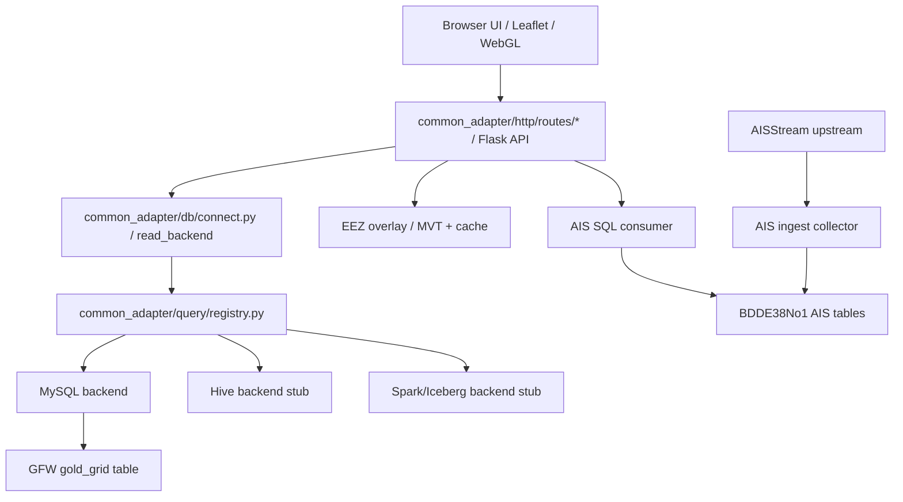
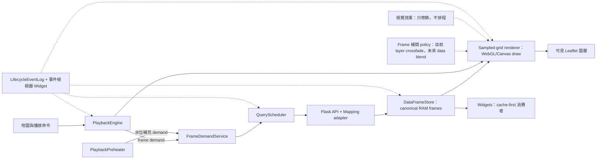
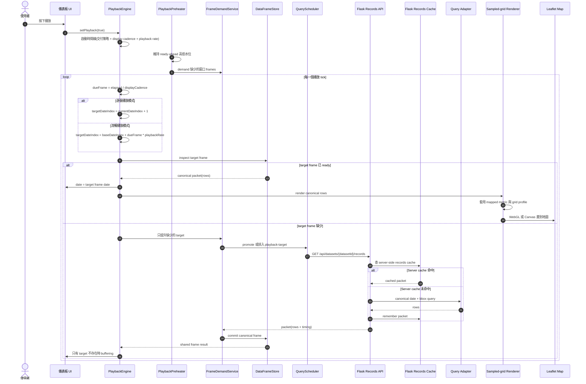
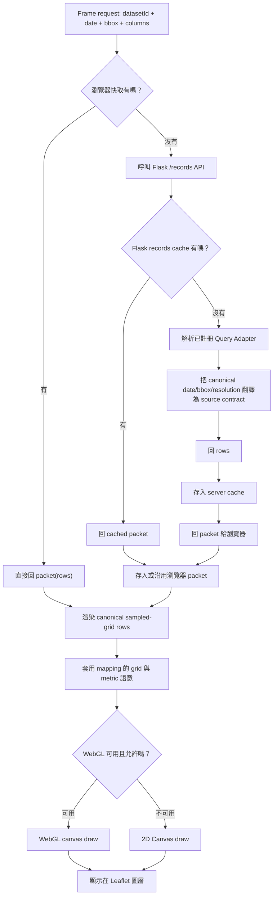
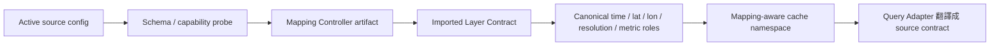

# Common Adapter

這是一個本機資料探索與轉接工具，用 Flask、MySQL、PostGIS、Leaflet 與前端 WebGL/Canvas 管線，把 GFW、AIS 與 EEZ 等資料接到同一個地圖介面上。

它目前是研究與原型工具，不是正式 GIS 產品，也不是資料上游的最終治理系統。

## 目前能力

- GFW 漁業網格資料：從 MySQL read model 讀取，前端優先使用 WebGL 繪製，無 WebGL 時退回 Canvas。
- AIS 船舶位置：前端只消費 SQL 裡的最新狀態表；AISStream 由獨立 collector 長駐寫入 SQL。
- EEZ 經濟海域：使用 PostGIS MVT tiles 與本機快取向量資料。
- 地圖 UI：支援資料集選擇、圖層排序、圖層齒輪設定、暗色模式、底圖切換、經緯網格、比例尺、全螢幕、截圖、測速欄、渲染 ready 燈號、時間播放與播放快取預熱。
- 設定頁：保留資料源、圖層與播放行為的設定入口，避免把所有控制塞在儀表板同一層。

外部 Chrome 無痕模式的全年冷／暖快取驗收結果記錄在
[`benchmarks/playback_lifecycle_acceptance_2026-07-15.md`](benchmarks/playback_lifecycle_acceptance_2026-07-15.md)。
第二輪 Runtime OOP 收斂後的全年回歸結果記錄在
[`benchmarks/runtime_oop_acceptance_2026-07-15.md`](benchmarks/runtime_oop_acceptance_2026-07-15.md)。

## 專案邊界

這個 repo 的主要角色是「消費端」：

- 消費 SQL/read model。
- 消費 PostGIS/MVT 或未來資料服務。
- 負責地圖視覺化、LOD、播放、快取與互動。

它不是正式的上游治理系統。但 AIS 目前缺少可直接使用的基礎資料庫，因此 repo 內保留一個例外的上游 collector：

- `core.py ingest-ais`
- `common_adapter/ais/ingest.py`
- `common_adapter/ais/stream.py`
- `config/runtime/ais_collector.local.json`

這個 collector 是為了養出可被小可愛消費的 AIS SQL 資料庫。未來若上游同學用 Airflow、K8、Hive、Spark/Iceberg 或其他 sink 接手，只要維持 read model 與 config contract，小可愛就不需要直接碰 AISStream。

## Handoff 交接文件

交接上游時看 `handoff/`：

- `handoff/airflow_ais_crawler/`：給 Airflow / crawler 負責人。重點是 AISStream collector、輪詢/重連設定、SQL sink、健康檢查與啟動方式。
- `handoff/backend_config_contract/`：給後端 / 系統負責人。重點是 `adapter` JSON、連線設定、MySQL/Hive/Spark 邊界、dataset 欄位與 capability matrix。

不要把真實 API key、資料庫密碼或本機私有路徑 commit 進 repo。真實值應放在：

- `config/runtime/adapter.local.json`
- `config/runtime/ais_collector.local.json`
- 環境變數
- 之後的 K8 Secret / Airflow Variable

## 架構總覽

```text
core.py
  -> common_adapter/http/interface.py       Flask app factory / route assembly
  -> common_adapter/http/server.py          server lifecycle / PID / port helpers
  -> common_adapter/http/routes/*           system / dataset / overlay / live / developer routes
  -> common_adapter/db/connect.py           dataset read dispatch
  -> common_adapter/db/backends/*           MySQL 與未來 backend adapters
  -> common_adapter/query/registry.py       database / endpoint 共用 query-adapter registry
  -> common_adapter/query/identity.py       mapping-aware cache namespace
  -> common_adapter/ais/live.py             AIS SQL consumer packet
  -> common_adapter/ais/ingest.py           AISStream upstream collector to SQL latest-state table
  -> common_adapter/spatial/overlay.py      EEZ fallback helpers
  -> common_adapter/spatial/lod.py          PostGIS / MVT EEZ tile helpers
  -> templates/index.html      Leaflet UI shell
  -> static/js/*               前端 state、API、layer、rendering、UI 模組
```

Runtime 只引用 `common_adapter/` 的正式模組。舊 root modules 與 `database/registry.py` 相容入口已刪除；新程式不得重新依賴這些路徑。

前端 Runtime 的狀態所有權、DI composition root、class 判定與後續 Application Service 規範見 [`docs/architecture/runtime-oop.md`](docs/architecture/runtime-oop.md)。

前端拆分：

- `static/app.js`：啟動 app，綁定 UI 與事件。
- `static/js/core`：共用 state、DOM、map、geo、render-state。
- `static/js/services`：render intent、中央 query coordinator、sampled-grid canonical cache、API client 與共用 service helper。
- `static/js/playback`：播放控制、純時間線 scheduler、frame readiness buffer、playback renderer handoff、playback interpolation policy、telemetry、獨立水位預熱器與 snapshot splitter。
- `static/js/layers`：GFW、AIS、EEZ、graticule 圖層行為，以及 GFW zoom blur / crossfade 視覺效果邊界。
- `static/js/rendering`：WebGL/Canvas 能力檢查、renderer registry、GFW paint 設定。
- `static/js/ui`：table、播放控制、圖層選單、地圖設定、圖層樣式設定。

## 資料流



## Database backend 模式

資料來源讀取端以 config + query-adapter registry 解耦：

- `@query_adapter("mysql")` 註冊 database 或 endpoint adapter。
- `config/state/router_manifest.local.json` 決定目前啟用哪些 route fragments；DATABASE fragment 決定 dataset 使用哪個 backend、connection、table。
- `common_adapter/http/interface.py` 只負責 Flask app 組裝；HTTP shape 由 `common_adapter/http/routes/*` 管理。兩者都不應知道 MySQL、Hive、Spark 或 Iceberg 的查詢細節。
- `common_adapter/db/connect.py` 負責共用 database query helper 與 read dispatch；backend classes 位於 `common_adapter/db/backends/`。
- `common_adapter/query/registry.py` 統一負責 database 與 endpoint adapter 的 registration / instantiation。
- 外部欄位名稱只能留在 source adapter 與 mapping 邊界；runtime、cache、renderer 與 Widgets 只認 canonical roles。

Hive 與 Spark 目前只是明確保留的 unsupported stub。這代表架構上有位置，不代表目前已經完成 Hive、Spark 或 Iceberg 連線。

## 圖層

資料圖層選單由已導入的 Layer Contract 動態建立，不是前端寫死三個選項：

- Mapping Controller 產生的 sampled-grid 資料集
- active websocket/read-model route 提供的 AIS 船舶位置
- active spatial route 提供的 EEZ 經濟海域邊界

主資料圖層由啟用狀態控制，可以全部關閉；未勾選的 imported layer 不得查詢也不得渲染。EEZ 是獨立 overlay。圖層可拖拉排序，齒輪會依 Layer Contract 暴露 metric、resolution、顏色、alpha 與顯示模式。

## 時間與播放

時間控制只有在選中的資料層具備時間能力時啟用。EEZ-only 模式會把日期與播放控制灰掉。

具時間能力的 sampled-grid 圖層支援：

- 單日模式
- 跳到最後一日
- 起訖日期
- replay
- 前一日 / 後一日
- 播放 / 暫停
- 播放速度
- 播放期間的獨立水位預熱

播放排程以時間線為主控：播放速度是時間軸倍率，不是舊的「上一格完成後再等待」迴圈。預設交付策略是分析模式：每一張選取範圍內的真實 snapshot 都會依序消耗，`playbackRate` 只改變下一張 snapshot 的目標節拍。設定頁已暴露流暢與嚴格模式端口，但兩者明確標示為尚未實作，因此現階段不會接管播放 clock。查詢與渲染工作不會在每格後再額外疊一個完整 interval。progressive 模式不會為了完整 prebuffer 阻塞開播；分析模式會進入 buffering 而不是跳過下一張，等待期間不推進播放進度，frame ready 後會先記錄 resumed，再顯示真實 snapshot。target request 失敗會成為明確的 frame-buffer failed 狀態，不會永遠停在 `fetching`；暫停、重播、切圖層與切資料集會讓舊背景預載進度失效。

設定頁把播放器拆成多個責任 box，而不是把所有選項混在同一個控制面：

- 播放時間軸：播放交付策略與 `playbackRate` 決定播放器正在追哪一張真實 snapshot。分析模式已實作；流暢與嚴格模式是已暴露但未啟用的保留端口。
- Frame buffer：分析模式會回報 `fetching/missing/ready/waiting/failed` 邊界；測速 box 會把 `buffering`、`resumed`、`顯示 snapshot` 與 SQL/API/render 分開觀測。
- 資料快取 / 預熱：獨立生產者維持 ready-ahead 高低水位；scheduler 並行數與 RAM 容量限制其工作。
- Frame 補間：播放可選用現有 layer crossfade 作為純視覺補間，也可在播放時直接切換真實 snapshot；真正資料 blend 仍保留給未來由 render artifact 支撐的 `requestAnimationFrame` 循環。
- 視覺效果：淡入淡出只修飾 layer 替換；高斯模糊只限縮放 / LOD 重算時遮罩。
- 渲染壓力與測速：renderer policy 與儀表板測速 box 只觀測或降級，不擁有播放 clock。

播放器不變式由 `tests/playback_contracts.test.mjs` 保護，可用下列命令執行：

```powershell
python scripts/playback_contract_smoke.py
```

目前鎖住的契約：

- `analysis` 交付策略使用 `sequential` 步進：即使 clock late 或速度是 4x，下一個 render target 仍必須是 `currentIndex + 1`。
- buffering 可以平移 scheduler clock，但 frame ready 前不能推進選取日期。
- progressive cold cache 會回報 `fetching 0 / 1`；target packet ready 後以 `1 / 1` resumed，然後才記錄 `顯示 snapshot`。
- progressive request 失敗會回報 `failed`、在測速 box 留下錯誤事件；若 target frame 長時間等不到，會在等待逾時後停止播放，而不是無限等待。
- 被取消或被取代的 progressive preheat，不得把 late progress、status 或 failure state 套到目前播放 generation。
- 播放器不等待完整預熱批次。獨立預熱器逐張補足至高水位，播放器持續消費 ready frame；只有當下 target 缺少時才可進入 `BUFFERING`。
- `fluid` 是唯一允許把 elapsed time 映射到未來日期的 step mode；目前仍保留在 disabled 的流暢交付端口後面。
- prefetch、render、interpolation、blur 與測速觀測只供應或修飾 frame，不擁有播放日期 clock。

目前前端 module 邊界：

| Module | 邊界 |
| --- | --- |
| `static/js/playback/playback-delivery-policy.js` | 播放交付策略：analysis / smooth / strict 時間軸語意的唯一上層入口。目前只啟用分析模式；流暢與嚴格模式明確標示為保留端口。 |
| `static/js/playback/playback-scheduler.js` | 純時間線計算：cadence、due frame、speed/rate 映射與目標日期 index。 |
| `static/js/playback/playback-frame-buffer.js` | frame readiness 決策：missing/fetching/ready/waiting/failed 狀態 packet、target-frame buffering，以及最近 ready frame 選擇。 |
| `static/js/playback/playback-renderer.js` | 播放器到渲染的 handoff：設定選取日期、同步控制狀態、呼叫既有 active-layer reload。 |
| `static/js/playback/playback-interpolation-controller.js` | 播放補間 policy：播放時選擇 layer crossfade 或直接切換；資料 blend 尚未啟用。 |
| `static/js/services/frame-identity.js` | canonical BBOX signature、request intent key、scope key 與回傳 frame key 的唯一建構器。 |
| `static/js/services/data-frame-store.js` | Canonical RAM frame store：intent/frame alias、局部 coverage 合成、pin/release、LRU 淘汰與 failure state；不執行 transport。 |
| `static/js/services/layer-query-coordinator.js` | QueryScheduler：相同 intent 單次執行、queued task 提升、consumer scope 取消與前景保留槽。 |
| `static/js/services/frame-demand-service.js` | sampled-grid 唯一 transport 邊界；先查 `DataFrameStore`，miss 才排程，回傳後只提交一次 canonical packet。 |
| `static/js/playback/playback-preheater.js` | 長時間存在的生產者，獨立維護 ready-ahead 高低水位，不擁有播放 clock。 |
| `static/js/playback/playback-engine.js` | 純 frame 消費者與播放生命週期 owner；只要求缺少的 target、pin 可見 frame，並記錄 buffering/render 事件。 |
| `static/js/playback/playback-cache-service.js` | 播放快取設定與狀態 facade；只暴露水位與 RAM 容量，不擁有 transport 或 batch pipeline。 |
| `static/js/services/lifecycle-event-log.js` | 有界事件記錄、Run 匯出，以及 Queue/HTTP/cache/render/stall 體感指標。 |
| `static/js/ui/widgets/capabilities/event-viewer.js` | 唯讀生命週期事件檢視器 Widget，支援 Run/資料集/事件篩選與 JSON 匯出。 |
| `static/js/playback/playback-telemetry.js` | 播放控制事件送進測速 box，和 SQL/API/render timing 分開。 |
| `static/js/layers/gfw-layer-effects.js` | 純視覺 sampled-grid layer effects：zoom/LOD blur、reveal、retired-layer cleanup 與 crossfade。檔名是歷史名稱，只輸出 `SampledGridLayerEffects`。 |
| `static/TimingMetrics.js` | 測速 box 狀態、dynamic/persistent/event lanes 與 snapshot timing history。 |



AIS live 模式目前不走日期播放器。

## 播放快取與預熱

播放快取是 sampled-grid 查詢管線的一部分：

- `static/js/playback/playback-cache-service.js` 提供水位、容量與狀態顯示；實際補充生命週期由 `PlaybackPreheater` 擁有。
- `static/js/playback/playback-controls.js` 保留控制器事件、按鈕狀態、播放節奏與設定視窗。
- 預熱器在圖層、日期範圍與查詢 scope 確定後獨立運作；低於低水位時非同步補到高水位。
- 預熱器 `FETCHING` 與播放器 `PLAYING` 可同時成立。只有 target frame miss 且前方已無 ready frame 時，播放器才進入 `BUFFERING`。
- 快取有容量上限，預設 2 GB，可在播放設定中調整。
- 快取生命週期以瀏覽器頁面為主；關閉頁面後可視為釋放。
- HTTP sampled-grid adapter 另有 server-side canonical source snapshot cache；`query_policy.snapshot_cache_max_rows` 是跨 dataset namespace 的全域 row budget，不會讓每個資料集各自無上限常駐。

設計原則：地圖擁有 source query 意圖與最高優先序；播放負責供應時間窗口，Widgets 優先消費已完成快照。取消預熱或 Widget 插隊只能取消未完成任務，不得清除 canonical cache。

## Sampled-grid 查詢與快取生命週期

每一個 frame 是 canonical records packet，主要由下面這組 key 決定：

```text
mapping-aware cache namespace + date + bbox + limit + columns + resolution/LOD context
```

cache namespace 由目前 mapping contract 推導，包含 source route、canonical 欄位角色、grid profile、resolution policy 與 query contract。只要 mapping 語意改變，就會使用新的 namespace；密碼與純視覺設定不影響資料快取身分。冷路徑由 `FrameDemandService` 要求 `QueryScheduler` 排入唯一 source request，再由 `DataFrameStore` 保存 canonical 結果；暖路徑讓地圖、播放、選取工具與 Widgets 共用同一份 packet。

只有地圖/query layer 擁有 source transport。地圖 request 的 scheduler 優先序最高；Widget 先查 canonical cache，miss 時只能透過 coordinator 排入較低優先序的 fill。表格工具是嚴格唯讀的目前快照快取檢閱器，不能向 source 發 request。

來源錯誤語意由 Mapping 翻譯。`snapshot.no_data` 把來源特有的缺 partition 錯誤轉成空的 canonical snapshot 並做負快取；`snapshot.retry` 只處理有限次的瞬時錯誤重試；`resolution_policy` 只在來源確實有較粗 LOD 時降級。三者不能混用。



Frame 來源判斷：



Config 與 layer mapping 的角色：



## 渲染與 LOD

GFW 渲染優先走 WebGL，無法使用時回退 Canvas。GFW record cache 會依 viewport、zoom、date、dataset 與粒度建立快取。

目前行為：

- 同 zoom 平移時盡量沿用既有 LOD packet。
- zoom 改變時會標記 GFW loading、套用可選的縮放模糊遮罩、清除舊 LOD key，並重新抓取 LOD packet。
- 日期播放換幀不再套用高斯模糊；它依賴快取 readiness、renderer 工作與 layer crossfade。
- 成功渲染後會在背景預熱其他設定過的 zoom / LOD packet。
- GFW 支援漸層色票、alpha、最大強度與粒度控制。

EEZ 被視為接近底圖的 overlay，應盡量重用向量 tile / local vector cache，而不是每次平移都重新載入。

## AIS collector

AIS 拆成兩個進程：

```powershell
.\.venv\Scripts\python.exe core.py --config config\runtime\adapter.local.json serve
```

負責地圖與 API。

```powershell
.\.venv\Scripts\python.exe core.py --config config\runtime\adapter.local.json ingest-ais --collector-config config\runtime\ais_collector.local.json
```

負責長駐 AISStream collector，寫入 SQL。

AIS latest-state table 採用 `mmsi` upsert：一艘船保留最新狀態，不無限制成長。若未來要歷史軌跡，應建立獨立 history/events table，並設定 retention policy。

目前內部 key check 不是正式 auth，只是原型邊界標記：前端設定 AIS key 後，consumer 端只保存 fingerprint；raw key 交給 collector handoff。小可愛讀 SQL 前會確認 SQL metadata 中的 collector key fingerprint 是否匹配。

## GFW upstream collector

GFW ingestion 被視為 upstream collector job，不是前端功能：

- `collectors/gfw_collector.py`：將 GFW DuckDB source 匯入 SQL read model。

地圖 UI 不應知道原始 source path 或暫存 manifest。這些屬於 collector 設定；小可愛只消費 SQL/read model 或之後約定好的資料服務。

## 快速啟動

```powershell
py -3 -m venv .venv
.\.venv\Scripts\python.exe -m pip install -r requirements.txt
Copy-Item config\examples\runtime\adapter.example.json config\runtime\adapter.local.json -Force
```

接著編輯：

```text
config\runtime\adapter.local.json
```

啟動服務：

```powershell
.\.venv\Scripts\python.exe core.py --config config\runtime\adapter.local.json serve
```

開啟：

```text
http://127.0.0.1:5057
```

服務是 single-instance：啟動時會讀 `flask_pid.txt`，若舊 Flask 進程還在，會強制退出舊進程並清理 port，避免重複查詢 AIS 或資料庫。

## EEZ 的 PostGIS 依賴

當 `overlays.eez.provider` 設為 `postgis` 時，PostGIS 是 EEZ 的正式執行期依賴。地圖正常渲染 EEZ 時走 PostGIS MVT table，不是在前端或 Flask 直接讀 `.gpkg`。

Marine Regions 的預設下載 URL 會先回傳互動表單，再提供 zip 檔。下載器現在會用 `source.form` 自動填寫表單、保留第一次請求的 cookie、送出 disclaimer agreement，並在寫入前確認最後回應是真正的 zip。若專案要回報其他 contact metadata，可以在 local config 覆寫 `source.form`。

先啟動 PostGIS：

```powershell
docker compose up -d postgis
```


把 EEZ 匯入 PostGIS：

```powershell
.\.venv\Scripts\python.exe scripts\import_eez_to_postgis.py --config config\runtime\adapter.local.json --replace
```

啟動前可先做依賴健檢：

```powershell
.\.venv\Scripts\python.exe core.py --config config\runtime\adapter.local.json check-dependencies
```

`core.py serve` 會先確認 EEZ runtime assets，再執行依賴檢查。若本地 `data/eez/eez_v12.gpkg` 不存在且 `auto_download` 為 true，啟動會先自動下載並解壓 GPKG。若 `eez_v12`、`eez_v12_tile` 或 `eez_v12_boundary` 缺表或空表且 `auto_import` 為 true，啟動會在開服務前從 GPKG 匯入 PostGIS。

## 常用 API

```text
GET /api/health
GET /api/datasets
GET /api/datasets/<dataset_id>/schema
GET /api/datasets/<dataset_id>/records?date=YYYY-MM-DD&bbox=west,south,east,north&limit=max
GET /api/datasets/<dataset_id>/records/range?start=YYYY-MM-DD&end=YYYY-MM-DD&bbox=west,south,east,north&limit=max
GET /api/overlays/eez
GET /api/overlays/eez/tiles/<z>/<x>/<y>.pbf
GET /api/overlays/eez/boundary/tiles/<z>/<x>/<y>.pbf
GET /api/live/ais?bbox=west,south,east,north
GET /api/live/ais/ingest/status
GET /api/live/ais/settings
GET /api/live/ais/diagnostics
POST /api/live/ais/settings
DELETE /api/live/ais/settings
GET /api/render/capability
```

## 驗證

Demo-critical smoke：

```powershell
python scripts\demo_smoke.py --base-url http://127.0.0.1:5081
```

架構與生命週期合約：

```powershell
python -m unittest discover -s tests
node --test tests/*.test.mjs
```

以 6 條冷查詢 worker、30 日暖窗、拖曳視窗、選格與 LOD probe 稽核資料集完整可用日期：

```powershell
python scripts\full_year_cache_benchmark.py `
  --dataset pipeline_iceberg.fishing_hours `
  --concurrency 6 `
  --warm-window 30 `
  --output "$env:TEMP\rrkal-full-year.json"
```

2026-07-15 本機 checkpoint，每套資料集均先重啟服務清空 server cache，並使用來源宣告的最細解析度：

| 資料集 | 可用日期 | 冷跑完成 | 冷跑中位 / p95 | 暖窗命中 | 選格 |
| --- | ---: | ---: | ---: | ---: | ---: |
| `pipeline_iceberg.fishing_hours` | 366 | 366 | 2.90 s / 4.05 s | 29 / 30 | 27 ms，cache hit |
| `pipeline_iceberg.chlor_a` | 355 | 355 | 2.92 s / 4.21 s | 29 / 30 | 26 ms，cache hit |
| `pipeline_iceberg.ocean_productivity_score` | 355 | 355 | 3.58 s / 4.67 s | 30 / 30 | 32 ms，cache hit |
| `pipeline_iceberg.sea_temperature` | 356 | 356 | 3.65 s / 5.02 s | 30 / 30 | 30 ms，cache hit |
| `pipeline_iceberg.sustainability_pressure` | 355 | 355 | 3.32 s / 4.33 s | 30 / 30 | 24 ms，cache hit |
| `gfw_full` | 31 | 31 | 68 ms / 106 ms | 30 / 30 | 16 ms server probe |

Pipeline Iceberg 的 server snapshot high-water 維持在 `800,000` canonical rows 以下；全年稽核時 Flask worker set 約由 1.53 GB 降到 0.89 GB。GFW 的 server probe 仍是 bbox MySQL 查詢，瀏覽器的 containment reuse 另由 `tests/playback_contracts.test.mjs` 保護：選取已快取 viewport 內的 Tile 不得再次發送 transport request。

JavaScript syntax check：

```powershell
Get-ChildItem static\js -Recurse -Filter *.js | ForEach-Object { node --check $_.FullName }
node --check static\app.js
```

Python syntax check：

```powershell
.\.venv\Scripts\python.exe -m py_compile core.py common_adapter\http\interface.py common_adapter\db\connect.py common_adapter\spatial\dependency.py common_adapter\spatial\lod.py
```

Git whitespace check：

```powershell
git diff --check -- static templates scripts *.py config requirements.txt docker-compose.yml README.md README.zh-TW.md
```

## 架構不變式

- Router Manifest 的 `active_configs` 是 source 啟用真相；資料夾與 JSON `role` 必須同步。
- Mapping Controller artifact 是外部 schema 到 canonical roles 的唯一翻譯層。
- `imported_layers` 決定哪些 mapping contracts 可進入 dashboard；未啟用圖層不得查詢。
- 地圖/query layer 是 source transport 的 owner；Widgets 優先讀 canonical cache。
- 表格 Widget 是目前快照的唯讀 cache inspector，不能發送 source query。
- pending task cancellation、viewport change 與 completed-cache eviction 是三種不同操作，不能互相代替。
- 舊 root wrappers、database registry alias、runtime config materializer 與 Widget 相容入口已刪除。

## 注意事項

- 不要 commit `config/runtime/adapter.local.json`。
- 不要 commit `config/runtime/ais_collector.local.json`。
- 不要 commit runtime logs、PID、下載資料集、資料庫檔。
- 真實 secret 應放環境變數、local config、K8 Secret 或 Airflow Variable。
- AISHub polling 目前只是備援，不是 MVP 主線。
- EEZ 海域管轄判定已註冊為 `1x1` Widget，會消費虛擬網格選取並區分管轄、爭議、共管與其他映射情況；它是探索性資料判讀，不是法律認定。
