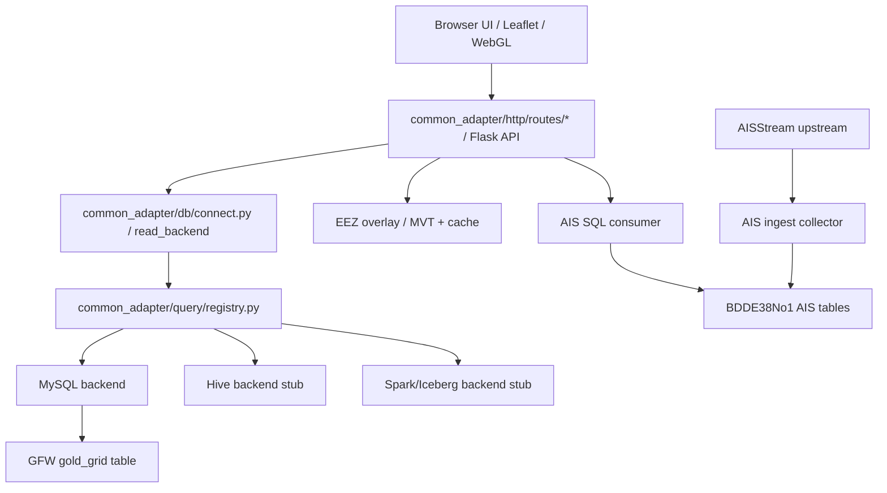
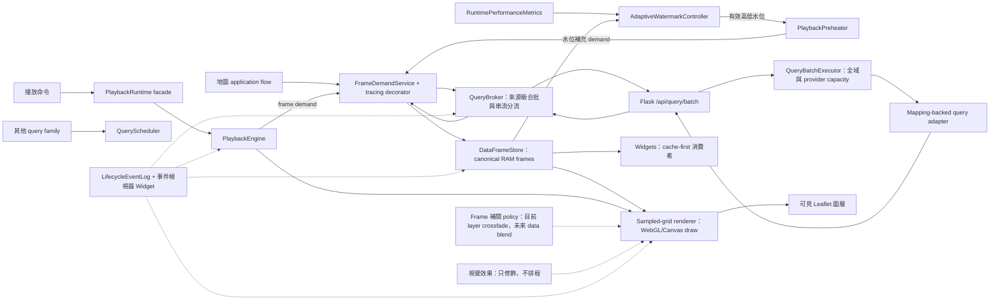
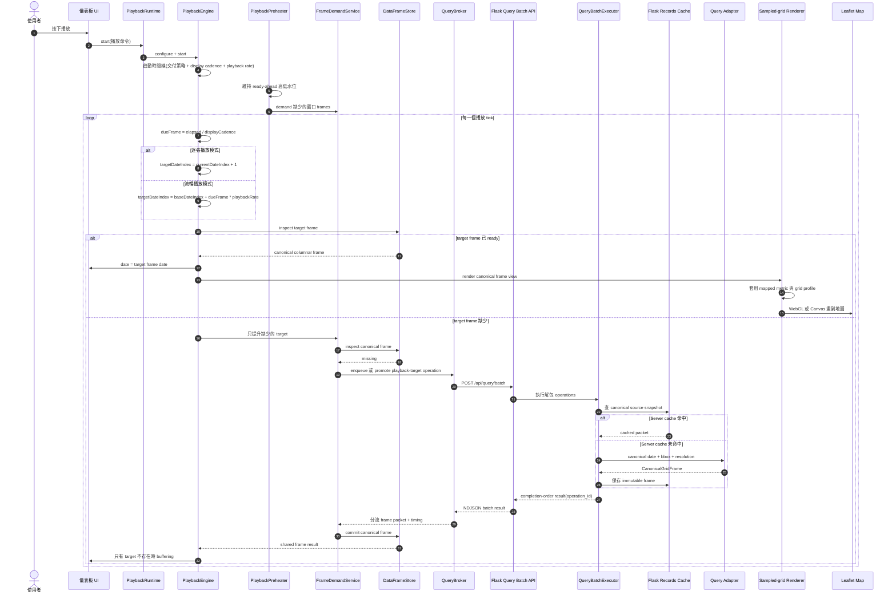
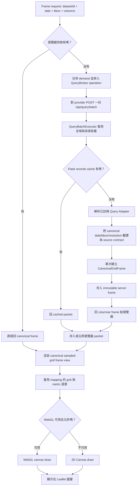
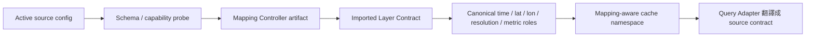

# Common Adapter

這是一個本機資料探索與轉接工具，用 Flask、MySQL、PostGIS、Leaflet 與前端 WebGL/Canvas 管線，把 Mapping 驅動的 sampled-grid、AIS 與 EEZ 等資料接到同一個地圖介面上。

它目前是研究與原型工具，不是正式 GIS 產品，也不是資料上游的最終治理系統。

## 目前能力

- sampled-grid 資料：目前包含 GFW MySQL read model 與 Pipeline Iceberg serving datasets；前端優先使用 WebGL 繪製，無 WebGL 時退回 Canvas。
- AIS 船舶位置：前端只消費 SQL 裡的最新狀態表；AISStream 由獨立 collector 長駐寫入 SQL。
- EEZ 經濟海域：使用 PostGIS MVT tiles 與本機快取向量資料。
- 地圖 UI：支援資料集選擇、圖層排序、圖層齒輪設定、暗色模式、底圖切換、經緯網格、比例尺、全螢幕、截圖、測速欄、渲染 ready 燈號、時間播放與播放快取預熱。
- 設定頁：保留資料源、圖層與播放行為的設定入口，避免把所有控制塞在儀表板同一層。

外部 Chrome 無痕模式的全年冷／暖快取驗收結果記錄在
[`benchmarks/playback_lifecycle_acceptance_2026-07-15.md`](benchmarks/playback_lifecycle_acceptance_2026-07-15.md)。
第二輪 Runtime OOP 收斂後的全年回歸結果記錄在
[`benchmarks/runtime_oop_acceptance_2026-07-15.md`](benchmarks/runtime_oop_acceptance_2026-07-15.md)。
Widget UI／Application 邊界拆分後的回歸結果記錄在
[`benchmarks/widget_application_boundary_acceptance_2026-07-16.md`](benchmarks/widget_application_boundary_acceptance_2026-07-16.md)。
Clock Domain 與可信效能指標校正後的回歸結果記錄在
[`benchmarks/clock_domain_acceptance_2026-07-16.md`](benchmarks/clock_domain_acceptance_2026-07-16.md)。
自適應水位與最終全年冷／暖快取驗收結果記錄在
[`benchmarks/adaptive_watermark_acceptance_2026-07-16.md`](benchmarks/adaptive_watermark_acceptance_2026-07-16.md)。
Mapping、QueryBroker、共用快取收斂與目前側邊瀏覽器驗收結果記錄在
[`benchmarks/runtime_convergence_acceptance_2026-07-17.md`](benchmarks/runtime_convergence_acceptance_2026-07-17.md)。
目前 5081 sampled-grid 吞吐、完成順序 batch 與五個資料集播放驗收結果記錄在
[`benchmarks/sampled_grid_throughput_acceptance_2026-07-17.md`](benchmarks/sampled_grid_throughput_acceptance_2026-07-17.md)。
Runtime 身分、緩衝 episode、計時真相與五資料集全年使用者風暴驗收記錄在
[`benchmarks/runtime_truth_acceptance_2026-07-19.md`](benchmarks/runtime_truth_acceptance_2026-07-19.md)。
單次 Mapping 與端到端 columnar Canonical Frame 的驗收結果記錄在
[`benchmarks/sampled_grid_canonical_frame_acceptance_2026-07-18.md`](benchmarks/sampled_grid_canonical_frame_acceptance_2026-07-18.md)。
CC 視角分頁、共用渲染格網與查詢風暴驗收結果記錄在
[`benchmarks/sampled_grid_spatial_storm_acceptance_2026-07-18.md`](benchmarks/sampled_grid_spatial_storm_acceptance_2026-07-18.md)。
Sampled-grid Canonical validity、immutable render transaction、Mask 接縫與五資料集視覺風暴驗收結果記錄在
[`benchmarks/sampled_grid_render_correctness_acceptance_2026-07-20.md`](benchmarks/sampled_grid_render_correctness_acceptance_2026-07-20.md)。

## 專案邊界

這個 repo 的主要角色是「消費端」：

- 消費 SQL/read model。
- 消費 PostGIS/MVT 或未來資料服務。
- 負責地圖視覺化、LOD、播放、快取與互動。

它不是正式的上游治理系統。但 AIS 目前缺少可直接使用的基礎資料庫，因此 repo 內保留一個例外的上游 collector：

- `core.py ingest-ais`
- `common_adapter/ais/ingest.py`
- `common_adapter/ais/stream.py`
- `config/runtime/ais_collector.local.json`

這個 collector 是為了養出可被小可愛消費的 AIS SQL 資料庫。未來若上游同學用 Airflow、K8、Hive、Spark/Iceberg 或其他 sink 接手，只要維持 read model 與 config contract，小可愛就不需要直接碰 AISStream。

## Handoff 交接文件

交接上游時看 `handoff/`：

- `handoff/airflow_ais_crawler/`：給 Airflow / crawler 負責人。重點是 AISStream collector、輪詢/重連設定、SQL sink、健康檢查與啟動方式。
- `handoff/backend_config_contract/`：給後端 / 系統負責人。重點是 source config、Router Manifest 啟用、Probe／Mapping 分工、MySQL/Hive/Spark 邊界與提案用 capability matrix。

不要把真實 API key、資料庫密碼或本機私有路徑 commit 進 repo。真實值應放在：

- `config/runtime/adapter.local.json`
- `config/runtime/ais_collector.local.json`
- 環境變數
- 之後的 K8 Secret / Airflow Variable

## 架構總覽

```text
core.py
  -> common_adapter/http/interface.py       Flask app factory / route assembly
  -> common_adapter/http/server.py          server lifecycle / PID / port helpers
  -> common_adapter/http/routes/*           system / dataset / overlay / live / developer routes
  -> common_adapter/db/connect.py           dataset read dispatch
  -> common_adapter/db/backends/*           MySQL 與未來 backend adapters
  -> common_adapter/query/registry.py       database / endpoint 共用 query-adapter registry
  -> common_adapter/query/identity.py       mapping-aware cache namespace
  -> common_adapter/ais/live.py             AIS SQL consumer packet
  -> common_adapter/ais/ingest.py           AISStream upstream collector to SQL latest-state table
  -> common_adapter/spatial/overlay.py      EEZ fallback helpers
  -> common_adapter/spatial/lod.py          PostGIS / MVT EEZ tile helpers
  -> common_adapter/spatial/land_mask.py    EEZ 衍生陸地／公海 topology 與 LOD 遮罩
  -> templates/index.html      Leaflet UI shell
  -> static/js/*               前端 state、API、layer、rendering、UI 模組
```

Runtime 只引用 `common_adapter/` 的正式模組。舊 root modules 與 `database/registry.py` 相容入口已刪除；新程式不得重新依賴這些路徑。

前端 Runtime 的狀態所有權、DI composition root、class 判定與後續 Application Service 規範見 [`docs/architecture/runtime-oop.md`](docs/architecture/runtime-oop.md)。

前端拆分：

- `static/app.js`：啟動 app，綁定 UI 與事件。
- `static/js/core`：共用 state、DOM、map、geo、render-state。
- `static/js/services`：render intent、sampled-grid `QueryBroker`、一般 query scheduler、canonical frame cache、API client 與共用 service helper。
- `static/js/playback`：播放控制、純時間線 scheduler、frame readiness buffer、playback renderer handoff、playback interpolation policy、獨立水位預熱器、自適應水位控制器與 snapshot splitter。
- `static/js/layers`：sampled-grid、AIS、EEZ、graticule 圖層行為，以及 zoom blur／crossfade 視覺效果邊界。
- `static/js/rendering`：WebGL/Canvas 能力檢查、renderer registry 與 sampled-grid paint 設定。
- `static/js/ui`：table、播放控制、圖層選單、地圖設定、圖層樣式設定。

## 資料流



## Database backend 模式

資料來源讀取端以 config + query-adapter registry 解耦：

- `@query_adapter("mysql")` 註冊 database 或 endpoint adapter。
- `config/state/router_manifest.local.json` 決定目前啟用哪些 route fragments；DATABASE fragment 決定 dataset 使用哪個 backend、connection、table。
- `common_adapter/http/interface.py` 只負責 Flask app 組裝；HTTP shape 由 `common_adapter/http/routes/*` 管理。兩者都不應知道 MySQL、Hive、Spark 或 Iceberg 的查詢細節。
- `common_adapter/db/connect.py` 負責共用 database query helper 與 read dispatch；backend classes 位於 `common_adapter/db/backends/`。
- `common_adapter/query/registry.py` 統一負責 database 與 endpoint adapter 的 registration / instantiation。
- 外部欄位名稱只能留在 source adapter 與 mapping 邊界；runtime、cache、renderer 與 Widgets 只認 canonical roles。

Hive 與 Spark 目前只是明確保留的 unsupported stub。這代表架構上有位置，不代表目前已經完成 Hive、Spark 或 Iceberg 連線。

## 圖層

資料圖層選單由已導入的 Layer Contract 動態建立，不是前端寫死三個選項：

- Mapping Controller 產生的 sampled-grid 資料集
- active websocket/read-model route 提供的 AIS 船舶位置
- active spatial route 提供的 EEZ 經濟海域邊界

主資料圖層由啟用狀態控制，可以全部關閉；未勾選的 imported layer 不得查詢也不得渲染。EEZ 是獨立 overlay。圖層可拖拉排序，齒輪會依 Layer Contract 暴露 metric、resolution、顏色、alpha 與顯示模式。Scout 提供來源欄位與 value-semantics evidence；Mapping 明確採用欄位角色及 provider status aliases，並正規化為 Canonical `observed / filled / no_data / unknown`，再由 Layer capability compiler 決定 sampled-grid 是否可暴露 render-only 線性插值。UI 不會從圖層名稱或來源類型猜測能力；EEZ、分類值與未解析語意維持 nearest-only。插值只改 Renderer 著色，不改 Canonical Frame、選格、Widget、Query 或 cache identity。海洋 sampled-grid Renderer 會消費跟隨 EEZ 註冊的陸地遮罩子能力：Canonical cell 仍是 Scout 推導的規整正方形，Browser 端 `SpatialLandMaskServiceCore` 以 viewport epoch 合成版本化 `SpatialValidityMask`，相同 tile URL 共用一份 pending request；`ContinuousFieldServiceCore` 以 Frame、插值 policy 與 Mask 身分快取衍生場，並以 Mask 線段採樣避免跨越已偵測陸地的角點共用。WebGL 最後以當前 EEZ z/x/y LOD 海域幾何裁切 fragment；海岸線精度受所選 Mask LOD 約束，但不改分析格網身份。exact `eez_v12` 幾何擁有 attribution 覆蓋率真相；版本化粗 topology artifact 只負責把 exact EEZ 聯集的補集合分類成陸地或公海，不作為視覺海岸線。對有完整 coverage 的 sampled-grid，Mapping 的 `default_coverage_id` 決定初始中心，coverage union 決定合法相機邊界；CC 則以 `視角 BBOX ∩ coverage` 擁有實際空間需求。Adapter 依 Scout 推導的基礎格網與來源 page capacity，把需求換算成穩定的內部 row-band pages。這些 page identity 是我們公式的結果；來源只需提供 `limit`／`offset`，不依賴對方提供 `shard_id`、bbox 或 window 參數。

## 時間與播放

時間控制只有在選中的資料層具備時間能力時啟用。EEZ-only 模式會把日期與播放控制灰掉。

具時間能力的 sampled-grid 圖層支援：

- 單日模式
- 跳到最後一日
- 起訖日期
- replay
- 前一日 / 後一日
- 播放 / 暫停
- 播放速度
- 播放期間的獨立水位預熱

播放排程以時間線為主控：播放速度是時間軸倍率，不是舊的「上一格完成後再等待」迴圈。預設交付策略是分析模式：每一張選取範圍內的真實 snapshot 都會依序消耗，`playbackRate` 只改變下一張 snapshot 的目標節拍。設定頁已暴露流暢與嚴格模式端口，但兩者明確標示為尚未實作，因此現階段不會接管播放 clock。查詢與渲染工作不會在每格後再額外疊一個完整 interval。progressive 模式不會為了完整 prebuffer 阻塞開播；分析模式會進入 buffering 而不是跳過下一張，等待期間不推進播放進度，frame ready 後會先記錄 resumed，再顯示真實 snapshot。target request 失敗會成為明確的 frame-buffer failed 狀態，不會永遠停在 `fetching`；暫停、重播、切圖層與切資料集會讓舊背景預載進度失效。

所有 Runtime 計時由 `ClockDomain` 經 DI 注入，分成三個互不混用的時鐘：

- Monotonic wall clock：Queue、HTTP、Mapping、Cache、Buffer、timeout 與 P95。
- Playback clock：切片日期與播放節拍；只有這條路徑接受 `playbackRate`。
- Render clock：`requestAnimationFrame`、draw 與畫面可見時間。

生命周期事件只記錄 `monotonic_ms`。事件檢視器、測速 Widget 與狀態列共同讀取 `RuntimePerformanceMetrics`，不再各自建立等待時間或播放 telemetry 真相。

設定頁把播放器拆成多個責任 box，而不是把所有選項混在同一個控制面：

- 播放時間軸：播放交付策略與 `playbackRate` 決定播放器正在追哪一張真實 snapshot。分析模式已實作；流暢與嚴格模式是已暴露但未啟用的保留端口。
- Frame buffer：分析模式會回報 `fetching/missing/ready/waiting/failed` 邊界；`LifecycleEventLog` 會把 `BUFFER_ENTERED`、`BUFFER_RESUMED`、`FRAME_VISIBLE` 與 Queue/HTTP/cache/render 分開觀測。
- 資料快取 / 預熱：獨立生產者只維持 ready-ahead 高低水位；自適應模式取使用者 RAM 上限的 50% 作播放庫存容量，再以容量的 1/3、2/3 作低高補貨門檻，也可切回固定 10/15 水位。水位只管理背景庫存，不決定播放器能否前進。
- Frame 補間：播放可選用現有 layer crossfade 作為純視覺補間，也可在播放時直接切換真實 snapshot；真正資料 blend 仍保留給未來由 render artifact 支撐的 `requestAnimationFrame` 循環。
- 視覺效果：淡入淡出只修飾 layer 替換；高斯模糊只限縮放 / LOD 重算時遮罩。
- 渲染壓力與測速：renderer policy 與儀表板測速 Widget 只觀測或降級，不擁有播放 clock；`consumption_rate`、`supply_rate`、`cache_ready_latency_p95`、`ready_ahead_slices` 與 `ready_ahead_seconds` 由 Runtime 統一提供。

播放器不變式由 `tests/playback_contracts.test.mjs` 保護，可用下列命令執行：

```powershell
python scripts/playback_contract_smoke.py
```

目前鎖住的契約：

- `analysis` 交付策略使用 `sequential` 步進：即使 clock late 或速度是 4x，下一個 render target 仍必須是 `currentIndex + 1`。
- buffering 可以平移 scheduler clock，但 frame ready 前不能推進選取日期。
- progressive cold cache 會回報 `fetching 0 / 1`；target packet ready 後先記錄 `BUFFER_RESUMED`，然後才記錄 `FRAME_VISIBLE`。
- progressive request 失敗會回報 `failed` 並留下 lifecycle error event；若 target frame 長時間等不到，會以真實 monotonic 30 秒 timeout 停止播放，而不是受倍率影響或無限等待。
- 被取消或被取代的 progressive preheat，不得把 late progress、status 或 failure state 套到目前播放 generation。
- 冷快取播放先進入 `PREPARING`，只等待下一張真實 target；這段準備等待不計入播放停頓。播放期間由獨立預熱器在背景補足至高水位。
- 只有當下 target 缺少時才可進入 `BUFFERING`；target 一到貨就恢復，不等待低水位或高水位。手動 Seek 也只提升目標影格。
- `AdaptiveWatermarkController` 只讀 `RuntimePerformanceMetrics` 與 `DataFrameStore` 容量快照；它不執行 transport、不改變 query concurrency，也不清除快取。UI 只能預覽或顯示目前策略，只有 Preheater reconcile 能套用策略。
- `fluid` 是唯一允許把 elapsed time 映射到未來日期的 step mode；目前仍保留在 disabled 的流暢交付端口後面。
- prefetch、render、interpolation、blur 與測速觀測只供應或修飾 frame，不擁有播放日期 clock。

目前前端 module 邊界：

| Module | 邊界 |
| --- | --- |
| `static/js/playback/playback-delivery-policy.js` | 播放交付策略：analysis / smooth / strict 時間軸語意的唯一上層入口。目前只啟用分析模式；流暢與嚴格模式明確標示為保留端口。 |
| `static/js/core/clock-domain.js` | DI 注入的 monotonic、playback 與 render clocks；播放倍率只存在 playback cadence／consumption rate 計算。 |
| `static/js/playback/playback-scheduler.js` | 純時間線計算：cadence、due frame、speed/rate 映射與目標日期 index。 |
| `static/js/playback/playback-runtime-controller.js` | 播放子系統的公開 facade，也是 timer、generation、timeline 與 session callback 的唯一 owner；UI 不直接存取 Engine 或 Preheater。 |
| `static/js/playback/playback-time-policy.js` | 純 timeout policy；buffer timeout 使用 monotonic elapsed time，不讀播放倍率。 |
| `static/js/playback/playback-frame-buffer.js` | frame readiness 決策：missing/fetching/ready/waiting/failed 狀態 packet、target-frame buffering，以及最近 ready frame 選擇。 |
| `static/js/playback/playback-renderer.js` | 播放器到渲染的 handoff：設定選取日期、同步控制狀態、呼叫既有 active-layer reload。 |
| `static/js/playback/playback-interpolation-controller.js` | 播放補間 policy：播放時選擇 layer crossfade 或直接切換；資料 blend 尚未啟用。 |
| `static/js/core/canonical-grid-frame.js` | 瀏覽器端不可變 columnar sampled-grid frame 與零拷貝 index/BBOX view；只允許在明確的展示邊界建立 row 物件。 |
| `static/js/services/frame-identity.js` | canonical BBOX signature、request intent key、scope key 與回傳 frame key 的唯一建構器。 |
| `static/js/services/data-frame-store.js` | Canonical RAM frame store：intent/frame alias、局部 coverage 合成、pin/release、LRU 淘汰與 failure state；不執行 transport。 |
| `static/js/services/layer-query-coordinator.js` | sampled-grid 傳輸鏈以外查詢族群使用的 QueryScheduler：相同 intent 單次執行、queued task 提升、consumer scope 取消與前景保留槽。 |
| `static/js/services/query-policy-controller.js` | 一般 QueryScheduler 的 DI policy 命令邊界；不擁有 sampled-grid provider capacity 或播放水位。 |
| `static/js/services/query-broker.js` | 實體來源級 transport owner：跨資料集合併相容 operation，依 Registry 公開的來源容量限制有效 batch 與 in-flight operation；每收到一筆串流結果就釋放槽位並立即補入最高優先工作。provider key 不取代 dataset/cache identity。 |
| `static/js/services/frame-demand-service.js` | sampled-grid demand 邊界；先查 `DataFrameStore`、合併相容 inflight，真正 miss 才直接交給 `QueryBroker`，回傳後只提交一次 canonical packet。 |
| `common_adapter/query/batch.py` | Flask 端 batch 執行 owner；`QueryBatchExecutor` 維護全域 worker pool 與跨 request 共用的 provider capacity，在提交 worker 前取得來源 permit，避免等待中的來源占滿 worker 使其他來源飢餓；結果依完成順序串流，以 `operation_id` 還原身份並隔離同批失敗。 |
| `common_adapter/query/grid_frame.py` | Server 端不可變 columnar sampled-grid frame、builder、transport projection 與零拷貝 selection view。 |
| `common_adapter/query/sampled_grid_paging.py` | 純函數化的 CC/coverage 裁切、基礎格網對齊、公式化內部分頁規劃與 Canonical Frame 拼接；不期待來源提供 shard identity。 |
| `static/js/services/frame-demand-decorators.js` | 由 DI 組裝的 observability decorator；只記錄 demand 邊界耗時與結果，不改變快取、排程、transport、回傳值或錯誤語意。 |
| `static/js/playback/playback-preheater.js` | 長時間存在的生產者，獨立維護 ready-ahead 高低水位，不擁有播放 clock。 |
| `static/js/playback/adaptive-watermark-controller.js` | DI 建立的有狀態 policy owner；依可信供需、cache-ready P95、播放消耗率與 RAM 預算決定有效水位，並以 monotonic hysteresis 防止頻繁下降。 |
| `static/js/playback/playback-engine.js` | frame 消費者與播放生命週期 owner；擁有下一 target 準備、target miss 緩衝、可見 frame pin 與相關 lifecycle event。播放就緒只看下一 target，不讀補貨水位。 |
| `static/js/playback/playback-cache-service.js` | 播放快取設定與狀態 facade；只暴露水位與 RAM 容量，不擁有 transport 或 batch pipeline。 |
| `static/js/services/lifecycle-event-log.js` | 有界事件記錄、Run 匯出，以及 Queue/HTTP/cache/render/stall 體感指標。 |
| `static/js/services/runtime-performance-metrics.js` | 由 lifecycle、preheater 與 engine 組合唯一可信的供需、尾端延遲、ready-ahead 與 buffer wait snapshot。 |
| `static/js/ui/widgets/capabilities/event-viewer.js` | 唯讀生命週期事件檢視器 Widget，支援 Run/資料集/事件篩選與 JSON 匯出。 |
| `static/js/services/browser-profile-store.js` | 由 DI 建立的 Browser Profile owner；只持久化明確列入白名單的裝置與視覺偏好，儲存失敗時退回目前 session。 |
| `static/js/services/renderer-capability-state.js` | Renderer capability runtime owner；統一 server/browser probe、hardware policy 與 WebGL context lost/restored 狀態。 |
| `static/js/services/spatial-land-mask-service.js` | 由 DI 建立的 viewport `SpatialValidityMask` owner；管理 refresh epoch、URL-level single-flight、timeout 與 bounded image LRU。 |
| `static/js/services/continuous-field-service.js` | 由 DI 建立的 mask-aware 連續場衍生快取；pure reconstruction kernel 不擁有狀態。 |
| `static/js/services/sampled-grid-layer-pool.js` | sampled-grid active layer 與 context-loss fallback owner；inactive pooled layer 不參與 viewport redraw。 |
| `static/js/layers/sampled-grid-layer-effects.js` | DI 建立的視覺 transition owner；以 generation 管理 zoom/LOD blur、reveal、cleanup 與 crossfade 的 RAF/timer，失效 callback 不得修改已重用 layer。 |
| `static/js/rendering/render-grid-profile.js` | 純函數 zoom bucket 視覺聚合策略；Renderer 色塊與虛擬選取網格共用相同 profile 與原點。 |
| `static/TimingMetrics.js` | DI 建立的渲染與查詢測速 service；只接受 ClockDomain，不保存播放事件第二真相。 |



AIS live 模式目前不走日期播放器。

## 播放快取與預熱

播放快取是 sampled-grid 查詢管線的一部分：

- `static/js/playback/playback-cache-service.js` 提供水位、容量與狀態顯示；實際補充生命週期由 `PlaybackPreheater` 擁有。
- `static/js/playback/playback-controls.js` 保留按鈕、狀態投影與設定視窗；播放節奏與 timer 由 `PlaybackRuntime` 擁有。
- 視角拖曳或縮放 settle 後，Map 與 Playback 會使用同一份 `RenderIntent` request context。Scope 真正改變時由 `PlaybackRuntime` 換代 generation、使舊 callback 失效並重錨唯一時間軸；coverage 只約束合法視角，不會讓 sampled-grid 沿用舊 BBOX。
- 預熱器在圖層、日期範圍與查詢 scope 確定後獨立運作；低於低水位時非同步補到高水位。
- `AdaptiveWatermarkController` 在尚無 frame-size 樣本時使用固定低 10 / 高 15；有樣本後取設定 RAM 上限的 50% 換算播放庫存容量，低水位為容量 1/3、高水位為 2/3。供需比低於 1 只觸發提前補貨，不改變播放 gate。
- 有效高水位受 `DataFrameStore` RAM／entry 預算共同限制。水位提高可立即生效；降低使用 monotonic hold 與有限步長，避免短期波動造成來回震盪。
- 高水位代表目標 ready-ahead，不代表開相同數量的 HTTP。sampled-grid 瀏覽器傳輸由 `QueryBroker` 依 provider capacity 計算有效 batch 與可用槽位；Flask 解包後的全域與來源 operation capacity 分別由 runtime `query_policy.network_concurrency` 與 source `query_policy.max_in_flight` 管理。
- 設定頁可在自適應與固定水位間切換；切換只重算 policy，不會清除已完成的 Canonical frame。
- 預熱器 `FETCHING` 與播放器 `PLAYING` 可同時成立。冷啟動 `PREPARING` 與中途 `BUFFERING` 都只等待下一 target；背景水位不構成播放資格門檻。
- 快取有容量上限，瀏覽器預設 512 MB，可在播放設定中調整。
- 快取生命週期以瀏覽器頁面為主；關閉頁面後可視為釋放。
- HTTP sampled-grid adapter 另有 server-side canonical source snapshot cache；`query_policy.snapshot_cache_max_rows` 是跨 dataset namespace 的全域 row budget，不會讓每個資料集各自無上限常駐。

設計原則：地圖擁有 source query 意圖與最高優先序；播放負責供應時間窗口，Widgets 優先消費已完成快照。取消預熱或 Widget 插隊只能取消未完成任務，不得清除 canonical cache。

## Sampled-grid 查詢與快取生命週期

每一個 frame 是 canonical records packet，主要由下面這組 key 決定：

```text
mapping-aware cache namespace + date + source-scope bbox + limit + columns + resolution context
```

cache namespace 由目前 mapping contract 推導，包含 source route、canonical 欄位角色、grid profile、resolution policy 與 query contract。只要 mapping 語意改變，就會使用新的 namespace；密碼與純視覺設定不影響資料快取身分。Registry 另從實體來源路由推導不含密鑰的 provider transport key 與容量；共用 provider key 的資料集共用同一個容量池，但仍保有各自的 cache namespace 與 canonical frame。冷路徑由 `FrameDemandService` 合併 logical intent 並直接委派給 `QueryBroker`，Broker 依可用來源槽位把相容 operation 壓成 NDJSON request；Flask 再由 `QueryBatchExecutor` 解包，在全域 worker 上限與來源 `query_policy.max_in_flight` 之內執行，並以完成順序串流、用 `operation_id` 還原身份。Mapping 對每筆 source row 只走一次，直接寫入不可變的 columnar `CanonicalGridFrame`；server cache、transport、browser store、Renderer 與 Widgets 共用同一種 frame 表示，不再膨脹第二份 row graph。每份 operation 結果只提交一次到 `DataFrameStore`；暖路徑讓地圖、播放、選取工具與 Widgets 共用同一份 immutable frame。

只有地圖/query application layer 可以建立 sampled-grid demand。`QueryBroker` 依 `map-current`、`playback-target`、`playback-window`、`widget-interactive`、`widget-auto/background` 排序；`QueryScheduler` 是其他 query family 的獨立 owner，不得再巢狀包住這條鏈。Widget 先查 canonical cache，只有明確允許的 miss 才能經 demand 邊界補一張；表格工具是嚴格唯讀的目前快照快取檢閱器，不能向 source 發 request。

容量有兩個獨立維度：runtime `query_policy.network_concurrency` 限制 Flask `QueryBatchExecutor` 的總 worker 數，source config 的 `query_policy.max_in_flight` 限制同一實體 provider 同時執行的解包 operation。後者未宣告時保守採 `1`；追蹤的 Pipeline Iceberg 範例採 `2`，是依相同日期集合的一路／兩路量測決定。`/api/datasets` 會公開來源容量，瀏覽器 dispatch 前計算 `min(batch_max_operations, source_capacity, available_slots)`；播放水位不得改變這兩個容量。

來源錯誤語意由 Mapping 翻譯。`snapshot.no_data` 把來源特有的缺 partition 錯誤轉成空的 canonical snapshot 並做負快取；`snapshot.retry` 只處理有限次的瞬時錯誤重試；`resolution_policy` 只在來源確實有較粗 LOD 時降級。三者不能混用。



Frame 來源判斷：



Config 與 layer mapping 的角色：



## 渲染與來源解析度

Sampled-grid 渲染優先走 WebGL，無法使用時回退 Canvas。相機縮放與來源解析度是兩個獨立邊界：

- Mapping 宣告完整 coverage 的資料集，會把 CC 視角裁切到 coverage、對齊基礎格網，只查缺少的內部 row-band pages；平移保留重疊 pages，只補新增範圍。
- 沒有 bounded coverage、且來源契約本來就是 bbox-backed 的資料集，仍由 viewport 決定查詢範圍，離開已快取範圍時才補查。
- 地圖平移、縮放與 Leaflet 版面 resize 都會替換 sampled-grid 的 viewport scope。三者必須先使目前 immutable `RenderContext` 失效，再共用同一條 settle reload；不得只清除舊 Frame 卻不要求替代 Frame。
- Query/cache 預設維持 Scout 推導的最細基礎格網；使用者明確選擇合法倍數時才取得另一份 source packet。camera zoom 只改 `RenderGridProfile`，基礎 frame 已快取時不得重查來源。
- 視覺聚合由 GPU 處理，reducer 由 Mapping 宣告，不改寫 Canonical Frame；虛擬選取網格與色塊必須共用聚合倍率、尺度與原點。
- 日期播放換幀依賴 canonical cache readiness、renderer 工作與 layer crossfade，不因相機層級建立另一條播放生命週期。
- 漸層色票、alpha、最大強度與粒度控制只改各自擁有的視覺或來源契約，不互相冒充。

EEZ 被視為接近底圖的 overlay，應盡量重用向量 tile / local vector cache，而不是每次平移都重新載入。

## AIS collector

AIS 拆成兩個進程：

```powershell
.\.venv\Scripts\python.exe core.py --config config\runtime\adapter.local.json serve
```

負責地圖與 API。

```powershell
.\.venv\Scripts\python.exe core.py --config config\runtime\adapter.local.json ingest-ais --collector-config config\runtime\ais_collector.local.json
```

負責長駐 AISStream collector，寫入 SQL。

AISStream 的位置與靜態訊息是兩種獨立 delta。collector 會依 `mmsi` 合併、分別比較 position/static event time、拒絕各自領域內的舊資料，且不會用訊息中缺少的欄位覆寫既有值。latest-state table 因此是一艘船一筆目前狀態，不會無限制成長。來源事件時間與 collector 的 `received_at` 也分開保存。若未來要歷史軌跡，應建立獨立 history/events table，並設定 retention policy。

目前內部 key check 不是正式 auth，只是原型邊界標記：前端設定 AIS key 後，consumer 端只保存 fingerprint；raw key 交給 collector handoff。小可愛讀 SQL 前會確認 SQL metadata 中的 collector key fingerprint 是否匹配。

## GFW upstream collector

GFW ingestion 被視為 upstream collector job，不是前端功能：

- `collectors/gfw_collector.py`：將 GFW DuckDB source 匯入 SQL read model。

地圖 UI 不應知道原始 source path 或暫存 manifest。這些屬於 collector 設定；小可愛只消費 SQL/read model 或之後約定好的資料服務。

## 發表用 Docker 路徑

目前的發表候選路徑保留 RRK 0.10.0 的 Spark／Iceberg 成果，並以同一個 Docker image 提供整合後的小組官網、儀表板、API 與開發者控制面。

```text
Docker app
  -> host.docker.internal:11000
  -> Windows OpenSSH tunnel
  -> bigred@192.168.32.201
  -> dt namespace 內的 kubectl port-forward
  -> deployment/dtadm:10000 的 Spark Thrift Server
  -> Iceberg／HDFS 上的 lake.ocean.gold_map_metric
```

正式 Sea1 serving table 已實際查詢並驗證 `2022-01-01` 至 `2024-12-31`，資料位於 `lake.ocean.gold_map_metric`，warehouse 為 `hdfs:///dataset/ocean/warehouse`。上游工作採年月分區的 Parquet 與逐月 Gold batch，以限制 Join／Group By 的 Shuffle 與 Spill。目前沒有已驗證的 2020-2021 Gold，標準 Bronze／Silver 位置也尚未確立，因此 Runtime 與文件不得宣稱 serving 範圍為 2020-2024。

| 目前線上契約 | 已驗證值 |
|---|---|
| AOI | `taiwan`、`northwest_pacific` |
| 日期 | `2022-01-01` 至 `2024-12-31`（1,096 個不同日期） |
| 解析度 | `4`、`16`、`32` km |
| 指標 | 葉綠素、捕魚時數、海洋生產力、海表溫度、永續壓力 |
| 叢集 | Sea1 `192.168.32.201`；HDFS 正常；YARN ResourceManager 與 3 個 NodeManager 正常；共用 Spark Thrift 監聽 `10000` |

先備條件為 Docker Desktop、Windows OpenSSH、可用的 Tailscale 連線，以及可登入 `bigred@192.168.32.201` 的 SSH。跳板機必須能以 `kubectl` 存取 `dt` namespace。Tk 啟動器使用 Windows AskPass；只有使用者勾選「記憶密碼」時才會存入 Windows Credential Manager，否則一次性 credential 會在啟動後刪除。密碼不會進入 repo、命令列、JSON 事件或 runtime state。

首次啟動 Docker 前，先將 `.env.example` 複製為 `.env`，並替換所有 `change-me` 值；`.env` 已被 git 忽略。目前 WIP 分支尚未自動產生此資料庫密碼。

建議使用 Tk 啟動器；CLI wrappers 與 JSON Lines controller 會呼叫同一套實作：

```powershell
# 圖形化啟動器。
.\scripts\presentation\presentation-launcher.cmd

# CLI 啟動／狀態／停止。
.\scripts\presentation\start-presentation.cmd
.\.venv\Scripts\python.exe .\scripts\presentation\presentationctl.py --json status
.\scripts\presentation\stop-presentation.cmd

# 唯讀計畫，不變更服務。
.\.venv\Scripts\python.exe .\scripts\presentation\presentationctl.py --json start --dry-run
```

Host 對外網址為 `http://127.0.0.1:5185/`、`http://127.0.0.1:5185/dashboard/` 與 `http://127.0.0.1:5186/`；Compose 會映射到 container 內的 `5085/5086`。EEZ 首次啟動可能需要數分鐘；GPKG 驗證／匯入、topology 產生與持久化 domain-tile 預熱 manifest 完成後，App 才會啟動。正常啟動不得執行 `restore-cluster-services.ps1`；該腳本只供 HDFS／YARN daemon 缺失時，在明確授權下修復共用叢集。

發表用 Config Browser 只編輯 Desired State。儲存會建立已驗證的 `pending_restart` generation，不會重建執行中的 connection pool；`presentationctl start` 才是受控重啟的 Apply Owner。Query、Registry、Status、Health 與 Supervisor 都消費同一份 immutable runtime snapshot。Dashboard 與 Developer 的 identity endpoints 必須在 runtime instance、generation、config bundle hash、backend/source 與 fingerprint 上完全一致。Config bundle hash 只涵蓋 effective runtime config、Manifest、Mapping 與 active source documents；runtime fingerprint 再綁定 generation、公開 ports、image digest、Compose hash 與 bridge owner token，因此舊部署證據不能沿用。

RRK 0.10.0 原有的 Kubernetes ConfigMap、Deployment、Service、registry 與 NodePort 內容仍保留在 repo，供之後進行叢集內部署。發表用 Compose 是新增部署面，不是取代隊友成果。

## 快速啟動

```powershell
py -3 -m venv .venv
.\.venv\Scripts\python.exe -m pip install -r requirements.txt
if (!(Test-Path config\runtime\adapter.local.json)) {
  Copy-Item config\examples\runtime\adapter.example.json config\runtime\adapter.local.json
}
```

接著編輯：

```text
config\runtime\adapter.local.json
```

啟動服務：

```powershell
.\.venv\Scripts\python.exe core.py --config config\runtime\adapter.local.json serve
```

開啟：

```text
http://127.0.0.1:5057
```

服務是 single-instance：啟動時會讀 `flask_pid.txt`，若舊 Flask 進程還在，會強制退出舊進程並清理 port，避免重複查詢 AIS 或資料庫。

同一個 `core.py` 命令會同時啟動消費端與開發者 listener。使用範例 port 時，路由如下：

| 位址 | Owner |
|---|---|
| `http://127.0.0.1:5057/` | 由 `official_site/` 提供的小組官網 |
| `http://127.0.0.1:5057/dashboard/` | 消費端儀表板 |
| `http://127.0.0.1:5057/api/...` | 消費端 API 與 runtime transport |
| `http://127.0.0.1:5058/` | 開發者控制面 |

官網與儀表板刻意共用消費端 origin。官網的 `DASHBOARD` 導覽使用 root-relative `/dashboard/`，不可改成綁定特定機器的 host 或 port。`core.py` 預設在下一個 port 啟動開發者 listener，也可用 `--developer-port` 指定；只有確定不啟動控制面時才使用 `--no-developer-server`。

## 部署指南

本專案由同一個消費端 listener 提供小組官網、消費端儀表板與消費端 API；同一個 `core.py` process 另以獨立 listener 啟動開發者控制面。具狀態依賴與上游 collector 仍分開治理。`docker-compose.yml` 保留為一般本機依賴 profile；`compose.presentation.yaml` 會建置並啟動整合後的發表應用與 PostGIS。

### 人類操作流程

1. 選定已審查的 Git commit，建立隔離的 Python 環境：

   ```powershell
   py -3 -m venv .venv
   .\.venv\Scripts\python.exe -m pip install -r requirements.txt
   ```

2. 建立 local config，但不要提交秘密。將 `config/examples/runtime/adapter.example.json` 複製為 `config/runtime/adapter.local.json`，只建立本次部署需要的 source fragments，並由 `config/state/router_manifest.local.json` 明確列出啟用項目。Config 角色與所有權規則見 [config/README.zh-TW.md](config/README.zh-TW.md)。

3. 啟動外部依賴。若使用內附的本機 PostGIS profile：

   ```powershell
   docker compose up -d postgis
   ```

   啟用 Compose 的 MySQL profile 前，必須先檢查 `docker-compose.yml`：其中 bind-mount 路徑與開發密碼只是本機範例，換機器時必須替換。正式環境應使用獨立治理或 managed MySQL/PostGIS。

4. 若 active spatial route 啟用 PostGIS EEZ，先準備資產，再以依賴健檢作為 fail-closed 門檻：

   ```powershell
   .\.venv\Scripts\python.exe core.py --config config\runtime\adapter.local.json bootstrap-eez
   .\.venv\Scripts\python.exe core.py --config config\runtime\adapter.local.json check-dependencies
   ```

5. 啟動一個應用程式實例：

   ```powershell
   .\.venv\Scripts\python.exe core.py --config config\runtime\adapter.local.json serve
   ```

   設定的消費端 port 會提供 `/`（官網）、`/dashboard/`（儀表板）與 `/api/...`（消費端 API）。同一個命令預設在下一個 port 啟動開發者控制面，也可用 `--developer-port` 指定。確定不啟動控制面時才使用 `--no-developer-server`；不可把開發者 port 暴露到不受信任的網路。

6. 導入使用者流量前先驗證：

   ```powershell
   Invoke-RestMethod http://127.0.0.1:5057/api/health
   Invoke-RestMethod http://127.0.0.1:5057/api/datasets
   ```

   另外以全新瀏覽器 profile 開啟 `/`，透過相對 `DASHBOARD` 連結進入 `/dashboard/`，再檢查圖層啟用、至少一張 sampled-grid frame、EEZ、播放、縮放、拖曳、選格與 Widget。開啟「開發者」頁籤，確認它嵌入設定的開發者 listener，而不是消費端路由。HTTP health 成功不代表路由與 Renderer 生命週期已驗收。

7. AIS 與其他 upstream collectors 必須作為獨立受監督工作執行。儀表板只讀取其 SQL/service 輸出，不擁有 collector 的持續運作。上游 key 應放在環境變數、K8 Secret、Airflow Variable 或同等 secret manager。

### Pod 與服務條件

- 每個 Pod 只執行一個 `core.py serve`。目前 runtime 擁有 process 內排程、endpoint supervision、播放快取與 local PID file，不可在同一 Pod 內增加多 worker。
- 將 `server.host` 設為 `0.0.0.0`、`kill_port_if_busy` 設為 `false`，由 orchestrator 負責重啟與 port 衝突。
- 將 EEZ cache 路徑（預設 `data/eez/`）掛載為持久儲存；MySQL 與 PostGIS 應位於應用容器外，或由獨立服務管理。
- `check-dependencies` 成功後，才可使用 `GET /api/health` 作為 liveness/readiness。開發者 port 必須保持私有或停用。
- Image 必須綁定 Git commit，並保留上一版 image digest。回滾是重新部署上一個 digest，不是修改執行中的容器或清空資料快取。
- Repo 已包含發表用 Dockerfile／Compose，以及保留的 Kubernetes manifests；但仍未提供 TLS termination 或公開網路驗證，這些屬於部署平台責任。

### Agent 操作流程

自動化 Agent 必須與人類操作員共用同一份 Config 與健康真相：

1. 操作前記錄 `git rev-parse HEAD` 與 `git status --short`。未經任務明確授權，不得覆寫既有 `*.local.json`、Mapping artifacts、資料庫或 EEZ cache。
2. 閱讀本節、[config/README.zh-TW.md](config/README.zh-TW.md) 與 [handoff/CURRENT_STATE.zh-TW.md](handoff/CURRENT_STATE.zh-TW.md)。啟用路由只能從 `config/state/router_manifest.local.json` 發現，不得靠檔名猜測。
3. 秘密不得出現在 command、log、commit 或產出報告；優先使用注入的環境變數或平台 secret store。
4. `serve` 前必須執行 `check-dependencies`。宣告中的依賴若不可用，應停止並回報失敗 route，不得偷偷移除或建立 fallback config。
5. 同一 selected config 最多啟動一個應用程序；沿用設定 port、關閉過期瀏覽器分頁，驗收時不可同時施加 benchmark 流量。
6. 驗證 `/`、`/dashboard/`、`/api/health`、`/api/datasets`、獨立開發者 listener 及需求中的使用者流程，並確認官網導覽維持同源 root-relative。發布候選版還必須執行[驗證](#驗證)命令，保存 commit、config identity、cache state、瀏覽器 profile 與結果。
7. 缺少資料集、Mapping 不一致、stale frame、永久 `FETCHING`、重複 HTTP、alpha 錯誤、Mask 接縫或破圖，都代表部署失敗。不得以提高 RAM、並行、水位或 timeout 掩蓋。
8. 失敗時停止新程序，保留 log 與事件證據，重新部署上一個 known-good commit/image。不可用未提交的 production edits 直接修執行中實例。

只有相同 commit 與 Config 下的依賴健檢、API 健檢和瀏覽器流程全數通過，部署才算完成。

## 開發者控制面使用指南

開發者頁面是 Config 控制面，不是第二個儀表板，也不是資料查詢 client。同一個 `core.py serve` 命令會啟動兩個 listener：官網、儀表板與 API 維持在 `server.port`，開發者控制面預設使用 `server.port + 1`。儀表板的「開發者」頁籤會嵌入這個獨立服務。若消費端是 `5057`，也可直接開啟 `http://127.0.0.1:5058`。

頁面會明確區分 **saved**、**validated**、**pending restart**、**effective** 與 **failed**。Browser 編輯只進入 pending copy，不會替換執行中的 Runtime snapshot。部署 Owner 套用 pending generation 並通過 smoke 前，Query 與 Health 都必須持續回報 effective backend/source。信任狀態面板前，應先確認 Dashboard 與 Developer 顯示的 runtime identity 相同。

操作時必須由上往下，因為每一區都消費上一區的持久化產物：

```text
Config 路由器
-> 路由狀態機
-> Schema Scout / Mapping Controller
-> 資料圖層合約導入
-> 儀表板資料圖層抽屜
```

### 1. Config 路由器

- **引導精靈**建立 DATABASE route fragment，並匯入受管 Config 清單；建立完成不會自動啟用。
- **導入**只把 JSON 放進 `config/staging/` 供檢視。Promotion、跨 source group 移動與刪除屬部署操作，Browser 會明確拒絕；必須在受審查的 checkout 完成後，再套用新 generation。
- 選定的 source group 必須與 JSON `role` 相同。Browser 不會在執行中的部署裡改寫路徑或下游引用。
- **啟用**、**鎖定**與註記都只更新 pending Manifest；受控重啟成功前，不會改變 effective routes。
- JSON 編輯器會驗證並暫存 pending source document。儲存前必須檢查差異，不可把可能被提交的 raw secret 寫入其中。

Config 已導入或 JSON 語法正確，不代表 route 可用。啟動器完成套用後，必須以路由狀態機與 runtime identity 確認新的 effective generation。

### 2. 路由狀態機

DATABASE、WEBSOCKET、SPATIAL 與 ENDPOINT 表格會把宣告身份與 runtime availability 分開顯示：

- **啟用**：route 已列在 active manifest。
- **連線／可用**：對應 probe adapter 已成功連到設定的依賴。
- **Schema／探測支援**：route 能提供表格中顯示的下游檢查能力。
- **細節**：probe 證據或失敗邊界。Route 不可用時，應修正它所屬的 Config 或基礎設施，不得建立第二條 route 或靜默 fallback 只為了讓狀態變綠。

狀態機會讀取即時基礎設施，但不重新定義來源能力。Route 可以宣告正確但暫時不可用；反過來，可連線的 endpoint 若未進 active manifest，也不屬於 active route。

### 3. Schema Scout 與 Mapping Controller

只有 active、connected 且可 probe 的 DATABASE route 會進入這一區。Source Scout 顯示來源實際存在的 table、column、型別、key、nullability、候選角色與觀測到的值域語意。候選提示只是證據，不是自動 Mapping 決策。

對可編輯 table：

1. 展開 table，設定穩定的圖層 ID 與顯示名稱。
2. 只依來源真相與 consumer 需求指定角色：
   - `time`：snapshot identity；
   - `lat`/`lon`、`west`/`south`/`east`/`north` 或 `row`/`column`：空間身份；
   - `id`：穩定 record identity；
   - `value`：canonical sampled-grid value；
   - `resolution`、`coverage`、`status`：各自明確的來源語意；
   - `metric`、`category`、`display`：額外 canonical projection 欄位。
3. 只有確定欄位不應進 query projection 時，才在可編輯 Mapping 中選擇**不查詢**。這不代表來源沒有該欄位。
4. 儲存 Mapping。產物會寫入 `config/artifacts/layer_mappings.local.json`，成為 query fields、canonical roles、status normalization、resolution evidence 與 layer contract 的來源。

Generated 或 source-contract Mapping 是唯讀的。**未映射**表示視覺編輯器不擁有該欄位，不代表停用 provider query。畫面上的 provenance 會指出 runtime 真相來自 Mapping Artifact 或來源宣告。

Provider-specific status 必須由 `sampled_grid.status_semantics` 正規化成 canonical `observed`、`filled`、`no_data` 或 `unknown`；Renderer 與 Widget 不得解讀 provider 字串。Status vocabulary 或 resolution evidence 改變時，應更新並儲存 Mapping，不能修補 consumer。

儲存後要確認頁面回報成功，且下方產生預期的圖層合約。Mapping 可以是 enabled，但尚未被導入儀表板。

### 4. 資料圖層導入

- **合約提供圖層**表格是 registered capability 進入 dashboard availability 的橋樑。
- 只有審查完成的 layer contract 才打開**導入**。導入只會讓圖層出現在儀表板資料圖層抽屜，不會啟用圖層，也不會發 Query。
- 關閉導入會移除 dashboard availability，並 reconcile 目前 runtime；不會刪除 source config 或 Mapping Artifact。
- DATABASE-backed layer 必須同時滿足三項條件才會進儀表板：source route active、Mapping enabled、layer contract imported。

Runtime activation 的 owner 仍是儀表板資料圖層抽屜。新導入圖層在使用者勾選前必須保持 dormant。

### 5. 變更驗證與復原

開發者頁嵌在儀表板內時，Config、Mapping 與 Import 成功變更會通知 consumer registry。若獨立開啟開發者頁，儲存後應重新整理消費端頁面。

每次變更後依序確認：

1. 路由狀態機顯示預期的 declaration 與 availability。
2. Schema Scout 仍完整呈現 source truth。
3. Mapping provenance、roles、status semantics、coverage 與 resolutions 正確。
4. 預期 layer contract 只被導入一次。
5. 儀表板抽屜能看到圖層，但在啟用前不發 Query。
6. 啟用圖層後，dataset、date、spatial extent、base/query/actual resolution、colors、alpha 與 Widget values 都符合預期。

若儲存後產生無效 route、Mapping 或 layer contract，應停止使用受影響圖層，還原經審查的 local JSON/artifact 或上一版部署。不可刪除無關 manifest entries、清空快取或建立 compatibility mapping。這些 local files 是持久化控制面狀態，應與部署 Config 一起備份。

## EEZ 的 PostGIS 依賴

當 `overlays.eez.provider` 設為 `postgis` 時，PostGIS 是 EEZ 的正式執行期依賴。地圖正常渲染 EEZ 時走 PostGIS MVT table，不是在前端或 Flask 直接讀 `.gpkg`。

Marine Regions 的預設下載 URL 會先回傳互動表單，再提供 zip 檔。下載器現在會用 `source.form` 自動填寫表單、保留第一次請求的 cookie、送出 disclaimer agreement，並在寫入前確認最後回應是真正的 zip。若專案要回報其他 contact metadata，可以在 local config 覆寫 `source.form`。

先啟動 PostGIS：

```powershell
docker compose up -d postgis
```


把 EEZ 匯入 PostGIS：

```powershell
.\.venv\Scripts\python.exe scripts\import_eez_to_postgis.py --config config\runtime\adapter.local.json --replace
```

啟動前可先做依賴健檢：

```powershell
.\.venv\Scripts\python.exe core.py --config config\runtime\adapter.local.json check-dependencies
```

`core.py serve` 會先確認 EEZ runtime assets，再執行依賴檢查。若本地 `data/eez/eez_v12.gpkg` 不存在且 `auto_download` 為 true，啟動會先自動下載並解壓 GPKG。若 `eez_v12`、`eez_v12_tile` 或 `eez_v12_boundary` 缺表或空表且 `auto_import` 為 true，啟動會在開服務前從 GPKG 匯入 PostGIS。

## 常用 API

```text
GET /api/health
GET /api/datasets
GET /api/datasets/<dataset_id>/schema
GET /api/datasets/<dataset_id>/records?date=YYYY-MM-DD&bbox=west,south,east,north&limit=max
GET /api/datasets/<dataset_id>/records/range?start=YYYY-MM-DD&end=YYYY-MM-DD&bbox=west,south,east,north&limit=max
POST /api/query/batch
GET /api/overlays/eez
GET /api/overlays/eez/tiles/<z>/<x>/<y>.pbf
GET /api/overlays/eez/boundary/tiles/<z>/<x>/<y>.pbf
GET /api/live/ais?bbox=west,south,east,north
GET /api/live/ais/ingest/status
GET /api/live/ais/settings
GET /api/live/ais/diagnostics
POST /api/live/ais/settings
DELETE /api/live/ais/settings
GET /api/render/capability
```

## 驗證

Demo-critical smoke：

```powershell
python scripts\demo_smoke.py --base-url http://127.0.0.1:5081
```

架構與生命週期合約：

```powershell
python -m unittest discover -s tests
node --test tests/*.test.mjs
```

以單路冷查詢 worker、30 日暖窗、拖曳視窗、選格與 LOD probe 稽核資料集完整可用日期。單路預設用來量測實體來源，不再重現已由 Runtime Broker 隔離的來源過度並行競爭：

```powershell
python scripts\full_year_cache_benchmark.py `
  --dataset pipeline_iceberg.fishing_hours `
  --concurrency 1 `
  --warm-window 30 `
  --output "$env:TEMP\rrkal-full-year.json"
```

2026-07-17 本機 checkpoint，使用 Mapping 最細解析度、單路冷查詢與 30 日暖快取：

| 資料集 | 日期 | 冷跑完成 | 冷跑中位 / p95 | 暖窗命中 / p95 | 選格 | 實際解析度 |
| --- | ---: | ---: | ---: | ---: | ---: | ---: |
| `pipeline_iceberg.fishing_hours` | 366 | 366 | 781 ms / 1,113 ms | 30 / 30 / 67 ms | 30 ms，cache hit | 4 km |
| `pipeline_iceberg.chlor_a` | 355 | 355 | 793 ms / 1,088 ms | 30 / 30 / 61 ms | 13 ms，cache hit | 4 km |
| `pipeline_iceberg.ocean_productivity_score` | 355 | 355 | 803 ms / 1,183 ms | 30 / 30 / 65 ms | 14 ms，cache hit | 4 km |
| `pipeline_iceberg.sea_temperature` | 356 | 356 | 781 ms / 1,006 ms | 30 / 30 / 63 ms | 26 ms，cache hit | 4 km |
| `pipeline_iceberg.sustainability_pressure` | 355 | 355 | 762 ms / 1,190 ms | 30 / 30 / 75 ms | 16 ms，cache hit | 4 km |
| `gfw_full` | 31 | 31 | 31 ms / 56 ms | 30 / 30 / 31 ms | 7 ms source probe | 9.28 km |

六個資料集共 1,818 個可用日期全部完成，沒有失敗。Pipeline Iceberg 全程使用要求的 4 km route，沒有 LOD 降級，server snapshot high-water 也維持在全域 `800,000` canonical rows 上限內。GFW 的 server probe 仍是 bbox MySQL 查詢；瀏覽器 containment reuse 另由快取合約測試保護，選取已快取 viewport 內的 Tile 不得再次發送 transport request。

5081 管路吞吐使用固定 30-frame A/B 基準：

```powershell
python scripts\sampled_grid_batch_benchmark.py `
  --dataset pipeline_iceberg.sea_temperature `
  --frames 30 `
  --output "$env:TEMP\sampled-grid-batch.json"
```

2026-07-18 canonical-frame 冷快取 checkpoint：`8791` 單路 1.470 fps、雙路 2.594 fps；完整 `5081` batch=2 管路達到 **1.377 fps**，比前一版 1.095 fps 提升 25.8%，兩張一批的 P95 為 1.468 秒。暖 batch=2 為 6.787 fps。來源容量為 2 時，三筆 operation 的 batch 仍會以 HTTP 400 拒絕。Mapping 現在以單一 pass 直接寫入不可變 columnar frame；server cache、transport、browser store、Renderer 與 Widgets 不再建立、膨脹或深拷貝 sampled-grid row graph。等價驗證、完整計時對帳與冷快取 2x 尚差約 3.6% 的邊界，都記錄於上方 canonical-frame 驗收報告。

若要單獨驗證 Mapping 等價性與 CPU 成本：

```powershell
python scripts\sampled_grid_mapping_microbenchmark.py --rows 24192 --repeats 5
```

對執行中的 Adapter 跑冷快取重複／混合查詢風暴：

```powershell
python scripts\sampled_grid_query_storm.py --base-url http://127.0.0.1:5083
```

2026-07-18 最終驗收中，12 個 client 同時要求同一影格，只產生 1 次來源 HTTP，另外 11 次沿用 cache／in-flight。第二組以 10 個 client 查詢五個 Pipeline Iceberg 資料集、共 15 個不同影格，冷快取吞吐為 **3.764 fps**，高於 0.86 fps 安全門檻。86,400-row compiled Mapping 的 **P50 為 205.78 ms**，且 transport SHA 與舊路徑完全一致。側邊瀏覽器另外執行切速、縮放、拖曳、選格、表格／事件檢視器與播放中切換資料集，沒有瀏覽器 warning/error 或永久 FETCHING。冷快取 4x 仍會如實記錄供給不足造成的 buffering 與 target promotion，不用前端假象掩蓋物理吞吐邊界。

2026-07-19 Runtime 真相 checkpoint 已把 requested、effective query 與 observed actual resolution 分離到實體 Frame identity，並由 `PlaybackEngineCore` 以單一 `PlaybackBufferEpisode` 擁有等待、timeout、恢復與取代語意；`run_id` 則在 demand 建立時固定，不會被晚回傳換成新 run。新 5085 smoke 的 batch=2 冷快取為 **1.912 fps**、暖快取為 **15.309 fps**，API timing 對帳誤差為 0。查詢風暴中，12 個相同 Frame consumer 仍只產生 1 次來源請求；五資料集 15 個不同 Frame 以 **2.618 fps** 完成且零失敗。側邊瀏覽器讓五個 Pipeline Iceberg 資料集都跑完整個 2020 年，並穿插切速、Buffering 恢復、Zoom、選格、Seek、Widget、Event Viewer 與播放中切資料集；沒有永久 FETCHING、舊 scope 覆寫、瀏覽器 warning 或 error。完整證據見上方 Runtime 真相驗收報告。

JavaScript syntax check：

```powershell
Get-ChildItem static\js -Recurse -Filter *.js | ForEach-Object { node --check $_.FullName }
node --check static\app.js
```

Python syntax check：

```powershell
.\.venv\Scripts\python.exe -m py_compile core.py common_adapter\http\interface.py common_adapter\db\connect.py common_adapter\spatial\dependency.py common_adapter\spatial\lod.py
```

Git whitespace check：

```powershell
git diff --check -- static templates scripts *.py config requirements.txt docker-compose.yml README.md README.zh-TW.md
```

## 架構不變式

- Router Manifest 的 `active_configs` 是 source 啟用真相；資料夾與 JSON `role` 必須同步。
- Mapping Controller artifact 是外部 schema 到 canonical roles 的唯一翻譯層。
- `imported_layers` 決定哪些 mapping contracts 可進入 dashboard；未啟用圖層不得查詢。
- 地圖/query layer 是 source transport 的 owner；Widgets 優先讀 canonical cache。
- 表格 Widget 是目前快照的唯讀 cache inspector，不能發送 source query。
- pending task cancellation、viewport change 與 completed-cache eviction 是三種不同操作，不能互相代替。
- 舊 root wrappers、database registry alias、runtime config materializer 與 Widget 相容入口已刪除。
- AIS runtime 只有 `AISStream -> collector merge -> MySQL read model -> map`；source config 以 `connection_ref` 指向已註冊連線，不存在隱性預設 MySQL 或 AISHub 備援旁路。
- Browser Profile 只保存地圖互動／底圖、paint/alpha、renderer 與 AIS 顯示策略。資料源、圖層啟用、日期、Mapping、Query Policy、cache/watermark 與 playback state 不得寫入 Browser Profile。

## 注意事項

- 不要 commit `config/runtime/adapter.local.json`。
- 不要 commit `config/runtime/ais_collector.local.json`。
- 不要 commit runtime logs、PID、下載資料集、資料庫檔。
- 真實 secret 應放環境變數、local config、K8 Secret 或 Airflow Variable。
- Kafka 等 broker 可列為未來 upstream 演進方向，但目前不構成第二條 AIS runtime 真相。
- EEZ 海域管轄判定已註冊為 `1x1` Widget，會消費虛擬網格選取，在同一 attribution query 中計算 exact EEZ 聯集覆蓋率，並列出剩餘陸地／公海補集合，不會把重疊主張比例相加；它可區分管轄、爭議、共管與其他映射情況，但仍是探索性資料判讀，不是法律認定。
