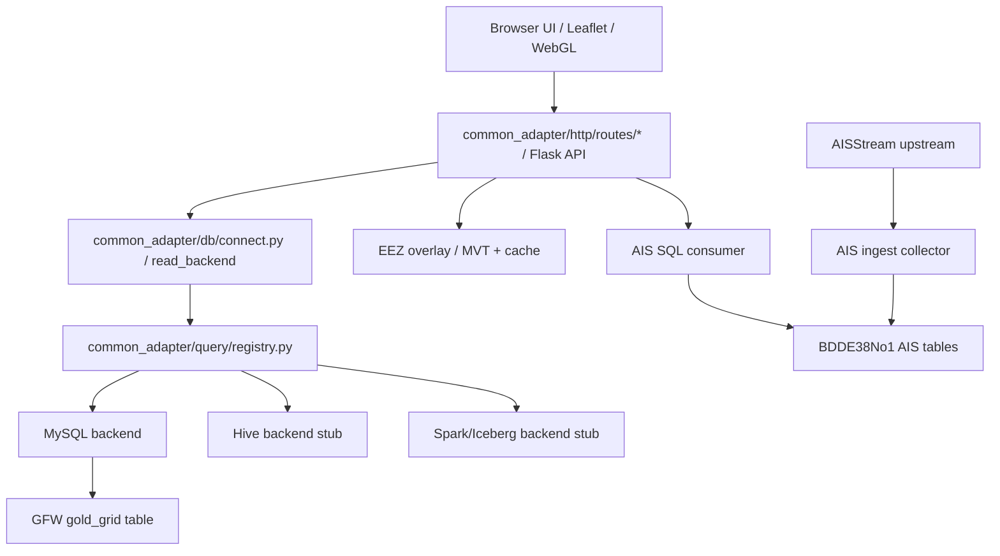
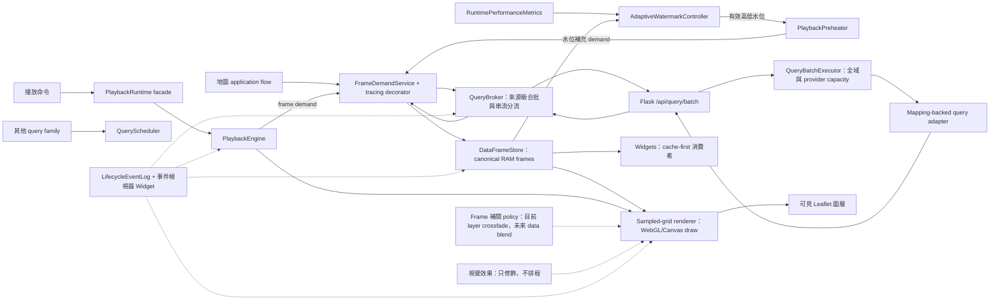
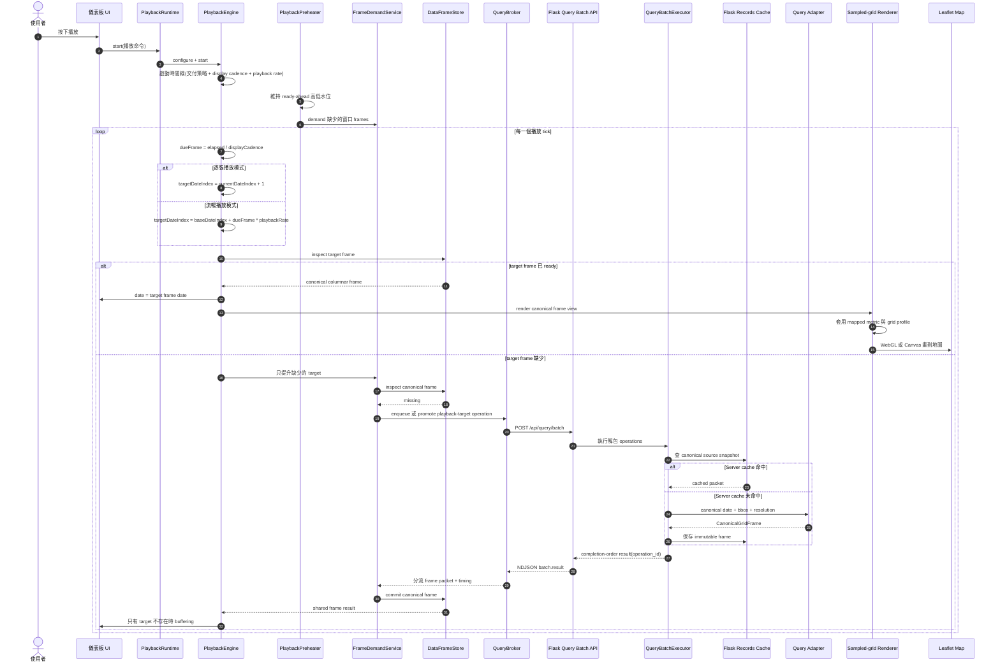
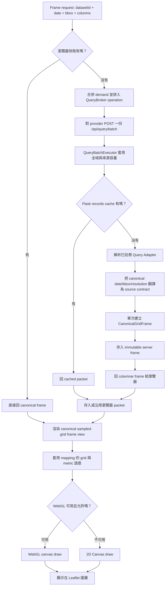
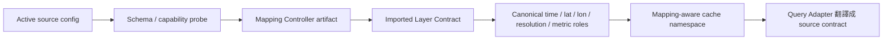

# Common Adapter

這是一個本機資料探索與轉接工具，用 Flask、MySQL、PostGIS、Leaflet 與前端 WebGL/Canvas 管線，把 GFW、AIS 與 EEZ 等資料接到同一個地圖介面上。

它目前是研究與原型工具，不是正式 GIS 產品，也不是資料上游的最終治理系統。

## 目前能力

- GFW 漁業網格資料：從 MySQL read model 讀取，前端優先使用 WebGL 繪製，無 WebGL 時退回 Canvas。
- AIS 船舶位置：前端只消費 SQL 裡的最新狀態表；AISStream 由獨立 collector 長駐寫入 SQL。
- EEZ 經濟海域：使用 PostGIS MVT tiles 與本機快取向量資料。
- 地圖 UI：支援資料集選擇、圖層排序、圖層齒輪設定、暗色模式、底圖切換、經緯網格、比例尺、全螢幕、截圖、測速欄、渲染 ready 燈號、時間播放與播放快取預熱。
- 設定頁：保留資料源、圖層與播放行為的設定入口，避免把所有控制塞在儀表板同一層。

外部 Chrome 無痕模式的全年冷／暖快取驗收結果記錄在
[`benchmarks/playback_lifecycle_acceptance_2026-07-15.md`](benchmarks/playback_lifecycle_acceptance_2026-07-15.md)。
第二輪 Runtime OOP 收斂後的全年回歸結果記錄在
[`benchmarks/runtime_oop_acceptance_2026-07-15.md`](benchmarks/runtime_oop_acceptance_2026-07-15.md)。
Widget UI／Application 邊界拆分後的回歸結果記錄在
[`benchmarks/widget_application_boundary_acceptance_2026-07-16.md`](benchmarks/widget_application_boundary_acceptance_2026-07-16.md)。
Clock Domain 與可信效能指標校正後的回歸結果記錄在
[`benchmarks/clock_domain_acceptance_2026-07-16.md`](benchmarks/clock_domain_acceptance_2026-07-16.md)。
自適應水位與最終全年冷／暖快取驗收結果記錄在
[`benchmarks/adaptive_watermark_acceptance_2026-07-16.md`](benchmarks/adaptive_watermark_acceptance_2026-07-16.md)。
Mapping、QueryBroker、共用快取收斂與目前側邊瀏覽器驗收結果記錄在
[`benchmarks/runtime_convergence_acceptance_2026-07-17.md`](benchmarks/runtime_convergence_acceptance_2026-07-17.md)。
目前 5081 sampled-grid 吞吐、完成順序 batch 與五個資料集播放驗收結果記錄在
[`benchmarks/sampled_grid_throughput_acceptance_2026-07-17.md`](benchmarks/sampled_grid_throughput_acceptance_2026-07-17.md)。
單次 Mapping 與端到端 columnar Canonical Frame 的驗收結果記錄在
[`benchmarks/sampled_grid_canonical_frame_acceptance_2026-07-18.md`](benchmarks/sampled_grid_canonical_frame_acceptance_2026-07-18.md)。

## 專案邊界

這個 repo 的主要角色是「消費端」：

- 消費 SQL/read model。
- 消費 PostGIS/MVT 或未來資料服務。
- 負責地圖視覺化、LOD、播放、快取與互動。

它不是正式的上游治理系統。但 AIS 目前缺少可直接使用的基礎資料庫，因此 repo 內保留一個例外的上游 collector：

- `core.py ingest-ais`
- `common_adapter/ais/ingest.py`
- `common_adapter/ais/stream.py`
- `config/runtime/ais_collector.local.json`

這個 collector 是為了養出可被小可愛消費的 AIS SQL 資料庫。未來若上游同學用 Airflow、K8、Hive、Spark/Iceberg 或其他 sink 接手，只要維持 read model 與 config contract，小可愛就不需要直接碰 AISStream。

## Handoff 交接文件

交接上游時看 `handoff/`：

- `handoff/airflow_ais_crawler/`：給 Airflow / crawler 負責人。重點是 AISStream collector、輪詢/重連設定、SQL sink、健康檢查與啟動方式。
- `handoff/backend_config_contract/`：給後端 / 系統負責人。重點是 `adapter` JSON、連線設定、MySQL/Hive/Spark 邊界、dataset 欄位與 capability matrix。

不要把真實 API key、資料庫密碼或本機私有路徑 commit 進 repo。真實值應放在：

- `config/runtime/adapter.local.json`
- `config/runtime/ais_collector.local.json`
- 環境變數
- 之後的 K8 Secret / Airflow Variable

## 架構總覽

```text
core.py
  -> common_adapter/http/interface.py       Flask app factory / route assembly
  -> common_adapter/http/server.py          server lifecycle / PID / port helpers
  -> common_adapter/http/routes/*           system / dataset / overlay / live / developer routes
  -> common_adapter/db/connect.py           dataset read dispatch
  -> common_adapter/db/backends/*           MySQL 與未來 backend adapters
  -> common_adapter/query/registry.py       database / endpoint 共用 query-adapter registry
  -> common_adapter/query/identity.py       mapping-aware cache namespace
  -> common_adapter/ais/live.py             AIS SQL consumer packet
  -> common_adapter/ais/ingest.py           AISStream upstream collector to SQL latest-state table
  -> common_adapter/spatial/overlay.py      EEZ fallback helpers
  -> common_adapter/spatial/lod.py          PostGIS / MVT EEZ tile helpers
  -> templates/index.html      Leaflet UI shell
  -> static/js/*               前端 state、API、layer、rendering、UI 模組
```

Runtime 只引用 `common_adapter/` 的正式模組。舊 root modules 與 `database/registry.py` 相容入口已刪除；新程式不得重新依賴這些路徑。

前端 Runtime 的狀態所有權、DI composition root、class 判定與後續 Application Service 規範見 [`docs/architecture/runtime-oop.md`](docs/architecture/runtime-oop.md)。

前端拆分：

- `static/app.js`：啟動 app，綁定 UI 與事件。
- `static/js/core`：共用 state、DOM、map、geo、render-state。
- `static/js/services`：render intent、sampled-grid `QueryBroker`、一般 query scheduler、canonical frame cache、API client 與共用 service helper。
- `static/js/playback`：播放控制、純時間線 scheduler、frame readiness buffer、playback renderer handoff、playback interpolation policy、獨立水位預熱器、自適應水位控制器與 snapshot splitter。
- `static/js/layers`：GFW、AIS、EEZ、graticule 圖層行為，以及 GFW zoom blur / crossfade 視覺效果邊界。
- `static/js/rendering`：WebGL/Canvas 能力檢查、renderer registry、GFW paint 設定。
- `static/js/ui`：table、播放控制、圖層選單、地圖設定、圖層樣式設定。

## 資料流



## Database backend 模式

資料來源讀取端以 config + query-adapter registry 解耦：

- `@query_adapter("mysql")` 註冊 database 或 endpoint adapter。
- `config/state/router_manifest.local.json` 決定目前啟用哪些 route fragments；DATABASE fragment 決定 dataset 使用哪個 backend、connection、table。
- `common_adapter/http/interface.py` 只負責 Flask app 組裝；HTTP shape 由 `common_adapter/http/routes/*` 管理。兩者都不應知道 MySQL、Hive、Spark 或 Iceberg 的查詢細節。
- `common_adapter/db/connect.py` 負責共用 database query helper 與 read dispatch；backend classes 位於 `common_adapter/db/backends/`。
- `common_adapter/query/registry.py` 統一負責 database 與 endpoint adapter 的 registration / instantiation。
- 外部欄位名稱只能留在 source adapter 與 mapping 邊界；runtime、cache、renderer 與 Widgets 只認 canonical roles。

Hive 與 Spark 目前只是明確保留的 unsupported stub。這代表架構上有位置，不代表目前已經完成 Hive、Spark 或 Iceberg 連線。

## 圖層

資料圖層選單由已導入的 Layer Contract 動態建立，不是前端寫死三個選項：

- Mapping Controller 產生的 sampled-grid 資料集
- active websocket/read-model route 提供的 AIS 船舶位置
- active spatial route 提供的 EEZ 經濟海域邊界

主資料圖層由啟用狀態控制，可以全部關閉；未勾選的 imported layer 不得查詢也不得渲染。EEZ 是獨立 overlay。圖層可拖拉排序，齒輪會依 Layer Contract 暴露 metric、resolution、顏色、alpha 與顯示模式。對有完整 coverage 的 sampled-grid，Mapping 的 `default_coverage_id` 只決定初始中心；coverage union 決定 CC 邊界與合法最低縮放層級，來源查詢則固定使用完整 coverage scope，不跟相機 zoom 改變。若來源因 cell limit 降到較粗解析度，必須以 requested／actual resolution 明確回報，不能偽裝成相機 LOD。

## 時間與播放

時間控制只有在選中的資料層具備時間能力時啟用。EEZ-only 模式會把日期與播放控制灰掉。

具時間能力的 sampled-grid 圖層支援：

- 單日模式
- 跳到最後一日
- 起訖日期
- replay
- 前一日 / 後一日
- 播放 / 暫停
- 播放速度
- 播放期間的獨立水位預熱

播放排程以時間線為主控：播放速度是時間軸倍率，不是舊的「上一格完成後再等待」迴圈。預設交付策略是分析模式：每一張選取範圍內的真實 snapshot 都會依序消耗，`playbackRate` 只改變下一張 snapshot 的目標節拍。設定頁已暴露流暢與嚴格模式端口，但兩者明確標示為尚未實作，因此現階段不會接管播放 clock。查詢與渲染工作不會在每格後再額外疊一個完整 interval。progressive 模式不會為了完整 prebuffer 阻塞開播；分析模式會進入 buffering 而不是跳過下一張，等待期間不推進播放進度，frame ready 後會先記錄 resumed，再顯示真實 snapshot。target request 失敗會成為明確的 frame-buffer failed 狀態，不會永遠停在 `fetching`；暫停、重播、切圖層與切資料集會讓舊背景預載進度失效。

所有 Runtime 計時由 `ClockDomain` 經 DI 注入，分成三個互不混用的時鐘：

- Monotonic wall clock：Queue、HTTP、Mapping、Cache、Buffer、timeout 與 P95。
- Playback clock：切片日期與播放節拍；只有這條路徑接受 `playbackRate`。
- Render clock：`requestAnimationFrame`、draw 與畫面可見時間。

生命周期事件只記錄 `monotonic_ms`。事件檢視器、測速 Widget 與狀態列共同讀取 `RuntimePerformanceMetrics`，不再各自建立等待時間或播放 telemetry 真相。

設定頁把播放器拆成多個責任 box，而不是把所有選項混在同一個控制面：

- 播放時間軸：播放交付策略與 `playbackRate` 決定播放器正在追哪一張真實 snapshot。分析模式已實作；流暢與嚴格模式是已暴露但未啟用的保留端口。
- Frame buffer：分析模式會回報 `fetching/missing/ready/waiting/failed` 邊界；`LifecycleEventLog` 會把 `BUFFER_ENTERED`、`BUFFER_RESUMED`、`FRAME_VISIBLE` 與 Queue/HTTP/cache/render 分開觀測。
- 資料快取 / 預熱：獨立生產者只維持 ready-ahead 高低水位；自適應模式取使用者 RAM 上限的 50% 作播放庫存容量，再以容量的 1/3、2/3 作低高補貨門檻，也可切回固定 10/15 水位。水位只管理背景庫存，不決定播放器能否前進。
- Frame 補間：播放可選用現有 layer crossfade 作為純視覺補間，也可在播放時直接切換真實 snapshot；真正資料 blend 仍保留給未來由 render artifact 支撐的 `requestAnimationFrame` 循環。
- 視覺效果：淡入淡出只修飾 layer 替換；高斯模糊只限縮放 / LOD 重算時遮罩。
- 渲染壓力與測速：renderer policy 與儀表板測速 Widget 只觀測或降級，不擁有播放 clock；`consumption_rate`、`supply_rate`、`cache_ready_latency_p95`、`ready_ahead_slices` 與 `ready_ahead_seconds` 由 Runtime 統一提供。

播放器不變式由 `tests/playback_contracts.test.mjs` 保護，可用下列命令執行：

```powershell
python scripts/playback_contract_smoke.py
```

目前鎖住的契約：

- `analysis` 交付策略使用 `sequential` 步進：即使 clock late 或速度是 4x，下一個 render target 仍必須是 `currentIndex + 1`。
- buffering 可以平移 scheduler clock，但 frame ready 前不能推進選取日期。
- progressive cold cache 會回報 `fetching 0 / 1`；target packet ready 後先記錄 `BUFFER_RESUMED`，然後才記錄 `FRAME_VISIBLE`。
- progressive request 失敗會回報 `failed` 並留下 lifecycle error event；若 target frame 長時間等不到，會以真實 monotonic 30 秒 timeout 停止播放，而不是受倍率影響或無限等待。
- 被取消或被取代的 progressive preheat，不得把 late progress、status 或 failure state 套到目前播放 generation。
- 冷快取播放先進入 `PREPARING`，只等待下一張真實 target；這段準備等待不計入播放停頓。播放期間由獨立預熱器在背景補足至高水位。
- 只有當下 target 缺少時才可進入 `BUFFERING`；target 一到貨就恢復，不等待低水位或高水位。手動 Seek 也只提升目標影格。
- `AdaptiveWatermarkController` 只讀 `RuntimePerformanceMetrics` 與 `DataFrameStore` 容量快照；它不執行 transport、不改變 query concurrency，也不清除快取。UI 只能預覽或顯示目前策略，只有 Preheater reconcile 能套用策略。
- `fluid` 是唯一允許把 elapsed time 映射到未來日期的 step mode；目前仍保留在 disabled 的流暢交付端口後面。
- prefetch、render、interpolation、blur 與測速觀測只供應或修飾 frame，不擁有播放日期 clock。

目前前端 module 邊界：

| Module | 邊界 |
| --- | --- |
| `static/js/playback/playback-delivery-policy.js` | 播放交付策略：analysis / smooth / strict 時間軸語意的唯一上層入口。目前只啟用分析模式；流暢與嚴格模式明確標示為保留端口。 |
| `static/js/core/clock-domain.js` | DI 注入的 monotonic、playback 與 render clocks；播放倍率只存在 playback cadence／consumption rate 計算。 |
| `static/js/playback/playback-scheduler.js` | 純時間線計算：cadence、due frame、speed/rate 映射與目標日期 index。 |
| `static/js/playback/playback-runtime-controller.js` | 播放子系統的公開 facade，也是 timer、generation、timeline 與 session callback 的唯一 owner；UI 不直接存取 Engine 或 Preheater。 |
| `static/js/playback/playback-time-policy.js` | 純 timeout policy；buffer timeout 使用 monotonic elapsed time，不讀播放倍率。 |
| `static/js/playback/playback-frame-buffer.js` | frame readiness 決策：missing/fetching/ready/waiting/failed 狀態 packet、target-frame buffering，以及最近 ready frame 選擇。 |
| `static/js/playback/playback-renderer.js` | 播放器到渲染的 handoff：設定選取日期、同步控制狀態、呼叫既有 active-layer reload。 |
| `static/js/playback/playback-interpolation-controller.js` | 播放補間 policy：播放時選擇 layer crossfade 或直接切換；資料 blend 尚未啟用。 |
| `static/js/core/canonical-grid-frame.js` | 瀏覽器端不可變 columnar sampled-grid frame 與零拷貝 index/BBOX view；只允許在明確的展示邊界建立 row 物件。 |
| `static/js/services/frame-identity.js` | canonical BBOX signature、request intent key、scope key 與回傳 frame key 的唯一建構器。 |
| `static/js/services/data-frame-store.js` | Canonical RAM frame store：intent/frame alias、局部 coverage 合成、pin/release、LRU 淘汰與 failure state；不執行 transport。 |
| `static/js/services/layer-query-coordinator.js` | sampled-grid 傳輸鏈以外查詢族群使用的 QueryScheduler：相同 intent 單次執行、queued task 提升、consumer scope 取消與前景保留槽。 |
| `static/js/services/query-policy-controller.js` | 一般 QueryScheduler 的 DI policy 命令邊界；不擁有 sampled-grid provider capacity 或播放水位。 |
| `static/js/services/query-broker.js` | 實體來源級 transport owner：跨資料集合併相容 operation，依 Registry 公開的來源容量限制有效 batch 與 in-flight operation；每收到一筆串流結果就釋放槽位並立即補入最高優先工作。provider key 不取代 dataset/cache identity。 |
| `static/js/services/frame-demand-service.js` | sampled-grid demand 邊界；先查 `DataFrameStore`、合併相容 inflight，真正 miss 才直接交給 `QueryBroker`，回傳後只提交一次 canonical packet。 |
| `common_adapter/query/batch.py` | Flask 端 batch 執行 owner；`QueryBatchExecutor` 維護全域 worker pool 與跨 request 共用的 provider capacity，在提交 worker 前取得來源 permit，避免等待中的來源占滿 worker 使其他來源飢餓；結果依完成順序串流，以 `operation_id` 還原身份並隔離同批失敗。 |
| `common_adapter/query/grid_frame.py` | Server 端不可變 columnar sampled-grid frame、builder、transport projection 與零拷貝 selection view。 |
| `static/js/services/frame-demand-decorators.js` | 由 DI 組裝的 observability decorator；只記錄 demand 邊界耗時與結果，不改變快取、排程、transport、回傳值或錯誤語意。 |
| `static/js/playback/playback-preheater.js` | 長時間存在的生產者，獨立維護 ready-ahead 高低水位，不擁有播放 clock。 |
| `static/js/playback/adaptive-watermark-controller.js` | DI 建立的有狀態 policy owner；依可信供需、cache-ready P95、播放消耗率與 RAM 預算決定有效水位，並以 monotonic hysteresis 防止頻繁下降。 |
| `static/js/playback/playback-engine.js` | frame 消費者與播放生命週期 owner；擁有下一 target 準備、target miss 緩衝、可見 frame pin 與相關 lifecycle event。播放就緒只看下一 target，不讀補貨水位。 |
| `static/js/playback/playback-cache-service.js` | 播放快取設定與狀態 facade；只暴露水位與 RAM 容量，不擁有 transport 或 batch pipeline。 |
| `static/js/services/lifecycle-event-log.js` | 有界事件記錄、Run 匯出，以及 Queue/HTTP/cache/render/stall 體感指標。 |
| `static/js/services/runtime-performance-metrics.js` | 由 lifecycle、preheater 與 engine 組合唯一可信的供需、尾端延遲、ready-ahead 與 buffer wait snapshot。 |
| `static/js/ui/widgets/capabilities/event-viewer.js` | 唯讀生命週期事件檢視器 Widget，支援 Run/資料集/事件篩選與 JSON 匯出。 |
| `static/js/layers/gfw-layer-effects.js` | 純視覺 sampled-grid layer effects：zoom/LOD blur、reveal、retired-layer cleanup 與 crossfade。檔名是歷史名稱，只輸出 `SampledGridLayerEffects`。 |
| `static/TimingMetrics.js` | DI 建立的渲染與查詢測速 service；只接受 ClockDomain，不保存播放事件第二真相。 |



AIS live 模式目前不走日期播放器。

## 播放快取與預熱

播放快取是 sampled-grid 查詢管線的一部分：

- `static/js/playback/playback-cache-service.js` 提供水位、容量與狀態顯示；實際補充生命週期由 `PlaybackPreheater` 擁有。
- `static/js/playback/playback-controls.js` 保留按鈕、狀態投影與設定視窗；播放節奏與 timer 由 `PlaybackRuntime` 擁有。
- 預熱器在圖層、日期範圍與查詢 scope 確定後獨立運作；低於低水位時非同步補到高水位。
- `AdaptiveWatermarkController` 在尚無 frame-size 樣本時使用固定低 10 / 高 15；有樣本後取設定 RAM 上限的 50% 換算播放庫存容量，低水位為容量 1/3、高水位為 2/3。供需比低於 1 只觸發提前補貨，不改變播放 gate。
- 有效高水位受 `DataFrameStore` RAM／entry 預算共同限制。水位提高可立即生效；降低使用 monotonic hold 與有限步長，避免短期波動造成來回震盪。
- 高水位代表目標 ready-ahead，不代表開相同數量的 HTTP。sampled-grid 瀏覽器傳輸由 `QueryBroker` 依 provider capacity 計算有效 batch 與可用槽位；Flask 解包後的全域與來源 operation capacity 分別由 runtime `query_policy.network_concurrency` 與 source `query_policy.max_in_flight` 管理。
- 設定頁可在自適應與固定水位間切換；切換只重算 policy，不會清除已完成的 Canonical frame。
- 預熱器 `FETCHING` 與播放器 `PLAYING` 可同時成立。冷啟動 `PREPARING` 與中途 `BUFFERING` 都只等待下一 target；背景水位不構成播放資格門檻。
- 快取有容量上限，瀏覽器預設 512 MB，可在播放設定中調整。
- 快取生命週期以瀏覽器頁面為主；關閉頁面後可視為釋放。
- HTTP sampled-grid adapter 另有 server-side canonical source snapshot cache；`query_policy.snapshot_cache_max_rows` 是跨 dataset namespace 的全域 row budget，不會讓每個資料集各自無上限常駐。

設計原則：地圖擁有 source query 意圖與最高優先序；播放負責供應時間窗口，Widgets 優先消費已完成快照。取消預熱或 Widget 插隊只能取消未完成任務，不得清除 canonical cache。

## Sampled-grid 查詢與快取生命週期

每一個 frame 是 canonical records packet，主要由下面這組 key 決定：

```text
mapping-aware cache namespace + date + source-scope bbox + limit + columns + resolution context
```

cache namespace 由目前 mapping contract 推導，包含 source route、canonical 欄位角色、grid profile、resolution policy 與 query contract。只要 mapping 語意改變，就會使用新的 namespace；密碼與純視覺設定不影響資料快取身分。Registry 另從實體來源路由推導不含密鑰的 provider transport key 與容量；共用 provider key 的資料集共用同一個容量池，但仍保有各自的 cache namespace 與 canonical frame。冷路徑由 `FrameDemandService` 合併 logical intent 並直接委派給 `QueryBroker`，Broker 依可用來源槽位把相容 operation 壓成 NDJSON request；Flask 再由 `QueryBatchExecutor` 解包，在全域 worker 上限與來源 `query_policy.max_in_flight` 之內執行，並以完成順序串流、用 `operation_id` 還原身份。Mapping 對每筆 source row 只走一次，直接寫入不可變的 columnar `CanonicalGridFrame`；server cache、transport、browser store、Renderer 與 Widgets 共用同一種 frame 表示，不再膨脹第二份 row graph。每份 operation 結果只提交一次到 `DataFrameStore`；暖路徑讓地圖、播放、選取工具與 Widgets 共用同一份 immutable frame。

只有地圖/query application layer 可以建立 sampled-grid demand。`QueryBroker` 依 `map-current`、`playback-target`、`playback-window`、`widget-interactive`、`widget-auto/background` 排序；`QueryScheduler` 是其他 query family 的獨立 owner，不得再巢狀包住這條鏈。Widget 先查 canonical cache，只有明確允許的 miss 才能經 demand 邊界補一張；表格工具是嚴格唯讀的目前快照快取檢閱器，不能向 source 發 request。

容量有兩個獨立維度：runtime `query_policy.network_concurrency` 限制 Flask `QueryBatchExecutor` 的總 worker 數，source config 的 `query_policy.max_in_flight` 限制同一實體 provider 同時執行的解包 operation。後者未宣告時保守採 `1`；追蹤的 Pipeline Iceberg 範例採 `2`，是依相同日期集合的一路／兩路量測決定。`/api/datasets` 會公開來源容量，瀏覽器 dispatch 前計算 `min(batch_max_operations, source_capacity, available_slots)`；播放水位不得改變這兩個容量。

來源錯誤語意由 Mapping 翻譯。`snapshot.no_data` 把來源特有的缺 partition 錯誤轉成空的 canonical snapshot 並做負快取；`snapshot.retry` 只處理有限次的瞬時錯誤重試；`resolution_policy` 只在來源確實有較粗 LOD 時降級。三者不能混用。



Frame 來源判斷：



Config 與 layer mapping 的角色：



## 渲染與來源解析度

Sampled-grid 渲染優先走 WebGL，無法使用時回退 Canvas。相機縮放與來源解析度是兩個獨立邊界：

- Mapping 宣告完整 coverage 的資料集，以固定 coverage bbox 建立 frame/cache 身分；平移與縮放只觸發 Renderer 重繪，不重發來源 query。
- 沒有 bounded coverage、且來源契約本來就是 bbox-backed 的資料集，仍由 viewport 決定查詢範圍，離開已快取範圍時才補查。
- 使用者明確調整 resolution 時可以取得另一份 source packet；camera zoom 不得作為 sampled-grid query 參數。
- 日期播放換幀依賴 canonical cache readiness、renderer 工作與 layer crossfade，不因相機層級建立另一條播放生命週期。
- 漸層色票、alpha、最大強度與粒度控制只改各自擁有的視覺或來源契約，不互相冒充。

EEZ 被視為接近底圖的 overlay，應盡量重用向量 tile / local vector cache，而不是每次平移都重新載入。

## AIS collector

AIS 拆成兩個進程：

```powershell
.\.venv\Scripts\python.exe core.py --config config\runtime\adapter.local.json serve
```

負責地圖與 API。

```powershell
.\.venv\Scripts\python.exe core.py --config config\runtime\adapter.local.json ingest-ais --collector-config config\runtime\ais_collector.local.json
```

負責長駐 AISStream collector，寫入 SQL。

AIS latest-state table 採用 `mmsi` upsert：一艘船保留最新狀態，不無限制成長。若未來要歷史軌跡，應建立獨立 history/events table，並設定 retention policy。

目前內部 key check 不是正式 auth，只是原型邊界標記：前端設定 AIS key 後，consumer 端只保存 fingerprint；raw key 交給 collector handoff。小可愛讀 SQL 前會確認 SQL metadata 中的 collector key fingerprint 是否匹配。

## GFW upstream collector

GFW ingestion 被視為 upstream collector job，不是前端功能：

- `collectors/gfw_collector.py`：將 GFW DuckDB source 匯入 SQL read model。

地圖 UI 不應知道原始 source path 或暫存 manifest。這些屬於 collector 設定；小可愛只消費 SQL/read model 或之後約定好的資料服務。

## 快速啟動

```powershell
py -3 -m venv .venv
.\.venv\Scripts\python.exe -m pip install -r requirements.txt
Copy-Item config\examples\runtime\adapter.example.json config\runtime\adapter.local.json -Force
```

接著編輯：

```text
config\runtime\adapter.local.json
```

啟動服務：

```powershell
.\.venv\Scripts\python.exe core.py --config config\runtime\adapter.local.json serve
```

開啟：

```text
http://127.0.0.1:5057
```

服務是 single-instance：啟動時會讀 `flask_pid.txt`，若舊 Flask 進程還在，會強制退出舊進程並清理 port，避免重複查詢 AIS 或資料庫。

## EEZ 的 PostGIS 依賴

當 `overlays.eez.provider` 設為 `postgis` 時，PostGIS 是 EEZ 的正式執行期依賴。地圖正常渲染 EEZ 時走 PostGIS MVT table，不是在前端或 Flask 直接讀 `.gpkg`。

Marine Regions 的預設下載 URL 會先回傳互動表單，再提供 zip 檔。下載器現在會用 `source.form` 自動填寫表單、保留第一次請求的 cookie、送出 disclaimer agreement，並在寫入前確認最後回應是真正的 zip。若專案要回報其他 contact metadata，可以在 local config 覆寫 `source.form`。

先啟動 PostGIS：

```powershell
docker compose up -d postgis
```


把 EEZ 匯入 PostGIS：

```powershell
.\.venv\Scripts\python.exe scripts\import_eez_to_postgis.py --config config\runtime\adapter.local.json --replace
```

啟動前可先做依賴健檢：

```powershell
.\.venv\Scripts\python.exe core.py --config config\runtime\adapter.local.json check-dependencies
```

`core.py serve` 會先確認 EEZ runtime assets，再執行依賴檢查。若本地 `data/eez/eez_v12.gpkg` 不存在且 `auto_download` 為 true，啟動會先自動下載並解壓 GPKG。若 `eez_v12`、`eez_v12_tile` 或 `eez_v12_boundary` 缺表或空表且 `auto_import` 為 true，啟動會在開服務前從 GPKG 匯入 PostGIS。

## 常用 API

```text
GET /api/health
GET /api/datasets
GET /api/datasets/<dataset_id>/schema
GET /api/datasets/<dataset_id>/records?date=YYYY-MM-DD&bbox=west,south,east,north&limit=max
GET /api/datasets/<dataset_id>/records/range?start=YYYY-MM-DD&end=YYYY-MM-DD&bbox=west,south,east,north&limit=max
POST /api/query/batch
GET /api/overlays/eez
GET /api/overlays/eez/tiles/<z>/<x>/<y>.pbf
GET /api/overlays/eez/boundary/tiles/<z>/<x>/<y>.pbf
GET /api/live/ais?bbox=west,south,east,north
GET /api/live/ais/ingest/status
GET /api/live/ais/settings
GET /api/live/ais/diagnostics
POST /api/live/ais/settings
DELETE /api/live/ais/settings
GET /api/render/capability
```

## 驗證

Demo-critical smoke：

```powershell
python scripts\demo_smoke.py --base-url http://127.0.0.1:5081
```

架構與生命週期合約：

```powershell
python -m unittest discover -s tests
node --test tests/*.test.mjs
```

以單路冷查詢 worker、30 日暖窗、拖曳視窗、選格與 LOD probe 稽核資料集完整可用日期。單路預設用來量測實體來源，不再重現已由 Runtime Broker 隔離的來源過度並行競爭：

```powershell
python scripts\full_year_cache_benchmark.py `
  --dataset pipeline_iceberg.fishing_hours `
  --concurrency 1 `
  --warm-window 30 `
  --output "$env:TEMP\rrkal-full-year.json"
```

2026-07-17 本機 checkpoint，使用 Mapping 最細解析度、單路冷查詢與 30 日暖快取：

| 資料集 | 日期 | 冷跑完成 | 冷跑中位 / p95 | 暖窗命中 / p95 | 選格 | 實際解析度 |
| --- | ---: | ---: | ---: | ---: | ---: | ---: |
| `pipeline_iceberg.fishing_hours` | 366 | 366 | 781 ms / 1,113 ms | 30 / 30 / 67 ms | 30 ms，cache hit | 4 km |
| `pipeline_iceberg.chlor_a` | 355 | 355 | 793 ms / 1,088 ms | 30 / 30 / 61 ms | 13 ms，cache hit | 4 km |
| `pipeline_iceberg.ocean_productivity_score` | 355 | 355 | 803 ms / 1,183 ms | 30 / 30 / 65 ms | 14 ms，cache hit | 4 km |
| `pipeline_iceberg.sea_temperature` | 356 | 356 | 781 ms / 1,006 ms | 30 / 30 / 63 ms | 26 ms，cache hit | 4 km |
| `pipeline_iceberg.sustainability_pressure` | 355 | 355 | 762 ms / 1,190 ms | 30 / 30 / 75 ms | 16 ms，cache hit | 4 km |
| `gfw_full` | 31 | 31 | 31 ms / 56 ms | 30 / 30 / 31 ms | 7 ms source probe | 9.28 km |

六個資料集共 1,818 個可用日期全部完成，沒有失敗。Pipeline Iceberg 全程使用要求的 4 km route，沒有 LOD 降級，server snapshot high-water 也維持在全域 `800,000` canonical rows 上限內。GFW 的 server probe 仍是 bbox MySQL 查詢；瀏覽器 containment reuse 另由快取合約測試保護，選取已快取 viewport 內的 Tile 不得再次發送 transport request。

5081 管路吞吐使用固定 30-frame A/B 基準：

```powershell
python scripts\sampled_grid_batch_benchmark.py `
  --dataset pipeline_iceberg.sea_temperature `
  --frames 30 `
  --output "$env:TEMP\sampled-grid-batch.json"
```

2026-07-18 canonical-frame 冷快取 checkpoint：`8791` 單路 1.470 fps、雙路 2.594 fps；完整 `5081` batch=2 管路達到 **1.377 fps**，比前一版 1.095 fps 提升 25.8%，兩張一批的 P95 為 1.468 秒。暖 batch=2 為 6.787 fps。來源容量為 2 時，三筆 operation 的 batch 仍會以 HTTP 400 拒絕。Mapping 現在以單一 pass 直接寫入不可變 columnar frame；server cache、transport、browser store、Renderer 與 Widgets 不再建立、膨脹或深拷貝 sampled-grid row graph。等價驗證、完整計時對帳與冷快取 2x 尚差約 3.6% 的邊界，都記錄於上方 canonical-frame 驗收報告。

若要單獨驗證 Mapping 等價性與 CPU 成本：

```powershell
python scripts\sampled_grid_mapping_microbenchmark.py --rows 24192 --repeats 5
```

JavaScript syntax check：

```powershell
Get-ChildItem static\js -Recurse -Filter *.js | ForEach-Object { node --check $_.FullName }
node --check static\app.js
```

Python syntax check：

```powershell
.\.venv\Scripts\python.exe -m py_compile core.py common_adapter\http\interface.py common_adapter\db\connect.py common_adapter\spatial\dependency.py common_adapter\spatial\lod.py
```

Git whitespace check：

```powershell
git diff --check -- static templates scripts *.py config requirements.txt docker-compose.yml README.md README.zh-TW.md
```

## 架構不變式

- Router Manifest 的 `active_configs` 是 source 啟用真相；資料夾與 JSON `role` 必須同步。
- Mapping Controller artifact 是外部 schema 到 canonical roles 的唯一翻譯層。
- `imported_layers` 決定哪些 mapping contracts 可進入 dashboard；未啟用圖層不得查詢。
- 地圖/query layer 是 source transport 的 owner；Widgets 優先讀 canonical cache。
- 表格 Widget 是目前快照的唯讀 cache inspector，不能發送 source query。
- pending task cancellation、viewport change 與 completed-cache eviction 是三種不同操作，不能互相代替。
- 舊 root wrappers、database registry alias、runtime config materializer 與 Widget 相容入口已刪除。

## 注意事項

- 不要 commit `config/runtime/adapter.local.json`。
- 不要 commit `config/runtime/ais_collector.local.json`。
- 不要 commit runtime logs、PID、下載資料集、資料庫檔。
- 真實 secret 應放環境變數、local config、K8 Secret 或 Airflow Variable。
- AISHub polling 目前只是備援，不是 MVP 主線。
- EEZ 海域管轄判定已註冊為 `1x1` Widget，會消費虛擬網格選取並區分管轄、爭議、共管與其他映射情況；它是探索性資料判讀，不是法律認定。
