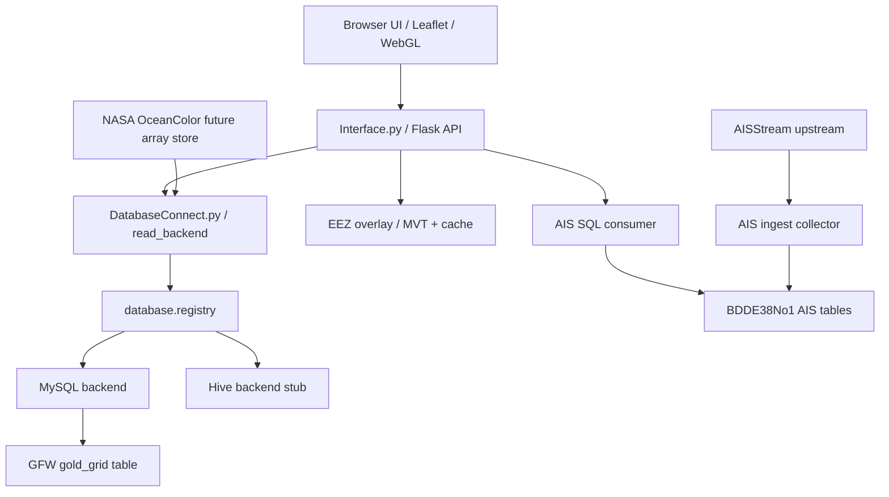

# GFW Flask MySQL Adapter

這是一個本機海洋資料探索工具，用 Flask、MySQL、PostGIS、Leaflet 與前端 WebGL/Canvas 管線，把 GFW、AIS、EEZ 與後續 NASA OceanColor 類資料接到同一個地圖介面上。

它目前是研究與原型工具，不是正式 GIS 產品，也不是資料上游的最終治理系統。

## 目前能力

- GFW 漁業網格資料：從 MySQL read model 讀取，前端優先使用 WebGL 繪製，無 WebGL 時退回 Canvas。
- AIS 船舶位置：前端只消費 SQL 裡的最新狀態表；AISStream 由獨立 collector 長駐寫入 SQL。
- EEZ 經濟海域：使用 PostGIS MVT tiles 與本機快取向量資料。
- 地圖 UI：支援資料集選擇、圖層排序、圖層齒輪設定、暗色模式、底圖切換、經緯網格、比例尺、全螢幕、截圖、測速欄、渲染 ready 燈號、時間播放與播放快取預熱。
- 設定頁：保留資料源、圖層與播放行為的設定入口，避免把所有控制塞在儀表板同一層。

## 專案邊界

這個 repo 的主要角色是「消費端」：

- 消費 SQL/read model。
- 消費 PostGIS/MVT 或未來資料服務。
- 負責地圖視覺化、LOD、播放、快取與互動。

它不是正式的上游治理系統。但 AIS 目前缺少可直接使用的基礎資料庫，因此 repo 內保留一個例外的上游 collector：

- `core.py ingest-ais`
- `AisIngestService.py`
- `AisStreamProvider.py`
- `config/ais_collector.local.json`

這個 collector 是為了養出可被小可愛消費的 AIS SQL 資料庫。未來若上游同學用 Airflow、K8、Hive 或其他 sink 接手，只要維持 read model 與 config contract，小可愛就不需要直接碰 AISStream。

## Handoff 交接文件

交接上游時看 `handoff/`：

- `handoff/airflow_ais_crawler/`：給 Airflow / crawler 負責人。重點是 AISStream collector、輪詢/重連設定、SQL sink、健康檢查與啟動方式。
- `handoff/backend_config_contract/`：給後端 / 系統負責人。重點是 `adapter` JSON、連線設定、MySQL/Hive 切換點、dataset 欄位與 capability matrix。

不要把真實 API key、資料庫密碼、Earthdata 帳密或本機私有路徑 commit 進 repo。真實值應放在：

- `config/adapter.local.json`
- `config/ais_collector.local.json`
- 環境變數
- 之後的 K8 Secret / Airflow Variable

## 架構總覽

```text
core.py
  -> Interface.py              Flask routes / HTTP API
  -> DatabaseConnect.py        dataset read dispatch / compatibility wrappers
  -> database/registry.py      @database_backend registry
  -> AisLiveService.py         AIS SQL consumer packet
  -> AisIngestService.py       AISStream upstream collector to SQL latest-state table
  -> SpatialOverlay.py         EEZ fallback helpers
  -> LodOverlayService.py      PostGIS / MVT EEZ tile helpers
  -> templates/index.html      Leaflet UI shell
  -> static/js/*               前端 state、API、layer、rendering、UI 模組
```

前端拆分：

- `static/app.js`：啟動 app，綁定 UI 與事件。
- `static/js/core`：共用 state、DOM、map、geo、render-state。
- `static/js/services`：API client、GFW record cache、播放快取與預熱 orchestration。
- `static/js/layers`：GFW、AIS、EEZ、graticule 圖層行為。
- `static/js/rendering`：WebGL/Canvas 能力檢查、renderer registry、GFW paint 設定。
- `static/js/ui`：table、播放控制、圖層選單、地圖設定、圖層樣式設定。

## 資料流



## Database backend 模式

資料庫讀取端以 config + registry 解耦：

- `@database_backend("mysql")` 註冊 backend。
- `config/adapter.local.json` 決定 dataset 使用哪個 backend、connection、table。
- `Interface.py` 只知道 API shape，不知道 MySQL 或 Hive 的細節。
- `DatabaseConnect.py` 負責 read dispatch。
- `database/registry.py` 負責 backend registration / instantiation。

Hive 目前只是明確保留的 unsupported stub。這代表架構上有位置，不代表目前已經完成 Hive 連線。

## 圖層

目前資料集選擇器支援：

- GFW 漁業網格
- AIS 船舶位置
- EEZ 經濟海域邊界

GFW 與 AIS 是互斥主圖層：可以都不開，但不能同時當主圖層。EEZ 是獨立 overlay，可以疊在 GFW 或 AIS 上。圖層可拖拉排序，齒輪可調整顏色、alpha、顯示模式等。

## 時間與播放

時間控制只有在選中的資料層具備時間能力時啟用。EEZ-only 模式會把日期與播放控制灰掉。

GFW 支援：

- 單日模式
- 跳到最後一日
- 起訖日期
- replay
- 前一日 / 後一日
- 播放 / 暫停
- 播放速度
- 播放前預熱快取

AIS live 模式目前不走日期播放器。

## 播放快取與預熱

播放快取是 v95 之後的重要行為：

- `static/js/services/playback-cache-service.js` 負責播放前預熱、進度統計、快取容量顯示與預熱策略。
- `static/js/ui/playback-controls.js` 只保留控制器事件、按鈕狀態、播放節奏與設定視窗。
- 預熱模式可設定為關閉、播放前完整預熱、或漸進式背景預熱。
- 預熱時播放按鈕會被防呆，避免資料還沒 ready 就開始播放。
- 快取有容量上限，預設 2 GB，可在播放設定中調整。
- 快取生命週期以瀏覽器頁面為主；關閉頁面後可視為釋放。

設計原則：使用者看圖時，程式不要只是等使用者操作，而是預先準備時間序列播放可能用到的資料。

## 渲染與 LOD

GFW 渲染優先走 WebGL，無法使用時回退 Canvas。GFW record cache 會依 viewport、zoom、date、dataset 與粒度建立快取。

目前行為：

- 同 zoom 平移時盡量沿用既有 LOD packet。
- zoom 改變時才重新選擇 LOD。
- 成功渲染後會在背景預熱其他設定過的 zoom / LOD packet。
- GFW 支援漸層色票、alpha、最大強度與粒度控制。

EEZ 被視為接近底圖的 overlay，應盡量重用向量 tile / local vector cache，而不是每次平移都重新載入。

## AIS collector

AIS 拆成兩個進程：

```powershell
.\.venv\Scripts\python.exe core.py --config config\adapter.local.json serve
```

負責地圖與 API。

```powershell
.\.venv\Scripts\python.exe core.py --config config\adapter.local.json ingest-ais --collector-config config\ais_collector.local.json
```

負責長駐 AISStream collector，寫入 SQL。

AIS latest-state table 採用 `mmsi` upsert：一艘船保留最新狀態，不無限制成長。若未來要歷史軌跡，應建立獨立 history/events table，並設定 retention policy。

目前內部 key check 不是正式 auth，只是原型邊界標記：前端設定 AIS key 後，consumer 端只保存 fingerprint；raw key 交給 collector handoff。小可愛讀 SQL 前會確認 SQL metadata 中的 collector key fingerprint 是否匹配。

## GFW / NASA upstream collectors

GFW 與 NASA 也被視為 upstream collector，不是前端功能：

- `collectors/gfw_collector.py`：將 GFW DuckDB source 匯入 SQL read model。
- `collectors/nasa_ocean_collector.py`：列出 NASA OceanColor 檔案、下載、檢查 NetCDF/HDF、轉成 Zarr，並寫入資料索引。

NASA OceanColor 不應把 4 km daily pixel 全部攤平成 MySQL。建議路徑：

```text
NASA NetCDF/HDF
  -> raw file cache
  -> Zarr/xarray 或 TileDB array store
  -> DuckDB/SQL metadata + tile-stat read model
  -> map / BI consumer query
```

目前 starter 變數：

- `CHL.chlor_a`
- `FLH.nflh`
- `KD.Kd_490`
- `SST.sst`

## 快速啟動

```powershell
py -3 -m venv .venv
.\.venv\Scripts\python.exe -m pip install -r requirements.txt
Copy-Item config\adapter.example.json config\adapter.local.json -Force
```

接著編輯：

```text
config\adapter.local.json
```

啟動服務：

```powershell
.\.venv\Scripts\python.exe core.py --config config\adapter.local.json serve
```

開啟：

```text
http://127.0.0.1:5057
```

服務是 single-instance：啟動時會讀 `flask_pid.txt`，若舊 Flask 進程還在，會強制退出舊進程並清理 port，避免重複查詢 AIS 或資料庫。

## 測試資料

大型資料不 commit 到 repo。`config/test_data.example.json` 與 `TestDataBootstrap.py` 提供測試資料 bootstrap。若缺少預期檔案，可執行：

```powershell
.\.venv\Scripts\python.exe core.py --config config\adapter.local.json bootstrap-test-data
```

這是測試便利路徑，未來可移除，不應綁死在 core 邏輯。

## 常用 API

```text
GET /api/health
GET /api/datasets
GET /api/datasets/<dataset_id>/schema
GET /api/datasets/<dataset_id>/records?date=YYYY-MM-DD&bbox=west,south,east,north&limit=100000
GET /api/overlays/eez
GET /api/overlays/eez/tiles/<z>/<x>/<y>.pbf
GET /api/overlays/eez/boundary/tiles/<z>/<x>/<y>.pbf
GET /api/live/ais?bbox=west,south,east,north
GET /api/live/ais/ingest/status
GET /api/live/ais/settings
GET /api/live/ais/diagnostics
POST /api/live/ais/settings
DELETE /api/live/ais/settings
GET /api/render/capability
```

## 驗證

JavaScript syntax check：

```powershell
Get-ChildItem static\js -Recurse -Filter *.js | ForEach-Object { node --check $_.FullName }
node --check static\app.js
```

Python syntax check：

```powershell
.\.venv\Scripts\python.exe -m py_compile core.py Interface.py DatabaseConnect.py LodOverlayService.py
```

Git whitespace check：

```powershell
git diff --check -- static templates *.py config requirements.txt docker-compose.yml README.md README.zh-TW.md
```

## 文件漂移檢查結果

本次檢查時：

- `README.md` 已涵蓋大多數 v94 架構，包括中文 UI、GFW/EEZ/AIS、SQL/Hive 邊界、upstream handoff、NASA collector 與資料不入 repo 的策略。
- `README.md` 缺少 v95 新增的 `playback-cache-service.js` 模組說明，因此已補上。
- `handoff/*.zh-TW.md` 與 `benchmarks/*.md` 可以用 UTF-8 嚴格解碼，沒有 U+FFFD 或 PUA；PowerShell 看到的亂碼是終端顯示問題，不是檔案本體壞掉。
- 現在新增本中文 README，作為 repo 使用者的主要 zh-TW 入口。

## 注意事項

- 不要 commit `config/adapter.local.json`。
- 不要 commit `config/ais_collector.local.json`。
- 不要 commit runtime logs、PID、下載資料集、資料庫檔。
- 真實 secret 應放環境變數、local config、K8 Secret 或 Airflow Variable。
- AISHub polling 目前只是備援，不是 MVP 主線。
- EEZ 國家/主權歸屬尚未完成，只畫幾何，不等於已能說明每一片海域屬於誰。
