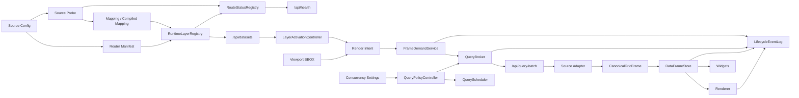

# 控制面真相審計

狀態：Architecture Truth Baseline 與收斂紀錄<br>
審計日期：2026-07-18<br>
Git 基線：`e5dc876d3b6073d0a4483a5fb93c6d897556b265`<br>
範圍：Config、Developer UI、Registry、Mapping、Runtime、Query、Cache、Playback、Renderer 與 Observability<br>
說明：基線段落保留修正前的觀察；各 CPD 的「收斂結果」與總表則記錄同一工作樹完成的修正。Arrow／Codec 遷移不在本輪範圍。

## 1. 結論

目前系統不是「動態載入鏈全部失效」，也不是「Mapping 完全沒有作用」。Config 移動、角色同步、啟用、圖層導入、Mapping 保存、Runtime Registry 失效重建與 Dashboard 重新載入，已經形成可用的主鏈。

基線審計確認，真正的問題是部分控制面宣稱的權責大於實際權責，導致 Declared Truth、Resolved Truth、Runtime Truth 與 Observed Truth 不一致。當時最主要的三個結構性飄移是：

1. Schema Probe 目前受既有 Mapping 反向過濾，形成 `Mapping -> Probe` 的反向依賴。
2. 查詢並行設定只控制 `QueryScheduler`，但 sampled-grid 的主要 Browser 傳輸走 `QueryBroker`，UI 宣稱的作用範圍不成立。
3. Mapping 對 MySQL 是可編輯控制面，對 pipeline-iceberg 卻是唯讀的產生結果；同時 sampled-grid Canonical roles 仍是固定集合，因此 Mapping 尚未成為所有資料源與欄位語意的完整唯一真相。

本輪已先收斂 Probe、Mapping extensions、Query Policy、Route Status、BBOX、連線引用、AIS 路徑、Browser Profile 與 sampled-grid 通用命名。下一階段仍不應跳過 Canonical Schema typing 與 lineage，直接讓 Codec 決定欄位；Codec 只能負責物理編碼。

## 2. 真相模型

本審計將每項控制拆成四層：

| 層級 | 定義 | 典型 owner |
|---|---|---|
| Declared Truth | 使用者在 UI 或 Config 宣告的意圖 | Config、Developer UI、Settings UI |
| Resolved Truth | 將外部宣告解析成內部合約 | Registry、Mapping、Capability Matrix |
| Runtime Truth | 真正擁有可變狀態與生命週期的物件 | Application Service、Engine、Store、Scheduler |
| Observed Truth | 對外呈現的實際狀態與事件 | LifecycleEventLog、Status Machine、Health API |

正確控制鏈應符合：

```text
Declared Truth
-> Resolver 驗證與正規化
-> 唯一 Runtime owner 套用
-> Observability 從同一 owner 或事件來源讀取
```

控制面不能直接改第二份鏡像狀態，也不能用「UI 已更新」代替「Runtime 已套用」。

## 3. 飄移分類與嚴重度

| 類型 | 意義 |
|---|---|
| `INERT_CONTROL` | UI 可見且可操作，但沒有到達 Runtime owner |
| `COSMETIC_STATUS` | 狀態看似正常，但不是從實際 Runtime 真相推導 |
| `HIDDEN_OVERRIDE` | Runtime 靜默改寫使用者要求，且控制面或事件未揭露 |
| `DUAL_TRUTH` | 同一語意由兩個以上狀態或元件共同決定 |
| `REVERSE_DEPENDENCY` | 下游產物反過來限制上游探測或宣告 |
| `STALE_PROPAGATION` | 宣告已變更，但 Resolver、Runtime 或 UI 未同步 |
| `CROSS_DOMAIN_LEAK` | 一份 Config 或 class 同時擁有不同生命週期的責任 |
| `UNREACHABLE_CONTROL_STATE` | 演算法或 UI 宣告某狀態，但正式操作流程無法產生該狀態 |

| 等級 | 判定 |
|---|---|
| P1 | 會破壞資料、路由、查詢或可用性真相，下一個穩定 checkpoint 前應修正 |
| P2 | 可見控制失效、隱藏覆寫或功能不可達，應在 Codec 遷移前處理 |
| P3 | 目前未直接破壞主流程，但會誤導後續維護或形成新旁路 |

## 4. 目前執行快照

以下數字是 2026-07-18 修正前對本機服務的唯讀觀察，只是歷史基線，不是目前 Runtime 或永久合約：

| 項目 | 目前觀察 |
|---|---|
| Active source configs | 4：database 2、spatial 1、websocket 1 |
| Imported layers | 8 |
| `/api/datasets` sampled-grid datasets | 6 |
| `/api/datasets` layer contracts | 8 |
| Developer router rows | 2 |
| Developer endpoint rows | 0 |
| Developer schema profiles | 2 |
| Developer layer-import rows | 8，全部 available |
| `/api/health` datasets | 只有 `gfw_full` |

當時 `/api/datasets` 與 Developer Registry 能看到 pipeline-iceberg 的五個 sampled-grid dataset，但 `/api/health` 只從 database mapping 路徑建構 `gfw_full`。目前 `/api/health` 已改由共用 `RouteStatusRegistry` 與 `RuntimeLayerRegistry` 組裝，不再把這筆歷史快照當成現況。

另外，runtime config 內的 server port 可被 CLI `--port` 覆寫。CLI 優先本身合理，但狀態頁應呈現有效值，不能只顯示檔案內宣告值。

## 5. 控制面總表

| ID | 控制面 | Declared Truth | 實際 Runtime owner | 結果 | 等級 |
|---|---|---|---|---|---|
| CP-01 | Config 抽屜與 `role` | 抽屜代表 source role | `SourceConfigStore` 實體移檔並同步 `role` | 對齊 | - |
| CP-02 | Config 啟用勾選 | active 表示可參與路由 | `RouterManifestStore.active_configs` | 對齊 | - |
| CP-03 | 圖層導入勾選 | imported 表示可進 Dashboard | `RouterManifestStore.imported_layers` + `RuntimeLayerRegistry` | 對齊 | - |
| CP-04 | Route status | 顯示 active route 的連線能力 | `RouteStatusRegistry` | 對齊；Developer 與 Health 共用 snapshot | - |
| CP-05 | Schema Probe | 探測來源提供的 tables/fields | `SchemaInspector` | 對齊；Mapping 不再反向過濾 | - |
| CP-06 | MySQL Mapping | 決定 roles 與 query fields | `LayerMappingStore` -> database runtime/query | 部分對齊 | P1 |
| CP-07 | Pipeline Mapping | 顯示 source-resolved field mapping | endpoint config/catalog 產生唯讀 mapping | supported/editable/provenance 已分離 | - |
| CP-08 | Mapping 額外欄位 | 決定 query projection 與 canonical extension | `CompiledSampledGridMapping` | extension fields 進 query、identity 與 frame | - |
| CP-09 | Runtime dataset/layer registry | active + mapped + imported 形成 runtime | `RuntimeLayerRegistry` | 對齊 | - |
| CP-10 | Dashboard primary layer | 使用者啟用一個主要圖層 | `LayerActivationController` | 對齊，明確 XOR | - |
| CP-11 | Query network concurrency | 控制 Browser 可要求的網路並行 | `QueryPolicyControllerCore` 同步 Scheduler/Broker | 對齊，effective value 受來源容量限制 | - |
| CP-12 | Query background concurrency | 控制背景需求並行 | `QueryPolicyControllerCore` 同步 Scheduler/Broker | 對齊 | - |
| CP-13 | Query batch size/capacity | 依來源容量限制 batch | `QueryBroker` + server `QueryBatchExecutor` | 對齊；UI 揭露 declared/effective scope | - |
| CP-14 | 圖層 resolution | 每 dataset 選擇查詢／選取解析度 | sampled-grid contract/controller | 對齊，session-only | - |
| CP-15 | 共同格網倍數 | 使用者可選 `n` 倍格距 | `VirtualGridRuntimeController.setMultiplier()` | 對齊，UI command 已接線 | - |
| CP-16 | 多圖層 LCM | 兩個以上比較圖層共同計算 | `ExactCommonGridResolver` | 保留未來能力；目前 primary layer 明確 XOR | 架構債 |
| CP-17 | 地圖全螢幕 | 按鈕應進入全螢幕 | `app.js` command handler | 行為正確；僅剩 owner 可搜尋性問題 | P3 |
| CP-18 | Coverage／BBOX | 地圖視窗決定 query scope | `DatasetCoverageModel` + adapter source translation | requested/effective scope 已分離 | - |
| CP-19 | Cache/RAM/watermark | 設定快取與預熱政策 | `DataFrameStore`、Playback policy owners | 對齊，session-only | - |
| CP-20 | Hardware renderer | Auto／CPU／WebGL | Render capability state + `RendererRegistry` | 對齊，Browser Profile 持久化偏好 | - |
| CP-21 | Lifecycle Event Viewer | 顯示 query/cache/playback/render 事件 | `LifecycleEventLogCore` | 對齊，但不涵蓋 Config/Registry 真相 | - |
| CP-22 | `/api/health` | 表示整個服務可用性 | `RouteStatusRegistry` + `RuntimeLayerRegistry` | 對齊 | - |
| CP-23 | Developer endpoint status | 顯示 endpoint transport route | `RouteStatusRegistry.rows("endpoint")` | 共用 Registry 的唯讀 view | - |
| CP-24 | AIS route | 描述 AIS source 到 read model 的唯一鏈 | source Config + resolved collector handoff + MySQL read model | 生命週期已分離，無 AISHub 雙軌 | - |

## 6. 已對齊的主鏈

### 6.1 Config 分類與啟用

`common_adapter/developer/sources/files.py` 的 source-group 移動不是單純改 UI 分類。它會：

1. 實體移動 JSON 到對應資料夾。
2. 將 JSON `role` 改成目標 group。
3. 遷移 active、locked 與 note 狀態。
4. 拒絕直接保存 role 與資料夾不一致的 JSON。

Developer active API 另會拒絕 role-folder mismatch，並在變更後 invalidate `RuntimeLayerRegistry`。這條鏈符合「抽屜名稱就是 role 值，移動抽屜就是移動檔案並修改 role」的設計。

### 6.2 Layer Import 與 Runtime Registry

`RouterManifestStore` 是 `active_configs`、`locked_configs`、`config_notes` 與 `imported_layers` 的持久化 owner。`RuntimeLayerRegistry` 將 active source、Mapping、endpoint catalog 與 imported layer materialize 成 `/api/datasets` 使用的 runtime snapshot。

當已註冊圖層暫時無法 materialize 時，Registry 會保留 known layer identity 並回傳 `available=false`，而不是讓圖層靜默消失。這是正確的 registered-but-unavailable 語意。

### 6.3 Dashboard Layer Activation

`LayerActivationController` 是 primary layer 的唯一 owner。啟用流程會先停止播放、清除舊 primary render、載入新 dataset schema，再將 `dataLayer` 與 `enabledLayerIds` 更新為單一圖層。失敗時會回復為無 primary layer。

這條 XOR 行為本身清楚，但也直接證明目前「多 primary layer LCM」在正式 UI 流程不可達。

### 6.4 Playback、Cache 與 Event Log

目前 `PlaybackEngine`、`PlaybackPreheater`、`DataFrameStore`、`QueryBroker` 與 Renderer 已有明確 class owner，且架構測試禁止 Renderer 直接查詢、Playback 清除 completed cache、Widget 直接使用 transport。

`LifecycleEventLogCore` 以 monotonic clock 記錄 queue、network、cache、buffer 與 render 事件，Event Viewer 只讀該事件流。這一段已符合單向資料流。它的限制是目前只觀測 Runtime lifecycle，尚未把 Config、Registry generation、Mapping revision 與 control application 統一進同一條可追溯鏈。

## 7. 主要飄移詳情

### CPD-001：Schema Probe 被 Mapping 反向限制

類型：`REVERSE_DEPENDENCY`<br>
等級：P1

`common_adapter/developer/schema_inspector.py` 的 `_mapped_tables()` 先讀 `layer_mappings.local.json`，之後 relational inspection 以該集合限制 `provided_tables`。結果是已存在的 Mapping 會決定 Probe 顯示哪些來源表。

目前鏈路近似：

```text
Mapping artifact
-> Schema Inspector filter
-> Developer 可見的 source schema
```

正確鏈路應為：

```text
Source Probe
-> 完整 source schema snapshot
-> Mapping 只在該 snapshot 上選擇與翻譯
```

影響：

- 新表可能因舊 Mapping 不存在而不出現在控制面。
- 刪除 Mapping 可能改變「來源實際有什麼」的觀測結果。
- Probe 與 Mapping 無法獨立測試。
- Arrow 或其他 Codec 會被迫猜測 Schema owner。

修復方向：Probe 永遠回傳來源真相；另以 `mapped/unmapped/imported` metadata 標記狀態，不用 Mapping 過濾 source schema。

收斂結果：`SchemaInspector` 已移除 Mapping filter，先回傳完整 Source Scout 結果；Mapping 與 imported 狀態只作為後置 metadata。架構測試禁止反向依賴復活。

### CPD-002：Query concurrency 控制錯 owner

類型：`INERT_CONTROL`、`DUAL_TRUTH`<br>
等級：P1

Settings UI 的「網路查詢並行數」與「背景預熱並行數」寫入 `state.queryPolicy`，`QueryPolicyControllerCore` 只通知 `QueryScheduler.drain()`。但 sampled-grid 的 `FrameDemandService` 直接呼叫 `QueryBroker.requestSampledGrid()`。

目前形成兩條控制鏈：

```text
UI concurrency
-> QueryPolicyController
-> QueryScheduler

sampled-grid demand
-> QueryBroker
-> /api/query-batch
-> QueryBatchExecutor
```

`QueryBroker` 只讀 `batch_max_operations` 與 source capacity，server executor 的 worker 數又在 Flask 啟動時由 config 固定。使用者調整 UI 後，sampled-grid 的主要供給路徑不會按宣稱改變。

修復前必須先決定：

- Browser 控制只代表 client queue，就應改名並揭露 scope。
- 若要控制 sampled-grid transport，必須由同一 Query Policy Application Service 同時解析 scheduler、broker 與 server-advertised capacity，不能讓 UI 直接改三份 state。

收斂結果：`QueryPolicyControllerCore` 現在是唯一 UI command boundary，會同時更新一般 Scheduler 與 sampled-grid `QueryBroker`；Broker 再以 Registry 公開的 provider capacity 計算 effective concurrency。UI 顯示 declared 與 effective 值，不宣稱可熱修改 server worker 上限。

### CPD-003：Mapping 是部分真相，不是完整真相

類型：`DUAL_TRUTH`<br>
等級：P1

Developer UI 明確宣稱 Mapping 會決定 query request 查詢欄位。這對 MySQL 大致成立：roles、metric/display/category columns 會進入 runtime dataset，database query 會據此選欄位。

但 sampled-grid compiled mapping 的 canonical roles 目前固定為：

```text
time, id, lat, lon, value, resolution, coverage, status
```

Python `CanonicalGridFrameBuilder` 也以固定 canonical row/frame fields 建構 frame。Mapping 額外選到的 source/display 欄位可能被 query，卻不一定成為 Browser Canonical Frame 的欄位。

因此目前實際語意是：

```text
Mapping 可控制部分 source query
Mapping 可控制固定 canonical role 的來源對應
Mapping 尚不能宣告任意 canonical extension column
```

這不是要求 Canonical Frame 沒有標準角色。問題在於 UI 宣稱與 runtime 能力不一致。修復必須二選一：

1. 固定角色合約：UI 只允許標準 canonical roles，其他欄位明確標示為 debug/source-only。
2. 可擴充欄位合約：Compiled Mapping 產生 canonical column schema、type、nullability 與 consumer visibility，Frame/Codec 動態攜帶。

在這個決策完成前，不應建立獨立固定 Arrow schema config。

收斂結果：採用可擴充欄位合約。Mapping 的 selected columns 會形成 `extension_fields`，進入 compiled mapping、query projection、cache identity 與 immutable Canonical Frame；標準角色仍保留為通用 consumer contract。型別與 nullability lineage 仍是 Arrow 前置工作，不能由 Codec 猜測。

### CPD-004：Pipeline Mapping 是唯讀投影，能力旗標卻說可 Mapping

類型：`COSMETIC_STATUS`、`DUAL_TRUTH`<br>
等級：P1

pipeline-iceberg schema profile 同時回傳：

```text
mapping_readonly = true
capabilities.field_mapping = true
```

其 UI 顯示的是 endpoint config/catalog 解析後的 synthetic canonical fields，使用者不能像 MySQL 一樣保存欄位角色。這個頁面目前是「Resolved Mapping 檢視器」，不是「Mapping 控制器」。

能力模型至少應分開：

```text
field_mapping_supported
field_mapping_editable
mapping_source = user_artifact | source_contract | generated
```

收斂結果：Schema profile 已以 `supported`、`editable` 與 `provenance` 分開描述。user-authored Mapping 才顯示可編輯 select；source-contract/generated Mapping 顯示唯讀 resolved roles，未映射欄位標成「未映射」，不再誤稱「不查詢」。

### CPD-005：Health API 沒有使用 Runtime Registry

類型：`COSMETIC_STATUS`<br>
等級：P1

`/api/health` 直接呼叫 `database_datasets_from_mappings()`，並只對第一個 database dataset 執行 ping。它不會代表：

- pipeline endpoint/catalog 是否可用。
- imported layer 是否成功 materialize。
- spatial/websocket source 是否可用。
- Registry 是否保留 registered-but-unavailable layer。

目前 health 回傳 `ok` 且只列 `gfw_full`，同時 `/api/datasets` 已有六個 sampled-grid dataset。狀態機因此無法盡責指出 pipeline 不可用。

修復方向：Health 從 `RuntimeLayerRegistry.snapshot()` 和各 source probe 的同一份狀態模型組裝，並分開 `configured`、`registered`、`available`、`degraded` 與 `failed`。

收斂結果：Flask composition root 建立單一 `RouteStatusRegistry`，Developer 各狀態 view 與 `/api/health` 共用其 snapshot；圖層身分則來自注入的 `RuntimeLayerRegistry`。

### CPD-006：共同格網倍數接線收斂

類型：`INERT_CONTROL`<br>
等級：P2

`VirtualGridRuntimeController.setMultiplier()` 已存在，Resolver 也會使用 multiplier；但 `virtual-grid-settings.js` 只綁定 strategy，沒有監聽 `virtual-grid-multiplier`。

這不是計算器缺失，而是 UI command 未到達 owner。應補架構測試，要求所有 enabled control 至少有一個 command binding，disabled 且標示「待實作」的 control 例外。

收斂結果：`virtual-grid-multiplier` 已呼叫 `VirtualGridRuntimeController.setMultiplier()`，runtime snapshot 回傳 configured/effective 值。倍數只改選取格網，不覆寫來源實際 resolution。

### CPD-007：多圖層 LCM 在正式 Runtime 不可達

類型：`UNREACHABLE_CONTROL_STATE`<br>
等級：P2

`ExactCommonGridResolver` 支援多個 enabled sampled-grid layers，相關單元測試也手動建立兩個 `enabledLayerIds`。但 `LayerActivationController` 在 activate、reconcile 與 deactivate 中只會寫入：

```text
[]
或
[activeLayerId]
```

因此目前 production flow 永遠不會產生兩個 primary sampled-grid participant。測試驗證了數學函數，沒有驗證功能可達性。

決策：目前 Primary Layer 保持 XOR；單一圖層的共同格距就是自身格距。LCM Resolver 保留作為未來跨資料集比較能力，但在新增明確的 Layer Composition owner 前，不宣稱目前 UI 可產生多 participant，也不繞過 `LayerActivationController` 寫入第二份狀態。

### CPD-008：地圖全螢幕所有權不易搜尋

類型：可維護性<br>
等級：P3

基線掃描只檢查 `control-buttons.js`，漏掉 `app.js` 中的 `toggleMapFullscreen()`、`requestFullscreen()`、`exitFullscreen()` 與 click binding，因此「功能缺失」判定不成立。現有行為正確；剩餘問題只是 command handler 藏在大型 `app.js`，未來可在不改行為的前提下移到地圖 Application Service，不是 Runtime BUG。

### CPD-009：Coverage query scope 被靜默擴大

類型：`HIDDEN_OVERRIDE`<br>
等級：P2

`DatasetCoverageModel.sourceBbox()` 在 viewport 與 bounded source 任一區域相交時，回傳整個 source coverage union，而不是 viewport 與 coverage 的交集。這可用來適配不支援 bbox 的來源，但它會讓使用者看到的查詢範圍與實際 query scope 不同，也會放大 payload 與 cache 壓力。

若此策略是必要降級，應成為明確的 resolved query policy，並在事件中同時記錄：

```text
requested_bbox
effective_source_scope
override_reason
```

收斂結果：CC 以 `viewport BBOX ∩ coverage` 形成 effective query bbox，並對齊 Scout 推導的基礎格網。Adapter 依來源 page capacity 以純函數產生內部 row-band pages、只補缺少範圍，再由 `FrameAssembler` 合成一份 Canonical Frame。內部 page identity 不依賴來源 `shard_id`；目前來源僅有 `limit/offset`，因此事件與文件也不宣稱已具備來源端 bbox pushdown。camera zoom 只改 `RenderGridProfile`，不改 query/cache identity。

### CPD-010：Developer endpoint status 真相統一

類型：已收斂<br>
等級：-

`/api/developer/endpoint-status` 保留為 endpoint transport 分類的唯讀 view，但不再自行 probe 或持有第二份狀態；它與 router、websocket、spatial status 都讀取同一個 `RouteStatusRegistry`。pipeline-iceberg 依 source role 出現在 database router row，其 HTTP serving 能力作為 transport capability，不會被重複註冊成 endpoint source。

### CPD-011：`local_mysql` 隱性 fallback

類型：已收斂<br>
等級：-

Runtime dataset、Mapping 與 AIS read model 現在都要求明確 `connection_ref`。缺少引用、引用不存在或 backend 類型不符會 fail fast；架構測試禁止 `DEFAULT_MYSQL_CONNECTION_REF`、`default_connection_ref` 與 inline `live.ais.connection` 回流。

### CPD-012：AIS source、collector 與 read model 生命週期

類型：已收斂<br>
等級：-

AIS 現在只有 `AISStream delta -> collector merge -> MySQL read model -> Dashboard read`。WEBSOCKET source config 以 `connection_ref` 引用註冊連線，不含 inline credentials；gitignored collector handoff 是 composition boundary 解析出的獨立執行 payload。Dashboard 不讀 handoff、不直連 AISStream，AISHub API、UI 與 provider path 已刪除。position/static delta 依各自事件時間合併，collector receive time 另存。

Kafka 可作為未來 upstream broker 方向，但目前不建立第二條 Runtime 真相。

### CPD-013：Browser Profile 與控制 scope

類型：已收斂<br>
等級：-

裝置與視覺偏好由 DI-owned `BrowserProfileStoreCore` 以白名單持久化到 `localStorage`：map interactions/basemap、paint/alpha、renderer preference 與 AIS display strategy。storage 不可用時只退回 session。資料源、圖層啟用、日期、Mapping、Query Policy、cache/watermark 與 playback state 明確排除，仍由各自 owner 管理。

硬體能力尚未完成偵測時，CPU fallback 只屬於當次有效策略，不得覆寫使用者保存的 renderer preference。這項 bootstrap 不變量已由單元測試與實際瀏覽器重載驗證。

控制 metadata 的語意為：

```text
scope = browser_profile | session | persisted_config | runtime_startup
owner
effective_value
```

### CPD-014：GFW 命名殘留

類型：已收斂<br>
等級：-

通用 Runtime 模組已統一為 `sampled-grid-*`；`gfwPaint`、`repaintGfwLayer()`、`renderedLodZoom.gfw`、舊檔名與 `.gfw-webgl-layer` 相容選擇器已移除。GFW 名稱只可存在於實際 dataset identity、collector、fixture 或使用者文件，不可再成為通用 owner 名稱。架構測試鎖住舊模組不得復活。

## 8. Mapping Schema 的正確定位

Developer Mapping Schema 的原始設計仍然合理，而且應保留：

```text
Probe source schema
-> 使用者或 source contract 指定 source-to-canonical mapping
-> Compiled Mapping 產生 query plan 與 canonical schema
-> Codec 編碼該 canonical frame
```

目前不是「Mapping 已經不是真相」，而是「不同來源的 Mapping 真相程度不同」：

| 來源 | 目前 Mapping 性質 | 是否可編輯 | 是否控制 query | 是否完整控制 Canonical columns |
|---|---|---:|---:|---:|
| MySQL | 使用者 artifact | 是 | 大致是 | 否，只能映射既定 sampled-grid roles |
| pipeline-iceberg | source config/catalog 的 resolved projection | 否 | 由 endpoint adapter contract 控制 | 否，固定 canonical roles |
| Spatial／WebSocket | 各自專用 contract | 非本頁 | 非 relational Mapping | 非 sampled-grid frame |

後續應讓 Mapping owner 統一「語意」，但不要求所有來源都由同一 UI 編輯。source-provided mapping 與 user-authored mapping 可以有不同 authority，必須使用相同 resolved contract 形狀並標示 provenance。

## 9. 狀態所有權表

| 狀態／資源 | 應有唯一 owner | 目前判定 | 備註 |
|---|---|---|---|
| Source JSON 路徑與 role | `SourceConfigStore` | 對齊 | 移動與 role 同步 |
| Active/locked/note/imported | `RouterManifestStore` | 對齊 | 持久化 state |
| Source schema snapshot | Source Probe／`SchemaInspector` | 對齊 | Mapping 只消費，不反向過濾 |
| Mapping artifact | `LayerMappingStore` | 對齊 | pipeline 使用 generated projection |
| Mapping capability/provenance | Capability model | 對齊 | supported、editable、provenance 分離 |
| Runtime datasets/layers | `RuntimeLayerRegistry` | 對齊 | `/api/datasets` 使用此 owner |
| Active primary layer | `LayerActivationController` | 對齊 | XOR primary |
| Selection grid | `VirtualGridRuntimeController` | 對齊目前 XOR 流程 | multiplier 已接線；LCM 保留未來 composition |
| Query intent identity | Frame identity pure functions | 對齊 | generic pipeline 無 source schema |
| Query client scheduling | `QueryScheduler` | 對齊於其 lane | 由 Query Policy command boundary 控制 |
| Sampled-grid Browser batching | `QueryBroker` | 對齊 | 同一 Query Policy 同步 declared/effective policy |
| Server source capacity | `QueryBatchExecutor`／source capacity registry | 對齊 | startup config owner |
| Canonical frame cache | `DataFrameStore` | 對齊 | Widget/Renderer cache-first |
| Playback lifecycle | `PlaybackEngine` | 對齊 | Clock domain 已分離 |
| Replenishment lifecycle | `PlaybackPreheater` | 對齊 | policy owner 與 engine 分離 |
| Renderer selection | `RendererRegistry` | 對齊 | hardware preference 來自 Browser Profile |
| Device/visual preference | `BrowserProfileStoreCore` | 對齊 | localStorage failure 降級為 session |
| Runtime lifecycle events | `LifecycleEventLogCore` | 對齊 | 未涵蓋 control-plane revision |
| Overall health | `RouteStatusRegistry` + `RuntimeLayerRegistry` | 對齊 | Developer 與 Health 共用 snapshot |

## 10. 依賴圖



## 11. 狀態轉移

### 11.1 Source 到 Dashboard

```text
STAGED
-> MOVED_TO_ROLE_FOLDER
-> ROLE_CONSISTENT
-> ACTIVE
-> PROBED
-> MAPPED_OR_SOURCE_RESOLVED
-> IMPORT_REQUESTED
-> MATERIALIZED
-> AVAILABLE
-> DASHBOARD_ACTIVATED
```

失敗不能用「消失」表示。至少應保留：

```text
REGISTERED_UNAVAILABLE
MAPPING_INVALID
SOURCE_UNREACHABLE
IMPORT_NOT_REQUESTED
```

### 11.2 Control command

```text
UI INPUT
-> COMMAND HANDLER
-> APPLICATION SERVICE
-> OWNER TRANSITION
-> EVENT
-> STATUS/VIEWMODEL
```

`virtual-grid-multiplier`、`map-fullscreen` 與 query concurrency 現在都能到達各自 owner；health 也由共用狀態 Registry 建立 Observed Truth。未來新增 control 時仍須遵守這條命令鏈，不得直接寫第二份 state。

## 12. 硬編碼與 shim 審計

### 12.1 已有保護

現有測試已禁止：

- Renderer 直接呼叫 sampled-grid transport。
- Playback owner 清除 completed `DataFrameStore`。
- generic frame pipeline 出現特定 dataset、metric 或 source 名稱。
- 舊 Python wrapper、舊 cache、row inflation shim 與 config migration shim 回流。
- `common_adapter` Python import graph 形成循環依賴。

這些保護應保留。

### 12.2 收斂結果與保留項

| 項目 | 類型 | 建議 |
|---|---|---|
| `local_mysql` fallback | 隱性 route shim | 已移除並加入 fail-fast test |
| `/api/developer/endpoint-status` | transport status view | 已改讀共用 `RouteStatusRegistry` |
| AISHub dormant endpoints | compatibility experiment | 已移除；無 Runtime fallback |
| `gfwPaint`／`repaintGfwLayer()`／舊檔名 | frontend naming shim | 已單次遷移並以架構測試禁止復活 |
| `renderedLodZoom.gfw` | source-specific state key | 已移除，使用 per-layer owner |
| pipeline resolved Mapping | source-contract projection | 已揭露 supported/editable/provenance，不偽裝可編輯 |

測試 fixture 內的 `gfw_full`、`fish_sum`、4/16 km 與特定日期不是 Runtime 硬編碼，不能因字串掃描誤刪。掃描應限定 generic production owners。

## 13. 測試現況與缺口

| 測試層 | 已有覆蓋 | 主要缺口 |
|---|---|---|
| Pure/Unit | frame identity、compiled mapping/extensions、cache、broker、playback、LCM 計算、Browser Profile、AIS delta merge | 未來 multi-layer composition owner |
| Architecture | 禁止 transport 旁路、舊 shim、source schema leak、循環 import、Probe-Mapping 反向依賴、隱性 connection fallback 與 GFW aliases | control-plane revision 事件 |
| HTTP | datasets、batch、developer registry、Route Status、endpoint runtime | 真實外部來源故障注入 |
| Event | queue/network/cache/render/playback lifecycle | Config revision、Mapping revision、Registry generation 的關聯 |
| Browser E2E | sampled-grid 播放與互動驗收 | 控制面逐項套用與 effective value 對帳 |

本輪已新增或強化以下架構測試；第 6、7、10 項仍屬後續演進：

1. `SchemaInspector` 不得 import 或讀取 `LayerMappingStore` 來過濾 source schema。
2. 每個 enabled `input/select/button` 必須有 command binding；disabled pending control 可豁免。
3. Query policy 的 visible control 必須能到達它宣稱控制的 transport owner。
4. `/api/health` 的 registered/imported layer identity 必須來自 `RuntimeLayerRegistry`。
5. capability 必須區分 supported、editable 與 provenance。
6. 多圖層 LCM 未來啟用時，E2E 必須由正式 composition command 產生兩個 participant；目前明確 XOR。
7. effective source scope 與 requested bbox 不同時應加入 lifecycle event。
8. 缺少 `connection_ref` 的 Mapping 必須 fail fast，不得 fallback 到 `local_mysql`。
9. Mapping 新增測試欄位後，應明確驗證它是 source-only、canonical role 或 canonical extension，不可靜默消失。
10. Config save/active/import/mapping change 後續應把 Registry generation 串入 lifecycle event，Dashboard 必須重載相同 generation。

## 14. 修復順序與 checkpoint

### Checkpoint T0：Control Plane Truth Baseline

- 本文件完成並通過 docs validation。
- 不改 Runtime。
- 將目前 live snapshot 與已知 drift 固定為修復基線。

### Checkpoint T1：Probe、Mapping 與 Health 真相收斂

狀態：已完成實作，通過完整單元、架構與側邊瀏覽器回歸。

1. 移除 Mapping 對 Probe 的反向過濾。
2. 新增完整 source schema snapshot 與 mapped/unmapped metadata。
3. 將 Mapping capability 拆成 supported/editable/provenance。
4. 讓 health 使用 Runtime Registry 與 source probe 狀態。
5. 新增 Config -> Probe -> Mapping -> Registry -> Dashboard 垂直測試。

### Checkpoint T2：Query Policy owner 收斂

狀態：已完成實作，通過完整單元、架構與側邊瀏覽器回歸。

1. 定義 QueryScheduler、QueryBroker 與 server capacity 的各自責任。
2. 讓 UI 只控制一個明確 Application Service，或縮小文案宣稱。
3. 暴露 declared/effective concurrency 與來源 capacity。
4. 禁止用 UI state 偽裝 server runtime 已改變。

### Checkpoint T3：Control reachability

狀態：倍數與全螢幕已確認可達；Primary Layer 維持 XOR，LCM 保留未來 composition。

1. 共同格網倍數已接通 Runtime owner。
2. Primary Layer 現階段維持 XOR；multi-layer LCM 保留為未來 composition 能力。
3. 地圖全螢幕已確認可達，不列為 Runtime BUG。
4. 可見控制項的 command binding 已納入架構測試。

### Checkpoint T4：Canonical Schema owner

狀態：已採 extensible canonical columns 並接入 query/cache/frame；完整 type/nullability lineage 仍是 Codec 遷移前置。

1. 決定固定 canonical roles 或 extensible canonical columns。
2. 建立 source field -> canonical role -> canonical column -> consumer lineage。
3. 若採 extensible columns，由 Compiled Mapping 產生 type/nullability/schema。
4. DataFrameStore 只接受該 canonical frame，不接受 source schema。

### Checkpoint T5：Hidden override 與 shim 清理

狀態：已完成 BBOX policy、connection fallback、AIS 雙軌與 GFW naming 清理，並通過完整單元、架構與側邊瀏覽器回歸。

1. 將 coverage union 降級變成明確 resolved policy 與事件。
2. 移除 `local_mysql` fallback。
3. 清理 stale endpoint status、AISHub dormant path 與 GFW naming alias。
4. 不保留新舊雙軌或永久 compatibility shim。

### Checkpoint T6：Codec 遷移前門檻

完成 T1 至 T5 後，才執行 Arrow Runtime Transport：

```text
Resolved Canonical Schema
-> FrameCodec Registry
-> Arrow IPC
-> TypedArray-backed CanonicalGridFrame
```

Codec 不得決定欄位，不得包含 `pipeline_iceberg`、GFW 或特定 metric，也不得建立獨立固定 Arrow Schema config。

## 15. 驗收定義

控制面收斂完成需同時滿足：

| 驗收項 | 標準 |
|---|---|
| Source schema | Probe 結果不受既有 Mapping 增刪影響 |
| Mapping | 每個欄位可指出 source、canonical role/column 與 consumer |
| Registry | active、imported、materialized、available identity 一致 |
| Query policy | declared value 與 effective owner value 可對帳 |
| Controls | 所有 enabled visible control 均可達 Runtime owner |
| Health | 與 Registry 及 source probe 的可用性一致 |
| Observability | control revision 可追到 query、cache 與 frame visible |
| Architecture | 無反向依賴、雙軌 owner、隱性 fallback 或 source schema leak |
| Regression | 現有單元、HTTP、架構與外部瀏覽器驗收全部通過 |

## 16. 本輪未做事項

- 未修正任何上述 drift。
- 未修改 UI、API、Mapping、Canonical Frame、Query、Playback 或 Renderer。
- 未建立 Arrow Codec。
- 未刪除 shim。
- 未把本文件視為 Runtime 穩定版通過證明。

本文件的用途是提供可比較、可回退、可 `git bisect` 的架構真相基線，後續每一項修復都應對應獨立測試與 checkpoint。
