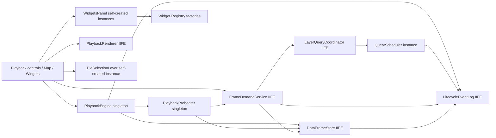
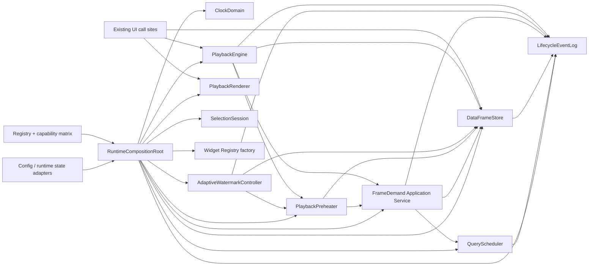
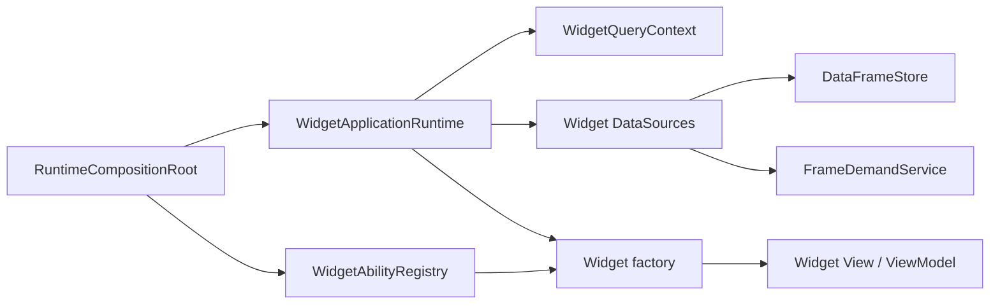

# Runtime OOP 收斂

本文件記錄第二輪重構前後的狀態所有權、依賴方向與後續建模規則。此輪只收斂 Runtime 物件與組裝責任，不改 UI 行為、外部 API、Canonical Frame、快取語意、查詢語意或 Renderer 合約。

## 重構前依賴圖



主要問題不是功能缺失，而是建立責任分散：類別在各自檔案底部自行 `new`，constructor 以全域名稱尋找依賴；部分具有可變狀態與生命週期的角色仍藏在 IIFE。這使依賴圖只能靠 script 載入順序成立，測試也容易無意間使用 Service Locator。

## 重構前狀態所有權

| 狀態／資源 | 目前 owner | 問題 | 本輪目標 owner |
| --- | --- | --- | --- |
| 播放日期、狀態、buffer、target demand | `PlaybackEngineCore` singleton | 自行尋找 Store、Preheater、Demand、EventLog | DI 建立的 `PlaybackEngine` instance |
| 預熱 scope、inflight、retry timer、Store subscription | `PlaybackPreheaterController` singleton | 自行尋找依賴並直接寫入全域 state | DI 建立的 `PlaybackPreheater` instance |
| query queue、active task、consumer、優先權 | `QueryScheduler`，藏在 Coordinator IIFE | instance 建立與 policy/state sink 隱藏 | DI 建立的 `QueryScheduler` instance |
| Canonical frame、alias、pin、failure、LRU | `DataFrameStore` IIFE closure | 有身份與資源，但不是可管理生命週期的物件 | DI 建立的 `DataFrameStore` instance |
| lifecycle events、run、listener | `LifecycleEventLog` IIFE closure | 有容量與 run lifecycle，但不是明確物件 | DI 建立的 `LifecycleEventLog` instance |
| HTTP demand orchestration | `FrameDemandService` IIFE | 無可變狀態，卻以全域取得所有依賴 | DI 呼叫的 stateless Application Service factory |
| active playback date 與日期事件 | `PlaybackRenderer` IIFE closure | active date owner 隱藏 | DI 建立的 `PlaybackRenderer` instance |
| 選取 mode、selected cells、time binding | `TileSelectionLayer` | session 狀態與 Leaflet/UI resource 混在同一 owner | `SelectionSession` 擁有狀態；Layer 只擁有視覺資源 |
| Widget instances 與位置 | `WidgetsPanel.widgets` | Panel 自行建構預設 instance；Popover 使用 static singleton | Panel 保持 collection owner，instance 只經 Registry factory 建立，Runtime root 注入 factory/popover |
| WebGL canvas、program、buffer、hit cells | `SampledGridWebglLayer` | 已有 `onAdd/onRemove`，owner 清楚 | 保留；只補齊組裝與銷毀責任文件 |

## 本輪依賴方向



## 完成後狀態所有權

| Runtime 角色 | 唯一 owner | 建立位置 | 生命週期／銷毀責任 |
| --- | --- | --- | --- |
| Monotonic／playback／render 時鐘 | `ClockDomain` immutable value | `RuntimeCompositionRoot` | 頁面期存活；只提供注入 clock interface，不保存業務狀態 |
| 播放狀態、日期、startup／resume gate、target、buffer | `PlaybackEngine` | `RuntimeCompositionRoot` | `start / pause / stop / dispose`；停止時取消 preparation、target、resume demand 並解除 frame pin |
| 預熱 scope、inflight、retry timer | `PlaybackPreheater` | `RuntimeCompositionRoot` | `setScope / stop / dispose`；銷毀時取消 scope、timer 與 Store subscription |
| 有效高低水位、下降 hold 與上次套用時間 | `AdaptiveWatermarkController` | `RuntimeCompositionRoot` | `resolve / reset / dispose`；只決定 policy，不擁有 query、cache 或 playback clock |
| query queue、active task、consumer | `QueryScheduler` | `RuntimeCompositionRoot` | `demand / cancelScope / dispose`；銷毀時 abort 未完成 task |
| Canonical frame、alias、pin、failure、LRU | `DataFrameStore` | `RuntimeCompositionRoot` | `put / inspect / pin / release / dispose`；銷毀時清空 RAM 與 listener |
| lifecycle event、run、listener | `LifecycleEventLog` | `RuntimeCompositionRoot` | `beginRun / record / endRun / dispose`；銷毀時清空 bounded log 與 subscription |
| 播放日期到既有 renderer 的 handoff | `PlaybackRenderer` | `RuntimeCompositionRoot` | 頁面期存活；`dispose` 清除 active date，不擁有 WebGL resource |
| WebGL/Canvas map resource | Leaflet layer instance | `RendererRegistry` 決策、map layer factory 建立 | Leaflet `onAdd / onRemove`；WebGL `onRemove` 釋放 program、buffer 與 canvas |
| 虛擬網格 strategy、revision 與 map/event subscription | `VirtualGridController` | `RuntimeCompositionRoot` | `bind / dispose` 對稱註冊與解除事件 |
| 選取模式、selected cells、time binding | `SelectionSession` | `TileSelectionLayer` aggregate factory，由 `AppRuntime.install` 接管 | Session 管資料；Layer 的 `dispose` 清除 Leaflet rectangle、label、cursor 與 listener |
| coverage viewport bounds | `LayerViewportController` | `RuntimeCompositionRoot` | 擁有 map min zoom/max bounds；`dispose` 還原 map 約束 |
| Render intent 組裝 | 無可變狀態 | `RuntimeCompositionRoot` 建立 `RenderIntentService` factory | 只讀注入的 state、viewport、FrameIdentity 與日期 provider；不自行定位全域依賴 |
| 圖層啟用 transition queue | `LayerActivationController` | `AppRuntime.install` | 序列化 transition；`dispose` 關閉後續 command |
| Widget panel、popover、全域事件 subscription | `WidgetRuntimeController` | `AppRuntime.install` | `mount / dispose`；AbortSignal、map listener、panel、popover 對稱釋放 |
| Widget instance collection、slot placement | 各 `WidgetsPanel` | `WidgetRuntimeController` | Widget 只能由 `WidgetRegistry` factory 建立；替換、刪除與 panel dispose 均呼叫 instance `dispose` |
| 查詢／渲染測速狀態 | `TimingMetrics` | `RuntimeCompositionRoot` | 只持有注入的 clocks、bounded history 與 subscribers；`dispose` 清除 subscription/history |
| 可信播放效能快照 | 無獨立可變狀態 | `RuntimeCompositionRoot` 建立 `RuntimePerformanceMetrics` factory | 每次從 LifecycleEventLog、PlaybackEngine 與 PlaybackPreheater 投影，不建立第二份時間真相 |

`RuntimeCompositionRoot.snapshot()` 只暴露 owner 名稱與組裝狀態供測試／診斷，不建立第二份 Runtime 狀態。全域名稱是既有 call site 的唯讀 reference；真正的建立與 teardown 仍只有 composition root 一條路徑。

## Class 判定規則

符合任一條件才使用 class：跨呼叫保存可變狀態；具有建立、啟動、停止或銷毀階段；可同時存在多個獨立實例；必須阻止非法狀態轉換；擁有 Runtime 資源。

以下維持 pure function：Frame key／intent key、BBOX 計算、Mapping、Canonical normalization、色彩與 ViewModel 建構。Registry 與能力矩陣仍是能力與相容關係的唯一真相，不以 inheritance 取代。

所有 Runtime class 由 `RuntimeCompositionRoot` 建立並注入依賴。Class 不讀全域 Config、不自行 `new` service；Decorator 及事件 subscriber 只處理 logging、metrics、tracing，不改變核心語意。

## 追加設計約束

本輪建立後續模組的物件建模規則，但不提前擴張至 UI／業務分離：

1. 有身份、可變狀態、生命週期或不變量的角色使用 class。
2. 純計算、Mapping、正規化與 ViewModel 建構維持 pure function。
3. Registry 與能力矩陣仍是能力及相容關係的唯一真相，不得被 class inheritance 取代。
4. 所有 class 必須由 DI composition root 建立，不得自行尋找或建立 service dependency；建立自身 timer、AbortController、DOM 或 GPU resource 不視為 service lookup，但必須自行釋放。
5. Decorator 僅處理 logging、metrics、tracing 等橫切能力，不得改變核心語意。
6. 本文件是狀態所有權表與 class 判定規則的唯一說明；stateless Application Service 使用 [`application-service.template.js`](application-service.template.js) 的 factory 形式。
7. 後續 UI／業務分離新增的程式必須直接遵守上述規則，不得完成後再二次 OOP 化。
8. 本輪不修改 UI 行為、不抽離 Widget 業務邏輯、不擴張既定驗收範圍。

## 維持 Pure Function／Factory 的角色

- `FrameIdentity`、BBOX／coverage 計算、`calculateAdaptiveWatermarkPolicy`、watermark/date window、color domain、Mapping 與 Canonical normalization 是 pure function 或 immutable registry。
- `FrameDemandService`、`PlaybackCacheService` 與 `RenderIntentService` 沒有跨呼叫私有狀態，因此使用注入依賴的 stateless factory，不為形式一致而 class 化。
- `PlaybackScheduler`、`PlaybackFrameBuffer`、`PlaybackDeliveryPolicy` 與 interpolation policy 是純 policy／計算物件，不擁有播放生命週期。
- `RendererRegistry`、`WidgetAbilityRegistry`、`WidgetSizeAbleDict` 與 Mapping registry 仍負責決策；Runtime class 只接收決策結果或 registry interface。

## Widget UI／Application 邊界

Checkpoint B 已移除圖表 DataSource 的 `shared()` 與 UI service lookup。`RuntimeCompositionRoot` 建立唯一的 `WidgetApplicationRuntime`，其中的 `WidgetQueryContext` 統一解讀目前日期、啟用圖層、Tile 選取、BBOX、LOD 與 canonical frame key；各 DataSource 擁有自己的 cache、inflight 與生命週期。Registry factory 在建立 Widget instance 時注入 frozen `services`，Capability 只負責 View、ViewModel 與使用者命令。



邊界規則：

- Widget、View 與 Launchpad 不得直接取得 Store、Demand、Coordinator 或 Config。
- 表格與事件檢視器只讀既有 Runtime 狀態，不會在 cache miss 時補查。
- 折線圖、圓餅圖與橫條圖只透過注入的 Application DataSource 取資料；允許補查時也只能提交 widget lane demand。
- Application service 不建立 DOM；Capability 不擁有 query cache。
- DataSource 的建立與銷毀集中在 composition root，不保留 `.shared()`、wrapper 或雙軌 shim。

## Clock Domain 與量測真相

Checkpoint C 將 Runtime 計時拆成三個 DI clock interface：

```text
Monotonic Wall Clock
  Queue / HTTP / Mapping / Cache / Buffer / Timeout / P95

Playback Clock
  snapshot cadence / date advancement / consumption rate

Render Clock
  requestAnimationFrame / draw / FRAME_VISIBLE
```

不變式：

- `playbackRate` 只允許出現在 playback cadence 與日期推進路徑。
- Query、HTTP、cache、buffer wait 與 timeout 一律使用 monotonic wall time。
- 所有 lifecycle event 只保存 `monotonic_ms`；`wall_time` 只供人類閱讀，不參與耗時計算。
- `TimingMetrics`、`PlaybackEngine`、`PlaybackPreheater`、`QueryScheduler`、`DataFrameStore` 與 renderer 都由 composition root 注入 clock，不自行呼叫 `Date.now()` 或 `performance.now()`。
- `RuntimePerformanceMetrics` 是狀態列、測速 Widget、事件檢視器與後續控制器共用的唯一投影，公開 `consumption_rate`、`supply_rate`、`cache_ready_latency_p95`、`ready_ahead_slices`、`ready_ahead_seconds` 與 `buffer_wait_ms`。
- 30 秒 buffer timeout 是純 monotonic policy；`1x／2x／4x` 不得改變等待秒數。

`tests/clock_domain.test.mjs` 使用可前進的假時鐘驗證上述規則。舊 `PlaybackTelemetry` 與 Widget 自行累加等待時間的路徑已刪除，不保留雙軌 shim。

## Adaptive Watermark 邊界

`AdaptiveWatermarkController` 是 DI 建立的有狀態 policy owner。純函數 `calculateAdaptiveWatermarkPolicy` 接收固定基準水位、可信 metrics、Store 容量快照及設定，回傳候選水位；class 只擁有跨次計算所需的 monotonic hysteresis、目前 policy 與 lifecycle event。

不變式：

- 樣本不足時使用固定 5/10 基準，不推測不存在的供應能力。
- 指標可信後，以 `consumption_rate`、`supply_rate`、`cache_ready_latency_p95`、尾端安全係數與 reserve slices 推導水位。
- 有效高水位不得超過設定上限或以 frame-size P95 換算的 RAM／entry 預算。
- 水位上升立即生效；下降使用 monotonic hold 與有限步長。播放倍率不得進入 hold、latency 或 timeout 計算。
- Controller 不呼叫 Adapter、Demand 或 Scheduler，不清除 Store，也不調整 query concurrency。
- UI 與 Widget 只能讀 `preview/snapshot`；只有 `PlaybackPreheater.reconcile()` 可呼叫 `resolve()` 套用策略。
- 策略狀態使用 `policyStatus`，不得覆蓋 Preheater 的 `READY/FETCHING/STOPPED` 生命週期狀態。
- 冷快取由 `PlaybackEngine` 進入 `PREPARING` 並等待 `startupWatermark`；這段耗時獨立記為 preparation，不得併入 stall。
- target miss 進入 `BUFFERING` 後，必須累積至 `resumeWatermark` 才能發出 `BUFFER_RESUMED`。gate 在同一次等待中只能提高，不能因短期指標波動降低。
- 手動 Seek 不呼叫 `PlaybackEngine.start()`，只由地圖 current demand 提升目標；其後的 Preheater 補貨維持背景工作。

## 停止條件

若任何遷移必須改動 UI 行為、外部 API、資料格式、Canonical Frame、查詢／快取語意或 Renderer 合約，停止該遷移並另立功能派工。本輪不提前抽離 Widget 業務邏輯。
