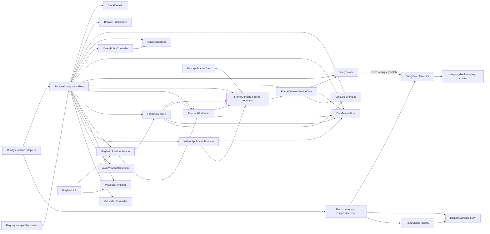

# Runtime 聚合與 OOP 邊界

本文件是 Runtime 狀態所有權、DI 組裝、Decorator、Registry、能力矩陣與 pure function 分工的目前真相。歷史 IIFE、self-created singleton、雙軌 cache、舊播放 timer 與相容 shim 已淘汰，不再作為新程式的參考。

## 設計分工

| 機制 | 唯一責任 |
| --- | --- |
| Config | 描述外部設定與 policy 值，不建立 Runtime instance |
| Registry | 登記、發現與建立能力 |
| Capability Matrix | 判斷 Widget 尺寸與能力組合是否合法 |
| DI Composition Root | 建立 instance、注入依賴、集中 teardown |
| Class | 擁有身份、可變狀態、生命週期、不變量或 Runtime 資源 |
| Decorator | 附加 tracing、metrics、logging，不改變核心結果與錯誤 |
| Pure Function / Factory | Mapping、正規化、key、policy、ViewModel 與無狀態 Application Service |

## 目前依賴圖



`PlaybackEngine` 是播放狀態 owner，但 `PlaybackRuntime` 是 UI 對播放子系統的唯一 facade。UI、地圖載入器與圖層效果不得直接呼叫 Engine 或 Preheater。

## 狀態所有權

| 狀態／資源 | 唯一 owner | 建立位置 | 銷毀責任 |
| --- | --- | --- | --- |
| monotonic、playback、render clock interfaces | `ClockDomain` immutable value | `RuntimeCompositionRoot` | 無業務狀態；供 instance 注入使用 |
| 裝置／視覺偏好、storage 狀態 | `BrowserProfileStoreCore` | `RuntimeCompositionRoot` | `dispose` 解除 profile change listener；storage 失敗只降級 session |
| timer、generation、timeline、播放 session callback | `PlaybackRuntimeController` | `RuntimeCompositionRoot` | `stop / dispose` 取消 timer，先停 Preheater 再停 Engine |
| 播放日期、狀態、下一 target readiness、visible-frame pin | `PlaybackEngineCore` | `RuntimeCompositionRoot` | `stop / dispose` 取消 preparation、target、buffer demand 並 release pin |
| 預熱 scope、inflight、retry/settle timer、Store subscription | `PlaybackPreheaterController` | `RuntimeCompositionRoot` | `stop / dispose` 取消 owned query scopes、timer 與 subscription |
| 有效水位、下降 hold、最近 policy | `AdaptiveWatermarkControllerCore` | `RuntimeCompositionRoot` | `reset / dispose`；不擁有 query、cache 或播放 clock |
| queued/active task、consumer、lane promotion | `QueryScheduler` | `RuntimeCompositionRoot` | `dispose` abort 未完成 task |
| provider batch、lane promotion、stream demultiplex、來源容量與 in-flight operation 計數 | `QueryBroker` | `RuntimeCompositionRoot` | `dispose` abort active batches 並拒絕 queued operation |
| Flask batch worker pool、跨 request 的 provider in-flight 計數 | `QueryBatchExecutor` | Flask `create_app()` composition root，保存於 `app.extensions` | 跟隨服務 process 生命週期，`close()` shutdown executor |
| active route probe、read-model readiness、status generation | `RouteStatusRegistry` | Flask server composition root，與 `RuntimeLayerRegistry` 一起注入 consumer/developer app | `invalidate` 重建 snapshot；跟隨服務 process 生命週期 |
| network/background concurrency policy 與不變量 | `QueryPolicyControllerCore` | `RuntimeCompositionRoot` | `dispose` 無資源；UI 只能透過 command 更新 policy |
| demand inflight、owned scope ids、transport lifecycle | `FrameDemandServiceCore` | `RuntimeCompositionRoot`，再交給 decorator | `dispose` 取消 owned scopes 並清空 inflight |
| canonical frames、alias、pin、failure、LRU | `DataFrameStoreCore` | `RuntimeCompositionRoot` | `dispose` 清空 RAM 與 listener |
| sampled-grid column storage 與 selection view | `CanonicalGridFrame` immutable value | Mapping builder 建立，經 transport 交給 `DataFrameStoreCore` | 無獨立 lifecycle；只能共用或由 Store 淘汰，不得由 consumer 修改 |
| lifecycle events、run、listener | `LifecycleEventLogCore` | `RuntimeCompositionRoot` | `dispose` 清空 bounded log 與 subscription |
| active date 到 renderer 的 handoff | `PlaybackRendererController` | `RuntimeCompositionRoot` | `dispose` 清除 active date；不擁有 WebGL resource |
| 圖層 transition queue | `DashboardLayerActivationController` | `AppRuntime.install` | `dispose` 停止接受 command；單一路徑停播放、切 dataset、載 schema、reload |
| Widget panel、popover、page lifecycle | `WidgetRuntimeController` | `AppRuntime.install` | `dispose` 釋放 panel、popover 與 coordinator |
| Widget refresh listeners、map listener、debounce timer | `WidgetRefreshCoordinator` | `WidgetRuntimeController` 的 DI factory | `dispose` abort listener 並取消所有 timer |
| Widget query cache/inflight | 各 Application DataSource instance | `WidgetApplicationRuntime` | Runtime dispose 時逐一釋放；Capability 不擁有 query state |
| 選取模式、cells、time binding | `SelectionSession` | Tile selection aggregate，由 `AppRuntime.install` 接管 | Layer dispose 清除 rectangle、label、cursor 與 listener |
| viewport coverage 約束 | `LayerViewportController` | `RuntimeCompositionRoot` | `dispose` 還原 map bounds/min zoom |
| 虛擬網格策略、revision、map subscription | `VirtualGridController` | `RuntimeCompositionRoot` | `dispose` 對稱解除 event/map subscription |

`RuntimeCompositionRoot.snapshot()` 只列 owner 名稱與組裝狀態，不複製業務狀態。完成組裝後，root 依建立順序反向呼叫 `dispose()`，因此每份資源只有一條 teardown 路徑。

## Class 判定規則

符合下列任一條件才使用 class：

- 跨呼叫保存可變狀態。
- 有建立、啟動、停止或銷毀階段。
- 同時可能存在多個獨立 instance。
- 必須阻止非法狀態轉換。
- 對 timer、subscription、DOM、GPU、query scope 或 RAM 資源具有所有權。

下列角色維持 pure function、immutable registry 或無狀態 factory：

- `FrameIdentity`、BBOX/coverage、Mapping、canonical normalization。
- `PlaybackScheduler`、`PlaybackFrameBuffer`、`PlaybackDeliveryPolicy`、固定水位正規化與 adaptive policy 計算。
- color domain、render plan、ViewModel 建構。
- `RenderIntentService`、`PlaybackCacheService` 與其他沒有私有可變狀態的 Application Service。
- `RendererRegistry`、`WidgetAbilityRegistry`、`WidgetSizeAbleDict` 與 Mapping registry。

Registry 與能力矩陣是能力與相容關係的唯一真相，不以 inheritance 取代。Class 只接收 registry interface 或已決定的結果。

## DI 與 Decorator

- 前端 Runtime class 只能由 `RuntimeCompositionRoot` 或其 `install()` factory 建立；後端長駐 Runtime class 由 Flask `create_app()` 建立並放入 `app.extensions`。
- Constructor 不讀全域 Config，不自行 `new` 其他 service。
- 自身擁有的 timer、AbortController、DOM/GPU resource 可以建立，但必須在 `dispose()` 釋放。
- `decorateFrameDemandService()` 只記錄需求開始、完成、取消、失敗與 monotonic duration；它不發 HTTP、不查 Store、不改 lane、不正規化 packet。
- Decorator 回傳原結果，失敗時重新拋出同一個 error instance；其 `dispose()` 只轉交被包裝的 core 一次。
- Event subscriber 只能觀測或取消自己明確擁有的 scope，不能成為第二個業務狀態 owner。
- Browser Profile 只持有裝置與視覺白名單；資料源、圖層啟用、日期、Mapping、Query Policy、cache/watermark 與 playback state 不得透過 profile 形成第二真相。

## Playback 聚合邊界

```text
Playback UI
  -> PlaybackRuntime (public facade, timer/session owner)
  -> PlaybackEngine (lifecycle truth)
  -> PlaybackPreheater / FrameDemandService / DataFrameStore
```

`PlaybackRuntime` 提供 start/stop/rate、scope configure、target demand、buffer snapshot 與 render lifecycle 命令。`PlaybackEngine` 仍決定合法狀態轉換；facade 不複製 Engine 狀態。

`PlaybackFrameBuffer` 是純投影，只回傳 waiting/failed state。真正寫入 UI buffer projection 的唯一入口是 `PlaybackCacheService.setBufferState()`。

固定水位設定只經 `normalizedFixedWatermarkPolicy()` 正規化一次，Cache status 與 Preheater policy 共用同一結果。自適應 policy 只能由 Preheater reconciliation 套用；UI 只能 preview。

## Query、Cache 與 Widget 邊界

- 地圖 application flow 建立 `map-current` demand，這是一般 source transport 的最高優先入口。
- `FrameDemandServiceCore` 先查 `DataFrameStore`，cache miss 才直接交給 `QueryBroker`；相同 intent 在 Demand 層共用同一份 logical request。
- Mapping 使用預編譯 context 對 source rows 做單一 pass，直接建立 columnar `CanonicalGridFrame`。Server cache、transport、browser Store、Renderer 與 Widgets 不得再膨脹或深拷貝 sampled-grid row graph；表格只在可見列的展示邊界 materialize row。
- `QueryBroker` 是 sampled-grid 唯一瀏覽器 transport owner。它使用 Registry 衍生的 provider transport key 與 capacity 合併跨資料集 operation，依可用槽位限制 batch 與 in-flight operation；每筆 completion-order result 都會立即釋放槽位並補入最高優先工作。不同資料集仍保有不同 cache identity。
- Flask `QueryBatchExecutor` 是 batch 解包後的唯一執行 owner；全域 worker 上限來自 runtime query policy，各 provider capacity 來自 source `query_policy.max_in_flight`，而且跨瀏覽器 request 共用同一份 in-flight 計數。Provider permit 必須在提交 worker 前取得，等待來源容量不得占用全域 worker。
- `QueryScheduler` 保留給其他 query family；不得再包住 sampled-grid Demand/Broker 鏈形成第二個 queued/active owner。
- tracing decorator 不參與 cache hit、dedupe、promotion 或 cancellation 決策。
- 插隊與 scope cancellation 只影響 consumer，不清除已完成 canonical frame。最後一個 consumer 離開時，queued operation 可取消；已送到 physical provider 的 operation 必須 drain 並提交 Store，不能因 browser abort 提前釋放虛假的來源容量。
- 播放中 Widget 日期刷新只讀 Store；明確 Tile 選取缺當日資料時，才允許一張 `widget-interactive` demand。
- idle/paused 圖表可用 `widget-auto` 補設定窗口；表格與事件檢視器永遠唯讀。
- Widget Capability 只渲染注入的 model，不得直接存取 Store、Demand、Coordinator 或 HTTP。

## Clock Domain

```text
Monotonic Wall Clock -> Queue / HTTP / Mapping / Cache / Buffer / Timeout / P95
Playback Clock       -> 切片節拍、日期推進、consumption rate
Render Clock         -> requestAnimationFrame、draw、FRAME_VISIBLE
```

所有 lifecycle event 使用 `monotonic_ms`。`playbackRate` 只能影響 Playback Clock，不得進入 HTTP latency、timeout、等待時間或下降 hold。

## 禁止依賴

- UI、Renderer、圖層效果不得直接呼叫 `PlaybackEngine` 或 `PlaybackPreheater`。
- Widget Capability、表格、事件檢視器不得呼叫 Adapter、HTTP、`FrameDemandService` 或 `LayerQueryCoordinator`。
- sampled-grid `FrameDemandService` 不得呼叫 `QueryScheduler`；瀏覽器實體 HTTP 只由 `QueryBroker` 發送，Flask 解包 operation 只由 `QueryBatchExecutor` 執行。
- Renderer 不發 query；Playback 不清除 completed `DataFrameStore` entries。
- Runtime class 不使用 service locator，不建立 mutable static singleton。
- 新程式不得依賴已刪除的 wrapper、IIFE singleton、`.shared()` 或相容 shim。
- source-specific 欄位、固定圖層數、固定日期與解析度不得進入 generic frame pipeline；由 Mapping/Registry 提供。

## 架構驗收

自動測試至少覆蓋：

- 每個 stateful core 只在 Composition Root 建立。
- lifecycle owner 有對稱 `dispose()`。
- Widget、Renderer、Playback、Query 與 Cache 的禁止依賴。
- cache hit 不重發 HTTP；同 key 不同 consumer 共用 request。
- sampled-grid 不得形成 Demand/Scheduler/Broker 雙重排程；同 provider 的 HTTP batch 與解包 operation 分別受 Broker 與 Executor 的唯一容量 owner 約束。
- scope 取消、倍率切換、圖層切換與 map interaction 不清除已完成快取。
- 1x/2x/4x 的真實等待與 timeout 不受播放倍率污染。
- Registry/Matrix/Pure Function 不被 inheritance 或 class 內硬編碼取代。

無狀態 Application Service 以 [`application-service.template.js`](application-service.template.js) 為範本。若新增角色需要改 UI 行為、外部 API、Canonical Frame、查詢語意或 Renderer 合約，另立功能派工，不把行為變更藏在 OOP 重構內。
