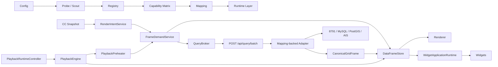

# Runtime 架構真相、Context 血緣與旁路健檢

狀態：Checkpoint A 後的唯讀審計報告<br>
審計日期：2026-07-18<br>
Git 基線：`2919129 perf: stabilize sampled grid playback runtime`<br>
Production 改動：無<br>
範圍：Runtime 組裝、Context identity、Query、Cache、Playback、Widget、Renderer、Clock、控制面與效能量測<br>
不在本輪：Arrow、Topology Split、8791 修改、UI 行為調整與 Findings 修正

## 1. 結論

目前 sampled-grid 主鏈已經收斂，並非整體仍由旁路驅動。地圖需求、預熱、Widget cache-first、Batch、Canonical Frame 與 DataFrameStore 都有合法入口；Clock Domain、Batch capacity、completion-order 與 immutable Canonical Frame 也已有測試保護。

本輪找到的風險集中在「組裝和政策漂移」，不是 Mapping、WebGL 或動態架構本身過重：

1. `requested resolution`、`effective query resolution` 與 Cache identity 尚未完全隔離，舊測試甚至鎖定了相同 scope 的政策。
2. Playback Engine 已擁有 buffering 真相，但 UI callback 仍保留 timeout、failed 與 waiting 的第二套決策。
3. 視窗 focus／visibility restore 會強制重建 Runtime Layer Registry，並重新探測 endpoint catalog。
4. Lifecycle 第一層事件缺少 `intent_key`／`scope_key`，無法機器化驗證完整父鏈；buffer episode 也沒有獨立 identity。
5. 目前 timing 無法在 10% 內對帳，狀態列與 Event Viewer 不能據此精確判斷延遲 owner。
6. 少數具有狀態和生命週期的 UI instance 仍在 Composition Root 外以 mutable global 建立。

沒有發現 P0。確認兩項 P1、五項 P2 與一項 P3；修正前不應開始 Arrow／Topology Split。

## 2. 審計基線

| 項目 | 結果 |
| --- | --- |
| Checkpoint A | `2919129`，工作樹於審計開始時乾淨 |
| Runtime／Playback／Clock／Widget／Broker Node tests | 82 / 82 通過 |
| Python architecture／registry／batch／mapping tests | 26 / 26 通過 |
| Live dataset | `pipeline_iceberg.chlor_a` |
| Live query | `2020-01-01`、4 km、viewport BBOX、`column_profile=render` |
| Live parent chain | Demand -> Miss -> Queue -> Dispatch -> HTTP -> Cache Ready |
| Production edit | 0 |

## 3. 目前合法 Runtime 架構



### 3.1 Runtime component inventory

| 類別 | 正式 owner／入口 | 狀態 |
| --- | --- | --- |
| Composition | `RuntimeCompositionRoot`／`AppRuntime` | 合法，集中建立與反向 dispose |
| Identity | `FrameIdentity` pure factory | 合法，但 resolution identity 有 Finding |
| Lifecycle | `LifecycleEventLogCore` | 合法，父鏈欄位不完整 |
| Query policy | `QueryPolicyControllerCore` | 合法，控制 Scheduler 與 Broker |
| Sampled-grid queue | `QueryBroker` | 合法，唯一 Browser batch transport owner |
| Other query families | `QueryScheduler`／`LayerQueryCoordinator` | 合法例外，不包 sampled-grid 主鏈 |
| Demand | `FrameDemandServiceCore` + telemetry Decorator | 合法，cache-first／dedupe |
| Data cache | `DataFrameStoreCore` | 合法，Canonical-only／LRU／pin |
| Playback lifecycle | `PlaybackEngineCore` | 核心 owner；UI 仍有第二套 projection decision |
| Playback timer | `PlaybackRuntimeController` | 合法，generation + single timer |
| Replenishment | `PlaybackPreheaterController` | 合法，獨立生命週期 |
| Watermark | `AdaptiveWatermarkControllerCore` | 合法，只有 policy 狀態 |
| Renderer handoff | `PlaybackRendererController` | 合法，不查 Server |
| Render resources | sampled-grid renderer／artifact cache | 合法，GPU 不是資料真相 |
| Layer activation | `DashboardLayerActivationController` | 合法，圖層 command 單一入口 |
| Widget data | `WidgetApplicationRuntime` + DataSources | 合法，Store-first；明確 miss 才 demand |
| Selection | `SelectionSession`／`TileSelectionLayer` | 合法，查 Canonical Frame |
| Viewport／grid | `LayerViewportController`、`RenderGridProfileController`、`VirtualGridController` | 合法，共用 grid profile |

## 4. 狀態所有權

| 狀態／資源 | 唯一合法 owner | 審計結果 |
| --- | --- | --- |
| 播放狀態、日期、buffer lifecycle | `PlaybackEngine` | 部分漂移：UI 仍決定 timeout／failed／waiting |
| 播放 timer、generation、visibility suspension | `PlaybackRuntimeController` | 對齊，測試確認 timer <= 1 |
| 預熱 scope、inflight、retry timer | `PlaybackPreheater` | 對齊 |
| 水位 policy | `AdaptiveWatermarkController` | 對齊 |
| Frame、alias、failure、LRU、pin | `DataFrameStore` | 對齊；resolution compatibility 需收斂 |
| Browser sampled-grid batch queue | `QueryBroker` | 對齊 |
| Server provider capacity | `QueryBatchExecutor` | 對齊 |
| Runtime layer materialization | `RuntimeLayerRegistry` | 對齊；refresh trigger 過度積極 |
| Mapping schema／canonical roles | Mapping controller／compiled context | 對齊 |
| Renderer GPU resource | Renderer／artifact pool | 對齊 |
| Widget instance | `WidgetRuntimeController` | 對齊 |
| Aerial backdrop request／listener | mutable global `aerialBackdropController` | 未納入 DI／dispose |
| Snapshot performance chart observer／timer | mutable global `SnapshotPerformanceChart` | 未納入 DI／dispose |

## 5. Context Identity 血緣

| 欄位 | Producer | 傳遞路徑 | Consumer | Fallback／風險 | 結果 |
| --- | --- | --- | --- | --- | --- |
| `datasetId` | Registry／LayerActivation | Intent -> Demand -> Broker -> Store | Renderer／Widget | 無 dataset-only 替代 key | 完整 |
| `cacheNamespace` | Registry／FrameIdentity | normalized request | Store key | dataset config fallback | 完整 |
| `scopeKey` | FrameIdentity | Demand／Broker／Store／Playback | cancellation／metrics | `FRAME_DEMAND_STARTED` 未記錄 | 部分缺口 |
| `bboxSignature` | CC／FrameIdentity | Intent -> operation -> frame metadata | Store／Renderer | 6 位正規化 | 完整 |
| `gridSignature` | Scout／compiled Mapping | Canonical grid metadata | RenderGridProfile／selection | 不進 intent key | 需在 resolution 修正一併核實 |
| `baseResolution` | Scout／Mapping | layer contract／grid profile | query／render policy | 不應由 source metadata 覆寫 | 完整 |
| `queryResolution` | layer query policy | normalized request -> Broker | Adapter | 不進 intent／scope identity | **不完整** |
| `renderResolution` | AggregationPolicy | RenderGridProfile | Renderer／virtual grid | Zoom bucket | 完整 |
| `actualResolution` | Canonical response observation | Frame key／metadata | Store／status | 被記成未來 query route | **政策漂移** |
| `mappingVersion` | Mapping／dataset namespace | cache namespace | Store | 不另成裸 global | 完整 |
| `date` | Playback／UI command | Intent -> Store -> Renderer | Frame visible | 無 | 完整 |
| `runId` | LifecycleEventLog／PlaybackEngine | playback events | metrics／viewer | map-current demand 合法為空 | 完整 |
| `bufferEpisodeId` | 尚無 owner | 尚未傳遞 | Event Viewer | 只能用 run+intent+date 推測 | **缺失** |
| `zoomBucket` | RenderGridProfile | renderer resource identity | GPU renderer／virtual grid | 不進 canonical cache | 完整 |

## 6. DI Composition Contract

| 規則 | 結果 | 證據 |
| --- | --- | --- |
| Runtime class 由 Composition Root 建立 | 核心主鏈通過 | `static/js/runtime/runtime-composition-root.js` |
| Constructor 不讀 global Config | 核心主鏈通過 | constructor contract tests |
| Decorator 不改業務結果 | 通過 | demand decorator tests |
| Registry／Matrix 不由 inheritance 取代 | 通過 | registry／widget contract tests |
| Core instance 有 dispose | 通過 | Root 反向 disposal |
| 所有 stateful UI instance 也進 DI | 未完全通過 | AerialBackdrop／SnapshotPerformanceChart globals |
| Composition Root 不漏 scope identity | `queryResolution` 未進 identity | RT-01 |

## 7. Declared Route Registry

| 路徑族 | 合法 owner | 目的 | sampled-grid 主鏈例外 |
| --- | --- | --- | --- |
| `/api/query/batch` | `QueryBroker` | sampled-grid Runtime transport | 否，唯一正式入口 |
| `/api/datasets*` | API client／Registry UI | catalog、schema、debug records | 不得成為 Frame transport |
| `/api/overlays/eez*` | EEZ query／vector renderer | PostGIS vector 與 attribution | 合法異質路徑 |
| `/api/live/ais*` + WebSocket | AIS client／collector | stream、settings、diagnostics | 合法異質路徑 |
| `/api/render/capability` | render capability loader | GPU／server capability | 合法控制面 |
| `/api/render/aerial-backdrop` | AerialBackdrop | 靜態／影像背景 | 合法功能，owner 尚未 DI |
| `/api/developer/*` | Developer UI API | Config／Mapping／status | 合法控制面，不可進 Runtime Frame 鏈 |
| Basemap tile／static asset | Leaflet／Browser | 底圖與資產 | 合法外部資產 |

### 7.1 Direct I/O 掃描結論

- sampled-grid Browser HTTP 只在 `QueryBroker`。
- Widget sampled-grid data source 先查 `DataFrameStore`；只有明確 miss 且非播放中才透過 `FrameDemandService` 補貨。
- Table Widget 是唯讀 Store inspector。
- Renderer 沒有 sampled-grid HTTP。
- EEZ、AIS、Developer、Backdrop 與 render capability 是已知異質路徑，不應誤報為 sampled-grid 旁路。

## 8. 禁止依賴矩陣

| 起點 | 禁止直接依賴 | 結果 |
| --- | --- | --- |
| Widget capability | Adapter、HTTP、QueryBroker | 通過 |
| Table／Event Viewer | Demand、HTTP | 通過 |
| Renderer | HTTP、FrameDemandService | 通過 |
| PlaybackEngine | UI、raw timer | 通過 |
| Playback UI | Engine／Preheater private state | **部分不通過：buffer decision** |
| Preheater | playback timer、Renderer | 通過 |
| Mapping | Transport Codec、UI | 通過 |
| Runtime class | global Config、自建 service | 核心通過；兩個 UI owner 例外 |
| Playback／Widget demand | completed cache clear | 通過 |
| Clock metrics | playback speed | 通過 |

## 9. Findings

| ID | 等級 | 類型 | 摘要 | 狀態 |
| --- | --- | --- | --- | --- |
| RT-01 | P1 | `SCOPE_IDENTITY_DRIFT` | effective query resolution 不參與 intent／scope／compatibility | 已證實 invariant 違反 |
| RT-02 | P1 | `TIMING_TRUTH_DRIFT` | API timing 與階段加總誤差超過 10% | Live 重現 |
| RT-03 | P2 | `CONTROL_PLANE_COMPETITION` | focus／visibility restore 強制 catalog probe | Live 重現，尚未證明造成播放 stall |
| RT-04 | P2 | `DUAL_TRUTH` | Playback buffer lifecycle 與 UI buffer decision 重疊 | 靜態與測試證據，未重現卡死 |
| RT-05 | P2 | `TRACE_PARENT_GAP` | Demand 起始事件缺 intent／scope；無 buffer episode identity | Live 重現 |
| RT-06 | P2 | `DI_OWNERSHIP_DRIFT` | stateful UI globals 在 Composition Root 外建立 | 靜態證據 |
| RT-07 | P3 | `METRICS_TAIL_OMISSION` | batch metrics event 未計入自身 encode／gzip／yield | 靜態證據 |

### RT-01：effective query resolution 未進入 cache identity

**Invariant**：不同 `queryResolution`／grid identity 不得交叉命中或共用錯誤統計。
**證據**：

- `FrameIdentity.requestParts()` 只使用 requested resolution；`queryResolution()` 只用於 transport。
- `DataFrameStore.compatibleMeta()` 只比對 `requestedResolution`。
- Store 同時將 requested intent 與 actual-resolution intent alias 到同一 Frame。
- `SampledGridContract.recordResolvedResolution()` 將 observed actual resolution 記成後續 effective query route。
- `tests/lifecycle_frame_identity.test.mjs` 明確要求 4 km request 與 16 km effective query 具有相同 intent／scope。

**風險**：來源一次回傳 16 km 後，後續 4 km effective query 可能命中同一 alias／compatible frame；同時 Observed Truth 反向改寫 Query Policy。
**最小修正方向**：保留 requested intent，但將 `queryResolution + gridSignature` 納入 physical demand／cache compatibility identity；`actualResolution` 僅作 observation，不自動成為下一次 query policy。需同步改 test，不保留雙軌 key shim。

### RT-02：效能 timing 不能對帳

Live `pipeline_iceberg.chlor_a` 單張：

| 指標 | 數值 |
| --- | ---: |
| Browser HTTP batch duration | 1,490.1 ms |
| Backend `batch_total_ms` | 1,078.5 ms |
| Browser Canonical decode | 95.1 ms |
| Frame `api_total_ms` | 933.6 ms |
| Frame `api_accounted_ms` | 1,086.4 ms |
| Frame `server_total_ms` | 1,086.4 ms |
| `api_accounted - api_total` | 152.8 ms（16.4%） |
| response bytes | 1.21 MB compressed / 33.71 MB uncompressed |
| Canonical frame | 209,264 rows / 約 13.06 MB Store estimate |

`cache_commit_ms` 與 `cache_evict_ms` 可能存在巢狀重複計算；`api_total_ms` 也未涵蓋和其他 server timing 相同的邊界。
**最小修正方向**：先畫出 non-overlapping timing spans，再統一 `api_total` 的起訖；metrics event 必須在最後一個 transport byte 完成後由可對帳的 trailer／server log 產生。不得先用 Arrow 掩蓋 timing 缺口。

### RT-03：focus／visibility restore 強制重探資料源

**實際鏈**：

```text
window focus / document visible
-> refreshDatasetRegistry()
-> loadDatasets()
-> GET /api/datasets
-> RuntimeLayerRegistry.snapshot(force=True)
-> endpoint_datasets_from_routes()
-> endpoint catalog HTTP GET
```

三次唯讀量測為 132.7、133.5、123.3 ms，response 約 32,975 bytes。單次不大，但它會和 resume/preheat 同時發生；多分頁、快速切換與外部 Browser 操作會製造非資料 Frame 的來源競爭。
**最小修正方向**：只由 Developer bridge invalidation 事件或 TTL 觸發 refresh；focus 使用目前 snapshot 或 stale-while-revalidate，不得 `force=True`。控制面探測需加入獨立 lifecycle event。

### RT-04：Playback buffering 有兩個決策層

`PlaybackEngine` 擁有 `BUFFERING`、target、required、ready、wait 與 resume；`playback-controls.js` 又執行 `playbackFrameDecision()`、timeout、waiting／failed state，並把結果回傳 Runtime Controller 決定 stop／poll。`PlaybackCacheService` 保存 UI projection 本身合理，但 projection 不應再決定 Engine terminal state。
**最小修正方向**：Engine／Application Service 回傳唯一 `FrameDueDecision`；UI 只 render snapshot。30 秒 timeout 由 Engine 的 monotonic policy 觸發。保留「下一張準備好即可 startup／resume」這項既定產品政策。

### RT-05：Lifecycle parent chain 不可完整機器驗證

Live chain：

```text
seq 3  FRAME_DEMAND_STARTED  intent_key=null, scope_key=null
seq 4  CACHE_MISS            intent/scope 完整
seq 6  TASK_QUEUED           intent/scope 完整
seq 7  TASK_DISPATCHED       batch=query-batch-1
seq 8  HTTP_BATCH_STARTED    batch=query-batch-1
seq 10 CACHE_READY           intent/scope/frame 完整
seq 11 HTTP_BATCH_FINISHED   batch=query-batch-1
```

此外，同一 run、intent、date 若反覆 buffering，Event Viewer 沒有 `bufferEpisodeId`，只能推測配對。
**最小修正方向**：Decorator 使用注入的 FrameIdentity 在第一筆事件就記 `intent_key`、`scope_key`；Engine 建立遞增 episode identity 並傳給 enter/resume/cancel。這是 tracing 修正，不改業務語意。

### RT-06：少數 stateful UI instance 未由 DI 管理

- `window.aerialBackdropController = new AerialBackdrop(...)`：擁有 event listener、AbortController、object URL 與 timer，沒有 `dispose()`。
- `window.SnapshotPerformanceChart = new SnapshotPerformanceChart()`：擁有 ResizeObserver／retry timer；`purge()` 不解除 observer。
- Widget panel／launchpad 雖有 Runtime dispose，仍透過 mutable global 互相尋找 instance。

**最小修正方向**：列入 UI composition install/dispose；global 只保留 immutable factory／registry 或明確 facade。這不是本輪的 UI／業務重構，但應在 Arrow 前清除 owner 漂移。

### RT-07：Batch metrics 尾端未被自身 snapshot 計入

`BatchStreamTiming.snapshot()` 在 `batch.metrics` event 被 encode／gzip／yield 之前取值，因此該 event 自身的 encode、gzip、yield 與 bytes 不會出現在 snapshot。影響通常小，但讓 100% 對帳不可能。應和 RT-02 一起處理。

## 10. Async Lifecycle 審計

| Invariant | 結果 | 備註 |
| --- | --- | --- |
| active playback timer <= 1 | 通過 | Runtime Controller cancel-before-schedule + generation |
| visibility pause 不追趕 wall time | 通過 | resume 重建 timeline |
| old generation callback 不改新 session | 通過 | generation guard |
| listener／timer 有 dispose | 核心通過 | AerialBackdrop／Snapshot chart 例外 |
| Preheater fetching 不等於 Playback buffering | 通過 | Engine 只在 target miss 進 buffering |
| startup／resume 最低只等下一張 | 通過，既定產品政策 | 不與高低水位綁定 |
| 每個 buffer episode 最多 resume 一次 | 邏輯有 guard，觀測無 episode id | RT-05 |
| UI 不建立第二 terminal policy | 未通過 | RT-04 |

## 11. Cache／Resolution 隔離

| Invariant | 結果 |
| --- | --- |
| 不同 dataset 使用不同 cache namespace | 通過 |
| 相同 intent 多 consumer 共用 HTTP | 通過 |
| Cache hit 不重發 HTTP | 通過 |
| Widget／Seek 插隊不清空 completed cache | 通過 |
| BBOX covered／composed reuse 保留 Canonical Frame | 通過 |
| Zoom 不改 Canonical cache identity | 通過 |
| Renderer grid 與 Virtual Grid 共用 RenderGridProfile | 通過 |
| 不同 query resolution 不交叉污染 | **未通過：RT-01** |
| actual resolution 只作 observation | **未通過：RT-01** |

## 12. 控制平面真相

| 鏈段 | 結果 |
| --- | --- |
| Config -> Probe -> Registry | 主鏈成立；focus refresh policy 過度積極 |
| Registry -> Mapping -> Runtime Layer | 成立，Mapping contract 是 Runtime source |
| Runtime Layer -> Query Intent | 成立，dataset／bbox／date／requested resolution 完整 |
| Query Intent -> Canonical Frame | 成立，compiled Mapping／columnar immutable frame |
| Canonical Frame -> Dashboard | 成立，Renderer／Widget 共用 Store |
| Declared／query／actual resolution | identity 與 policy 尚未完全分離 |
| Developer Mapping 與實際 query fields | 現有控制面審計已收斂；本輪未發現新 source schema bypass |

## 13. Clock Domain

| Clock | 合法用途 | 結果 |
| --- | --- | --- |
| Monotonic wall clock | queue、HTTP、cache、buffer、timeout、P95 | 通過 |
| Playback clock | 節拍、日期推進、consumption rate | 通過 |
| Render clock | rAF、draw、FRAME_VISIBLE | 通過 |

搜尋與 Fake Clock tests 均確認 `playbackRate` 只出現在 playback controls／cadence／consumption path。5 秒 delay 與 30 秒 timeout 不受 1x／2x／4x 污染。

## 14. Shim、硬編碼與循環

| 項目 | 結果 |
| --- | --- |
| sampled-grid GFW／`fish_sum` compatibility path | 未發現 |
| legacy batch cache／prefetch shim | 已移除，tests 鎖定 |
| Browser row inflation shim | 未發現 |
| 固定 4／16 km source 特例進 generic codec | 未發現 |
| Widget direct Runtime service locator | 核心已移除 |
| mutable globals | 仍有 RT-06；多數其他 global 是非 module script 的 class/factory export |
| import cycle | 既有架構測試通過，未找到新的 P0/P1 cycle |
| 測試鎖定過時政策 | query resolution 相同 identity 測試需隨 RT-01 修改 |

## 15. Remediation Queue

| 順序 | Finding | 最小修正單 | 驗收 |
| ---: | --- | --- | --- |
| 1 | RT-02 + RT-07 | Timing Span Truth | 全鏈誤差 <= 10%，Event Viewer／狀態列一致 |
| 2 | RT-01 | Resolution Physical Identity | 4/16/32 km 不交叉命中，actual 不改 policy |
| 3 | RT-03 | Registry Refresh Invalidation | focus/visibility 無同步 source probe；Developer 變更仍即時更新 |
| 4 | RT-05 | Lifecycle Parent Identity | 每個 HTTP 與 Frame 可由一個 root demand 完整追溯 |
| 5 | RT-04 | Playback Due Decision Ownership | UI 只投影；Fake Clock／timeout／亂序完成通過 |
| 6 | RT-06 | UI Runtime Ownership | stateful UI instance 由 install/dispose 管理，mutable service globals 為 0 |

每個 P1 應獨立 commit、完整回歸，不在同一刀混入 Arrow、Codec、Renderer 或 UI 外觀變更。

## 16. Checkpoint B 前驗收

1. 修正後重跑完整 Node/Python suite。
2. 外部無痕 Browser 跑 sampled-grid 五個資料集的冷／暖快取。
3. 1x 全年播放期間執行 Zoom、拖曳、Seek、切速、選格、Widget 與 dataset switch。
4. Event Viewer 自動檢查同 Frame 重複 HTTP = 0、cache hit query = 0、timer <= 1。
5. Timing waterfall 誤差 <= 10%。
6. `git status` 乾淨並建立 Checkpoint B。
7. Checkpoint B 後才重新評估 Arrow／Topology Split。

## 17. 審計判定

目前架構具備穩定主幹，可以修復，不需要推翻重寫。真正需要處理的是少數 Context 漏接、控制面觸發政策、可觀測性與 UI ownership 漂移。這些 Findings 都有明確 owner 與有限修正邊界；在完成 Checkpoint B 前，Arrow 不應開始，否則會把 identity 與 timing 的舊錯誤固化到新 Codec。

## 18. Remediation Closure（2026-07-19）

本節保留前述唯讀基線與原始 Finding，不回寫歷史判定；以下記錄 Checkpoint B 修復與驗收結果。

| Finding | 修復後 owner／語意 | 狀態 |
| --- | --- | --- |
| RT-01 Resolution Physical Identity | `FrameIdentity` 同時攜帶 requested 與 effective query resolution；`DataFrameStore` 只以 effective query resolution 判斷實體相容，actual 僅建立收到資料的 alias／observation | 關閉 |
| RT-02 Timing Truth | sampled-grid endpoint 宣告不重疊 critical phases；HTTP route 依 phase ledger 對帳 `api_total_ms`，實測誤差 0% | 關閉 |
| RT-03 Registry Refresh | `/api/datasets` 讀 Registry snapshot，不因 focus／visibility 自動重探；Developer invalidation 仍可顯式 refresh | 關閉 |
| RT-04 Playback Due Decision | `PlaybackEngineCore` 擁有 target readiness、waiting、failed、30 秒 monotonic timeout；UI 只投影 FrameBuffer decision | 關閉 |
| RT-05 Lifecycle Parent Identity | demand 建立時固定 `run_id`；每個 target miss 建立唯一 `buffer_episode_id`；QueryBroker batch trace 攜帶 operation/run identity | 關閉 |
| RT-06 UI Runtime Ownership | AerialBackdrop、SnapshotPerformanceChart 與 Metrics subscription 各自擁有對稱 install/dispose；它們是 DOM-only UI owner，不升格為資料 Runtime | 關閉 |
| RT-07 Metrics Tail | Batch snapshot 明確宣告自身 metrics event 不在 preceding batch metrics 內；Browser／QueryBroker HTTP wall 保持完整 transport truth | 關閉 |

新增治理防線：

- `PlaybackEngine` 是 buffer episode 與 timeout policy 的唯一 owner。
- UI helper 若建立 fetch、timer、rAF、observer 或 subscription，必須有對稱 `dispose()`。
- Widget／Renderer 不得直接建立 sampled-grid HTTP。
- 相同 Frame demand 必須合併，cache hit 不得再發來源 query。
- `run_id`、intent、requested/query/actual resolution 不得在 async 邊界靜默 fallback。

Checkpoint B 驗收：

| 驗收 | 結果 |
| --- | --- |
| Node contracts／architecture suite | 233 checks passed |
| Python service／route suite | 96 passed |
| Controlled 5085 batch=2 | 1.912 fps cold；15.309 fps warm |
| Timing reconciliation | 0% error |
| Duplicate storm | 12 consumers；1 source request；11 cache/in-flight reuse |
| Mixed storm | 15 unique Frames；5 datasets；2.618 fps；0 failure |
| Side-browser full-year | 五個 Pipeline Iceberg 資料集全部完成 2020 年 |
| User storm | 切速、Buffering、Zoom、選格、Seek、Widget、Event Viewer、播放中切資料集均未卡死 |
| Browser warn／error | 0 |

完整操作與效能證據見 [`../../benchmarks/runtime_truth_acceptance_2026-07-19.md`](../../benchmarks/runtime_truth_acceptance_2026-07-19.md)。本輪沒有導入 Arrow、Topology Split、外部 API 或 Renderer 合約變更。
